```mermaid
flowchart TD

PRUNNING[Prunning curto alcance:

plink --indep-pairwise win_size step_size prune_r2

--make-bed

--threads threads]

--> EXTRACT_VCF[Extrair regiões podadas para VCF: plink --bfile --extract --recode vcf-iid

]

EXTRACT_VCF --> KINSHIP_ANALYSIS[Análise e correção de kinship: Rscript Kinship_tirando_PCAs_de_Estruturacao.R --vcf --output]

KINSHIP_ANALYSIS --> FILTER_RELATED[Filtrar indivíduos aparentados: pandas kin entre deg degree]

FILTER_RELATED --> SAVE_LIST[Salvar lista de aparentados: write Related_at_degree.txt]
```

# Notes from 08-10-2025


----- Rare variant.md -----

# Rare Variants
> [[Genetic variant]]s with [[Minor allele frequency]] (MAF) < 0.5%

A **rare variant** is a genetic alteration that appears at a very low frequency in a given population (typically less than 1%).

### Key Points
- While individually rare, these variants are collectively very common; every person has thousands of them.
- Their cumulative effect is now believed to explain a significant portion of **"[[Missing Heritability]]"**.
- Studying them is statistically challenging because it requires large sample sizes to find enough individuals who both have the variant and the trait of interest.
- This challenge led to the development of specialized statistical methods like **[[Burden Test]]s** and **[[Sequence Kernel Association Test|SKAT]]**.

----- Genomic database.md -----

> **Genomic [[database]] of [[variant]]s:**
> Is a structured set of variants held in a computer [[database]] and can be accessed in several ways, most often through a web interface

### Uses of genomic databases/references
Discussion limited to the diagnosis and discovery of [[Mendelian Disease|mendelian disorder]]:
- [[Variant allele frequency]] is the most clinically usefull information derived from genomic databases.
- [[Natural vs. rare disease variants|Rare variants]] cause rare monogenic disorders, and hence would not be seen in healhty populations.
	- This is particularly true if the disease is severe (seen early in life, in children) and 
	- has a high [[Penetrance]] and
	- an early age of onset.
- [[Inheritance Models|Mode of inheritance]] is also taken into consideration, as variants that result in an autosomal dominatn condition would be absent, and variants that underlie autosomal recessive disorders would be very rarely seen in healthy carriers (heterozygotes), but unlikely in a homozygous state.
- The carrier frequencies for several genetic diseases can also be estimated from these data. 
- The ability to diagnose patients and determine the carrier status would have a multitude of direct benefits to the patients and society: treatment, genetic counselling, family planning, [[Precision Medicine]] and prenatal diagnosis.

From the database, we can:
- **Estimate carrier frequency** for specific diseases.
- **Identify carriers** in a population --> useful for:
	- Treatment decisions
	- Genetic counseling
	- Family planning
	- Precision medicine (custom treatments)
	- Prenatal diagnosis

### We need genomic information for every ethinicity
Genome databases are often skewed towards the populations they represent.
- The [[gnomAD]] (v4) is the largest aggregation of allele frequencies available to the public, and 77% of individuals represented in gnomAD v4 are from European ancestry. 
- This means most populations are underrepresented, including those that make up the majority of the world’s population.
- Even the disease‐causing variations are [known to be population‐specific for common and rare diseases](https://doi.org/10.1016%2Fj.cell.2019.02.048).
- Genetic data inequality hampers the diagnosis of rare diseases across diverse (all) populations.

### How do databases of diverse populations help in determining the variant pathogenicity for monogenic diseases?

**Wide population data** → reveals **true allele frequencies across ethnicities** → avoids mislabeling common-but-local variants as harmful → improves accuracy in diagnosing monogenic diseases → prevents false alarms, especially in underrepresented groups.
#### **The core idea:** population diversity helps us judge variant pathogenicity

![[Pathogenicity]]
- For severe, high-penetrance [[Mendelian Disease|monogenic diseases]]:
	- If the variant truly causes disease -> it should **not** be seen in healthy people.
	- So, we check **allele frequency** (how often the variant appears) and [[Genotype frequency]] (how often certain combinations appear) in population datasets.

#### Why population representation matters
- Local frequency clues:
	- If a variant is more common in the local healthy population than expected --> more likely benign (harmless)
	- But *absence* in a database doesn't prove it's harmful  it might just be more rare or underrepresented.
- Example from [[Genome Aggregation Database|gnomAD]]:
	- Each person has ~ 200 rare coding variants (< 0.1% frequency).
	- Non-European populations have even more *newly discovered* variants -> partly because they're underrepresented in databases.
	- Result: Without enough local data, many variants in these groups get flagged as "possibly pathogenic" simply because we don't have comparison data.

#### The "does not discriminate" principle
- If a variant truly causes a Mendelian disease --> It should be rare in **all ethnicities**.
- If one ethnic group is missing from databases:
	- Harmless variants common in that group may look *rare* in Euro-centric data --> false positive for [[Pathogenicity]].
	- Conversely, some variants rare in Europeans might be common elsewhere, so they shouldn't be treated as dangerous.

#### Practical threshold & filtyering
- [[Genome Aggregation Database|gnomAD]] often uses **< 1% allele frequency** as a cutoff for variants worth considering for pathogenicity checks.
- Filtering by **patient's own population**:
	- Can reduce the number of candidate variants from ~200 --> ~50.
- Local healthy population data can *downgrade* variants in [[Clinical Genomic Variants Resource|ClinVar]] from *uncertain* or *pathogenic* to *genign* - especially powerful for [[Inheritance Models#^e08b70|autosomal dominant]] high-penetrance diseases, where finding erven 1 healthy carrier argues strongly against disease causation.

---

| Database                                                                  | Individuals                                | Comments                                                                                                                                         | Reference                                                                                                                                                                                         |
| ------------------------------------------------------------------------- | ------------------------------------------ | ------------------------------------------------------------------------------------------------------------------------------------------------ | ------------------------------------------------------------------------------------------------------------------------------------------------------------------------------------------------- |
| The Genome Aggregation Database ([[Genome Aggregation Database\|gnomAD]]) | 807,162 (730,947 exomes and 76,215 genomes | The largest and the most popular database                                                                                                        | [A genomic mutational constraint map using variation in 76,156 human genomes](https://doi.org/10.1038/s41586-023-06045-0)                                                                         |
| All of Us Research Program                                                | 245,388 genomes                            | The Program aims to collect and study data from at least one million individuals living in the US, reflecting the diversity of the US population | [Genomic data in the All of Us Research Program](https://www.nature.com/articles/s41586-023-06957-x)                                                                                              |
| The 1000 Genomes Project Consortium                                       | 2504                                       | Healthy individuals from 26 populations                                                                                                          | [A global reference for human genetic variation](https://doi.org/10.1038/nature15393)                                                                                                             |
| Greater Middle East Variome                                               | 1111                                       | No comments                                                                                                                                      | [Characterization of Greater Middle Eastern genetic variation for enhanced disease gene discovery](https://doi.org/10.1038/ng.3592)                                                               |
| Singapore Genome Project                                                  | 4810                                       | Singapore Chinese, Malays, and Indians                                                                                                           | [Large-Scale Whole-Genome Sequencing of Three Diverse Asian Populations in Singapore](https://doi.org/10.1016/j.cell.2019.09.019)                                                                 |
| GenomeAsia 100K Project                                                   | 1739                                       | 219 population groups and 64 countries across Asia                                                                                               | [The GenomeAsia 100K Project enables genetic discoveries across Asia](https://doi.org/10.1038/s41586-019-1793-z)                                                                                  |
| Exomes of the Indians with rare diseases                                  | 1455                                       | Data compiled from patients with rare diseases and their family members                                                                          | [A data set of variants derived from 1455 clinical and research exomes is efficient in variant prioritization for early-onset monogenic disorders in Indians](https://doi.org/10.1002/humu.24172) |
| Genome of the Netherlands                                                 | 769 individuals from 250 families          | No comments                                                                                                                                      | [The Genome of the Netherlands: design, and project goals](https://doi.org/10.1038/ejhg.2013.118)                                                                                                 |
| Japanese population reference panel (1KJPN)                               | 1070                                       | No comments                                                                                                                                      | [Rare variant discovery by deep whole-genome sequencing of 1,070 Japanese individuals](https://doi.org/10.1038/ncomms9018)                                                                        |
| Collaborative Spanish Variant Server                                      | 267                                        | No comments                                                                                                                                      | [267 Spanish Exomes Reveal Population-Specific Differences in Disease-Related Genetic Variation](https://doi.org/10.1093/molbev/msw005)                                                           |
| Human genetic variation database                                          | 1208 exomes                                | Additional 3248 genotype arrays                                                                                                                  | [Human genetic variation database, a reference database of genetic variations in the Japanese population](https://doi.org/10.1038/jhg.2016.12)                                                    |
| Korean Variant Archive (KOVA)                                             | 1055                                       | No comments                                                                                                                                      | [Korean Variant Archive (KOVA): a reference database of genetic variations in the Korean population](https://doi.org/10.1038/s41598-017-04642-4)                                                  |
| ABraOM                                                                    | 609                                        | Brazilian database                                                                                                                               | [Exomic variants of an elderly cohort of Brazilians in the ABraOM database](https://doi.org/10.1002/humu.23220)                                                                                   |
| SweGen                                                                    | 942                                        | Swedish Genomes                                                                                                                                  | [SweGen: a whole-genome data resource of genetic variability in a cross-section of the Swedish population](https://doi.org/10.1038/ejhg.2017.130)                                                 |
| Kuwaiti exome variants                                                    | 291                                        | No comments                                                                                                                                      | [Assessment of coding region variants in Kuwaiti population: implications for medical genetics and population genomics](https://doi.org/10.1038/s41598-018-34815-8)                               |
| Vietnamese human genetic variation database                               | 105 genomes and 200 exomes                 | No comments                                                                                                                                      | [A Vietnamese human genetic variation database](https://doi.org/10.1002/humu.23835)                                                                                                               |
| Iranome                                                                   | 800                                        | No comments                                                                                                                                      | [Iranome: A catalogue of genomic variations in the Iranian population](https://doi.org/10.1002/humu.23880)                                                                                        |
| Italian genomic variation                                                 | 926                                        | No comments                                                                                                                                      | [A bird’s-eye view of Italian genomic variation through whole-genome sequencing](https://doi.org/10.1038/s41431-019-0551-x)                                                                       |
| Finnish isolates                                                          | 19292                                      | No comments                                                                                                                                      | [Exome sequencing of Finnish isolates enhances rare-variant association power](https://doi.org/10.1038/s41586-019-1457-z)                                                                         |
| Italian exomes                                                            | 1686                                       | No comments                                                                                                                                      | [Functional and clinical implications of genetic structure in 1686 Italian exomes](https://doi.org/10.1002/humu.24156)                                                                            |
### Caution while using these databases
- Do not assume that population databases include only data on healthy individuals, as it is known that they contain several pathogenic variants. 
- *Penetrance* of the disease and *age-of-onset* need to be considered when assessing the *allele frequency*. 
- Population databases can also contain more than one family member, thus giving skewed allelic data.
- Do not forget to check the quality of the variants (to avoid considering poor quality variants and variants in pseudogenes) in such resources.

## Why is equity in human genomics important to all ethnicities?

Mendelian diseases are caused by pathogenic variants irrespective of the ethnicities in which they occur. Similarly, variants that frequently occur in a small ethnic group will be benign across all diverse populations. If databases are not inclusive, a rare variant might be assigned as pathogenic by mistake even, in large populations. Moreover, different mutations in the same gene might be responsible for the same disease in different populations (exemplified by founder mutations in consanguineous populations). For instance, [cystic fibrosis is commonly caused by a different mutation](https://doi.org/10.1513/AnnalsATS.201606-481FR) in patients of European descent (deltaF508 (c.1521_1523delCTT)) versus patients of African descent (3120+1G>A (c.2988+1G>A)). Underrepresentation of diverse populations in genomic databases thus limits our ability to fully understand the genetic architecture of human rare and complex diseases, and also exacerbates health inequalities.

## What should I consider when a patient is from an underrepresented genetic background?

- **Allele frequencies may be misleading:** A variant that is rare or absent in European-based databases might be common and benign in other populations, leading to incorrect assumptions about its pathogenicity.
- **Lack of representation increases uncertainty:** Underrepresented populations are more likely to have variants labeled as “possibly pathogenic” simply due to insufficient data, making accurate interpretation more difficult.
- **Variant interpretation requires context:** To assess whether a variant causes disease, it’s essential to compare it to data from individuals of similar ethnic backgrounds—this helps distinguish between harmful and harmless variants.
- **More novel variants expected:** Patients from underrepresented backgrounds may carry more rare or novel coding variants, increasing the need for careful evaluation and additional supporting evidence.
- **Inclusion reduces health disparities:** Without diverse population data, diagnoses may be less accurate, and health inequalities are worsened, especially in the context of rare and monogenic diseases.

----- gain of function.md -----

Gain-of-function mechanisms have conventionally been explained by the monoallelic [[Genetic variant]]s that result in gene products with enhanced activity or increased dosage.

- A deeper undertanding of phenotype-genotype correlation has revealed that GoF variants have several distinct functional effects, including:
	- triplet-repeat expansion
	- protein aggregation and
	- changes in target-binding specificity

GoF mechanism has been implicated in:
- Gene duplication
- Uncontrolled gene expression
- Increased protein stability or reduced degradation
- Hyperactivity of the altered protein
- Chromosomal rearrangement in a regulatory region

GoF mechanisms are usually due to a restricted repertoire of variants in a gene, sometimes affecting a single codon or nucleotide.
- GoF variants tend to cluster together in specific sites in the gene and commonly increase the stabilisation of the altered protein.
- They are ingherited in an autosomal dominant manner with a pathogenic alteration in one allele of the gene.
- are often [[Missense variants|missense changes]] or alterations in the regulatory sequence.

Dominant variants occasionaly result in novel protein functions, referred to as **gain-of-new-function**.
- Are an important cause of rare diseases.
- Ex: the enzyme Alpha-1 antitrypsin binds to elastin, thereby protecting the body from its harmful effects.
- However, in the ‘Pittsburgh variant’ (p.Met358Arg), methionine is substituted with arginine, which causes the protein to bind to thrombin instead of elastin, causing a severe bleeding disorder due to the decrease in thrombin levels.

----- Genomic variant interpretation.md -----

---
aliases:
  - variant classification
---

> Is the practice of using various sources of evidence to decide if a genomic change could potentially be disease-causing and clinically relevant  (i.e., a pathogenic variant).

It is not always straightforward to predict pathogenicity:
- sometimes we don’t have enough evidence to make a clear call, and 
- sometimes the disease is so complex that it makes it difficult to interpret the evidence at hand.

### Variant classification
It has become standard practice to categorize a variant into one of five bins when performing variant classification:
![[Pasted image 20250806085715.png]]
### The process of variant interpretation
![[Pasted image 20250806085954.png]]
source: [Best practices for the analytical validation of clinical whole-genome sequencing intended for the diagnosis of germline disease](https://www.nature.com/articles/s41525-020-00154-9)

These components illustrated in this figure are common to all high-throughput sequencing tests, but modifications to the details of each component can result in differences in data quality and accuracy.

Variant interpretation relies on gathering information about the variant under review from several data resources to ultimately decide if the variant is likely to be involved in the disease under investigation.

#### Steps of the interpretation process
##### 1. [[Variant annotation]]
##### 2. [[6. Courses/Interpreting Genomic Variation/Variant prioritization]]
##### 3. [[Variant classification]]

- New developments have helped automate some parts of the workflow, e.g. the online tool [[Franklin]]
- Publicly available datasets must be as complete and diverse as possible, especially when they are used to decide if a genetic variant might cause disease.
- It’s important to include data from all global population groups and a wide range of clinical sources because genetic variants often differ in frequency between populations.
	- For instance, when using allele frequency to decide whether a variant is linked to disease, the data should reflect the patient’s ethnic background.


---
**Resources:**
- [A roadmap to increase diversity in genomic studies](https://www.nature.com/articles/s41591-021-01672-4)
- [Best practices for the analytical validation of clinical whole-genome sequencing intended for the diagnosis of germline disease](https://www.nature.com/articles/s41525-020-00154-9)
- [Next-generation sequencing for constitutional variants in the clinical laboratory, 2021 revision: a technical standard of the American College of Medical Genetics and Genomics (ACMG)](https://linkinghub.elsevier.com/retrieve/pii/S1098360021050565)

----- Single Nucleotide Variation.md -----

---
aliases:
  - SNV
  - SNP
  - SNPs
---
> Single nucleotide variations involve changes at a single nucleotide within the DNA sequence, encompassing [[Substitution]]s, [[Single nucleotide insertion|insertions]], or [[Single nucleotide deletion|deletions]].

----- Genetic variant.md -----

---
aliases:
  - variant
---
> Genetic variants are differences in the [[DNA]] sequences of individuals within a population, or to the [[Human Reference Genome|reference genome]].

- Changes that involve one or more [[nucleotide]]s.
- Can be [[Germline variant]] or [[Somatic variant]].
- Genetic variantions encompass:
	- changes at the [[nucleotide]] level (single or more base changes),
	- differences in the number of copies of specific [[DNA]] segments, 
	- or even a partial/full [[chromosome]].
- These genetic variantions collectively contribute to the diversity (of [[genotype]]s and [[phenotype]]s) seen among individuals.
- They exert influence over an individual's physical (and behavioural) characteristics and health status.
- Can be described at the level of DNA sequence and by their consequences on [[mRNA]] and [[protein]].

### Variations described at the genomic level
![[Pasted image 20250806081335.png]]

#### Variations at the nucleotide level
##### [[Small indels]]
##### Single nucleotide variations ([[Single Nucleotide Variation|SNV]])
###### Single nucleotide insertion
###### Single nucleotide deletion
###### Substitution
#### Variations at chromosomal level
##### [[Aneuploidy]]
##### [[Large Structural Variants]]
###### Inversions
###### Translocations
###### Repeat expansions
##### Copy number variations ([[Copy Number Variation|CNV]])
###### Copy number deletions
###### Copy number amplification
### Variation described on the transcript (mRNA) level
![[Pasted image 20250806081947.png]]
#### RNA nucleotide substitutions
##### [[Start-loss variant]]s
##### [[Synonymous variant|Synonymous / silent variants]]
##### [[Missense variants|Missense/Nonsynonymous variants]]
##### [[Stop-loss variant]]s
##### [[Nonsense variant|Nonsense / stop-gain variants]]

#### RNA deletions
##### [[In-frame deletion]]
##### [[Frameshift deletion]]
#### RNA insertions
##### [[In-frame insertion]]
##### [[Frameshift insertion]]

### Variants with effect on protein quantity and its function:
#### [[Amorph|Amorph (null allele)]]
####  [[Hypomorph]]
#### [[Hypermorph]]
#### [[Antimorph|Antimorph (dominant negative allele)]]
#### [[Neomorph]]

----- Pathogenicity.md -----

> The likelihood that a [[Genetic variant]] actually **causes** a [[disease]].

----- Using population data to aid in variant interpretation.md -----


Key points from her talk are:

- **Population data is essential for variant interpretation**  
    Large reference databases like [[Genome Aggregation Database|gnomAD]] allow clinicians and researchers to filter out common variants and better classify potentially pathogenic ones, especially by comparing allele frequencies across diverse genetic ancestry groups.
- **Genetic diversity improves diagnostic accuracy**  
    Including individuals from a wide range of ancestries helps reclassify many variants of uncertain significance and reduces diagnostic ambiguity, which corroborates the importance of equitable representation in genomics.
- **Advanced tools enhance variant filtering**  
    Statistical approaches like the filtering [[Variant allele frequency]] (FAF) and local ancestry inference provide more nuanced interpretations, allowing for more accurate disease-specific thresholds and assessments of the variant’s impact.

- To interpret the genetic variation found in one person, we need to study the variation found in the population.
- Large amounts of  variation in an *average* genome
	- 4-5M variants per genome
		- 90% single base changes
		- 9% short insertions/deletions
		- 1% larger structural variants
	- 40-100 new (*de novo*) variants
	- 10-12k [[Synonymous variant]]s
	- 10k [[Missense variants]]
	- ~150 predicted [[Loss of function variants]] (pLoF) variants
	- Even ~50 reported disease-causing mutations
![[Pasted image 20250812075507.png]]![[Pasted image 20250812075551.png]]
![[Pasted image 20250812075641.png]]
![[Pasted image 20250812080035.png]] ![[Pasted image 20250812080146.png]]
![[Pasted image 20250812080421.png]]
![[Pasted image 20250812080511.png]]
![[Pasted image 20250812080753.png]]
![[Pasted image 20250812080918.png]]![[Pasted image 20250812081022.png]]![[Pasted image 20250812081036.png]]

### 1. Why population data matters
- If we know how common a variant is in the *general population*, we can tell whether it's plausible that it causes a *rare, severe disease*.
	- Rare, severe diseases can't have causative variants taht occur frequently in healthy people.
	- If a variant is *too common* in the general population, it's almost certainly bening.

### 2. The "filtering" role of databases like gnomAD
- **Problem:** Each person's genome has millions of variants — even after focusing on potentially damaging ones, there are still hundreds left.
- **Solution:** Use [[Variant allele frequency|allele frequency]] filtering --- remove any variant whose frequency is above a threshold (e.g., 0.1%)
- **Benefit:**
	- Cuts down the number of variants to inspect
	- A bigger database --> better filtering, because:
		- More *statistical power* (more certainty about true frequency)
		- More *genetic diversity* (can detect if a variant is rare globally but common in one ancestry group).

### 3. The importance of ancestry diversity
- **Scenario:** A variant looks rare in Europeans but might be common in another ancestry.
- **Effect:** That variant could be reclassified from *uncertain* to *likely benign* if it's common in that other group.
- **Example from lecture:** Moving from gnomAD v2 to v4 allowed reclassification of over 200,000 variants _just_ because of more diverse representation.

### 4. Beyond simple thresholds --- disease-specific cutoffs
- **Challenge:** "0.1%" or "0.01%" thresholds are arbitrary.
- **Improvement:** *[[Filtering Allele Frequency]]* (FAF) --- calculates the *highest plausible* allele frequency for a variant to still be pathogenic, given:
	- Disease prevalence
	- Penetrance (how often carriers show disease).
- **Use:** Lets you tailor the cutoff to the *specific disease*, not a one-size-fits-all rule.
### 5. Local ancestry inference
- **What it does:** For individuals with mixed ancestry, determines which segment of DNA came from which ancestral background.
- **Why it helps:**
	- Can show that a variant is *driven* by one ancestry component.
	- Improves interpretation for admixed individuals.

## Key conclusions
1. **Population databases are indispensable** for ruling out too-common variants in rare disease contexts.
2. **Sample size + diversity = accuracy** --- without diversity, we risk misclassifgying variants.
3. **Statistical tools** like [[Filtering Allele Frequency|FAF]] and [[Local ancestry analysis]] refine the filtering process.

----- Guidelines for variant classification and interpretation.md -----


### ACMG / AMP guidelines

The current guidelines for [[Variant classification]] and [[Genomic variant interpretation|interpretation]] stem from the expert opinion of the workgroup convened by the [[American College of Medical Genetics and Genomics|ACMG]] in 2013 that comprised representatives from the ACMG, the [[Association for Molecular Pathology|AMP]] and the [[College of American Pathologists]].
- The latest guidelines were published in 2015.
- These guidelines are based on expert opinion and empirical data, though some criteria use published evidence.

#### When to apply these criteria
- These guidelines are to be used for the interpretation of variants observed in patients with suspected inherited (primarily [[Mendelian Disease|Mendelian]]) disorders in a clinical diagnostic laboratory setting. 
- refrain from using them to interpret [[Somatic variant|somatic variation]]s, [[Pharmacogenomic variant|pharmacogenomic (PGx) variants]], or variants in genes associated with [[multigenic non-Mendelian complex disorder]]s. 
- Ensure you apply these criteria for variants with an established gene-disease relationship. 
- These rules should be applied to the gene and the specific disorder pair (and the [[Inheritance Models|inheritance pattern]]), and not to all the Mendelian disorders in which the gene might have a role.

#### Terminology and criteria
-  the basic premise is that the clinical significance of any given sequence falls along a gradient (continuous variable)
- the terminology uses a categorical approach: *pathogenic*, *likely pathogenic*, variant of *uncertain* significance, *likely benign* and *benign*.
- There are two sets of criteria:
	1. classification of pathogenic and likely pathogenic variants
	2. classification of benign and likely benign variants.
- If a variant does not fit the criteria of pathogenic or benign, or the evidence for benign and pathogenic is conflicting, the variant defaults to being of *uncertain significance*. 
- *Likely* refers to a *greater than 90% certainty* that a variant is either disease-causing or benign.

#### Evidences used for [[Variant classification]]
- [[Variant allele frequency]] of the variant in the healthy population.
	- A ==disease-causing variant is very rare==, and a ==benign variant is frequent==. 
	- Therefore, prioritize local databases to assess population data.
- A variety of software programmes, both publicly and commercially available, can help in the interpretation of sequence varaints by predicting their consequences on a gene or protein function
- Published functional data can provide evidence of the functional consequences of the variant  in human cells and animal models.
- Segregation data and *de novo* data provide evidence of how the variant segregates in the family and other affected and unaffected individuals.
- Always search for information in mutation databases from reputable sources.

#### Each criterion is weighted, but is flexible
- The criteria for determining the *pathogenicity* of [[Genetic variant]]s are weighted as *very strong*, *strong*, *moderate*, or *supporting for pathogenic* criteria, and *stand-alone*, *strong*, or *supporting for benign* criteria. 
- To enable some flexibility, these criteria can be adjusted between weights based on professional judgement and the evidence available. 
- However, expert judgement needs to be applied when evaluating the full body of evidence to account for differences in the strength of variant evidence.
![[Pasted image 20250806093706.png]]
Source: [](https://doi.org/10.1038/gim.2015.30)

#### How are these guidelines used in clinical management?
- It’s important that [[Variants of uncertain significance]] (VUS) should not be used for clinical decision-making.
- A VUS represents a ==10-90% chance of being pathogenic==, and not all VUSs are the same.
- Other critical factors include:
	- **clinical information**: external phenotype, results from routine and special clinical and laboratory investigations, and imaging findings)
	- **family history**: information about the patient’s family health history
- Although the ACMG/AMP framework has been central to the harmonisation of variant pathogenicity classification, *there is still discordance* in the use of criteria.
	- Recommendations and guidance will continue to change due to the refinement of the framework and new/updated resources and datasets.
	- Since the publication of these guidelines, several additional recommendations have been made to improve them. 
	- There is a *new version of the framework under development*, which will mainly use the same evidence types, but *will include changes in how evidence is considered* and updated criteria names.

----- 02-09-2025.md -----

# Notes from 02-09-2025


----- bim file.md -----

# The `.bim` File
## Your Genetic Map

This file is the **map** for your [[Genetic variant]]s (usually [[Single Nucleotide Variation|SNPs]]). It tells [[PLINK]] where each marker is located. Like the `.fam` file, it's also a plain text file with six columns:

| Chromosome | Variant ID | Position (Morgans) | Position (base-pairs) | Allele 1 | Allele 2 |
| ---------- | ---------- | ------------------ | --------------------- | -------- | -------- |
| `1`        | `rs12345`  | `0`                | `752566`              | `A`      | `G`      |
| `1`        | `rs67890`  | `0`                | `752568`              | `C`      | `T`      |

- **Chromosome & Position:** Tells you the exact location of the SNP on the genome.   
- **Variant ID:** The name of the SNP (often an "rs" ID).
- **Allele 1 & Allele 2:** These are the two possible genetic letters at that position. Allele 1 is usually the minor (rarer) allele.

----- PLINK.md -----

# PLINK
### PLINK's binary format
#### [[fam file]]
#### [[bim file]]
#### [[BED file]]

----
`--double-id`: tells PLINK to use the same identifier for both the **Family ID (FID)** and the 

**Individual ID (IID)** when importing data from a format that only has a isngle smaple ID, like a [[VCF]] file.
- This solves a problem when converting VCF files into PLINK binary files:
	- **VCF Files:** Have a single ID for each sample in the header line (e.g., `SAMPLE_A`, `SAMPLE_B`).
	- **PLINK `.fam` Files:** Require **two** separate IDs for each sample: a Family ID (FID) and an Individual ID (IID). 
- When converting from VCF to PLINK, a decision has to be made about how to fill these two required columns from the single ID available in the VCF.
- Using the `--double-id` flag provides a simple and common solution: it just **copies the sample ID** from the VCF into both the FID and IID columns.

---

----- fam file.md -----

## The `.fam` File: Your Sample Information

This file is all about the **people** (or samples) in your study. It's a plain text file with six columns that describe each individual:

| Family ID | Individual ID | Paternal ID | Maternal ID | Sex | Phenotype |
| --------- | ------------- | ----------- | ----------- | --- | --------- |
| `FAM001`  | `ID001`       | `0`         | `0`         | `1` | `2`       |
| `FAM001`  | `ID002`       | `0`         | `0`         | `2` | `2`       |
| `FAM002`  | `ID003`       | `ID001`     | `ID002`     | `1` | `1`       |

- **Family ID & Individual ID:** Identifies who's who.
- **Paternal & Maternal ID:** Identifies parents. A `0` means the parent isn't in this dataset.
- **Sex:** `1` for male, `2` for female.
- **Phenotype:** This is the trait you're studying. `1` could be a control, `2` could be a case (e.g., has the disease), and `0` or `-9` means it's missing.

---
`-9` is the default value for a missing phenotype.

----- BED file.md -----

# The `.bed` File

It contains the actual **genotype data** for every person at every marker. 
- It's a **binary** file.
- It stores the genotypes (like AA, AG, or GG) as 0s and 1s, which is super compact.


### _Why_ being binary is so much better
Imagine you're taking a multiple-choice test with four options (A, B, C, D).
- **The Text File Method:** You write out your full answer for every question, like "For Question 1, I choose C." This takes up a lot of space and is slow to grade.
- **The Binary Method:** You use a Scantron sheet and just fill in a tiny bubble. It's incredibly compact, and a machine can read thousands of these sheets in a flash.

The `.bed` file is like the Scantron sheet. Instead of writing out "A G" for a genotype, PLINK uses a simple 2-bit code:

| Genotype  | 2-Bit Code |
| --------- | ---------- |
| `A A`     | `10`       |
| `A G`     | `01`       |
| `G G`     | `00`       |
| `Missing` | `11`       |
This simple trick leads to two massive advantages:
1. **Smaller File Size 📁:** A text file needs at least 2 bytes (16 bits) to store the two letters of a genotype, plus a space. The `.bed` file only needs **2 bits**. That's an **8x reduction** in size right off the bat, which is a huge deal when you have millions of variants for thousands of people.
2. **Faster Processing Speed 🚀:** Computers are built to work with binary code. When data is already in this format, the computer doesn't need to waste time reading text and converting it. It can perform calculations and analyses directly on the binary data, making everything run much, much faster.
So, by combining the simple text files (`.fam` and `.bim`) for information a human needs to read with the compressed binary file (`.bed`) for the massive amount of genotype data, PLINK gets the best of both worlds: it's easy for us to understand and lightning-fast for the computer to analyze.

----- Single Nucleotide Variation.md -----

---
aliases:
  - SNV
  - SNP
  - SNPs
---
> Single nucleotide variations involve changes at a single nucleotide within the DNA sequence, encompassing [[Substitution]]s, [[Single nucleotide insertion|insertions]], or [[Single nucleotide deletion|deletions]].

----- 02-09-2025.md -----

**02-09-2025**
#logbook

---
**General**
- [ ] Create Previous Daily Note Filter and Replicator 🔽 
- [ ] Create [[New Atas Automation]] 🔽 
- [ ] Sync my tasks into one ⏫ 
- [ ] Do  literature review [course](https://docs.google.com/document/d/11siCFBpjswZmZKhccji2yKBVtes7vuHGir6L5hfbh-E/edit?tab=t.0) 🔼 
- [ ] [[IGG]] #2know -> [link](https://support-docs.illumina.com/SW/dragen_v42/Content/SW/DRAGEN/gVCFGenotyper.htm)
---
#prjReHOTUFRJxELSA_RASP 
- [ ] Solve [[RASP Bug-1]]  🔺 
- [ ] Do [SKAT Package tutorial](https://cran.r-project.org/web/packages/SKAT/vignettes/SKAT.pdf)🔼 
---
#prjComparisonExomiserBIAS_PRIO 
- [ ] [[Variantes duplicadas nos arquivos do BIAS e Exomiser|Análise de variantes duplicadas]]
- [ ] Pensar sobre a questão da comparação via *rationale*
- [ ] Read [Next-generation diagnostics and disease-gene discovery with the Exomiser](https://www.nature.com/articles/nprot.2015.124) #2read
- [ ] [The ACMG/AMP reputable source criteria for the interpretation of sequence variants](https://pmc.ncbi.nlm.nih.gov/articles/PMC6709533/) #2read 
	- [ ] Ver prior works [connected papers](https://www.connectedpapers.com/main/c2e7a98e0fd838050506101d31a12b8717ab8c23/Next%20generation-diagnostics-and-disease%20gene-discovery-with-the-Exomiser/prior)
	- [ ] Ver derivative works [connected papers](https://www.connectedpapers.com/main/c2e7a98e0fd838050506101d31a12b8717ab8c23/Next%20generation-diagnostics-and-disease%20gene-discovery-with-the-Exomiser/derivative)
- [ ] Watch [Introduction to ACMG Genetic Variant Classification](https://www.youtube.com/watch?v=h7ZhGlFHBbQ) #2watch
- [ ] [PhenomeCentral](https://phenomecentral.org/) #2know 
---
**Learn:**
```dataview
TABLE item.text AS "#2know"
FROM #2know
FLATTEN file.lists AS item
WHERE contains(item.tags, "#2know")
```


----- 03-09-2025.md -----

**03-09-2025**
#logbook

---
**General**
- [ ] Create Previous Daily Note Filter and Replicator 🔽 
- [ ] Create [[New Atas Automation]] 🔽 
- [ ] Sync my tasks into one ⏫ 
- [ ] Do  literature review [course](https://docs.google.com/document/d/11siCFBpjswZmZKhccji2yKBVtes7vuHGir6L5hfbh-E/edit?tab=t.0) 🔼 
---
#prjReHOTUFRJxELSA_RASP 
- [ ] Solve [[RASP Bug-1]]  🔺 
- [ ] Do [SKAT Package tutorial](https://cran.r-project.org/web/packages/SKAT/vignettes/SKAT.pdf)🔼 
---
#prjComparisonExomiserBIAS_PRIO 
- [ ] [[Variantes duplicadas nos arquivos do BIAS e Exomiser|Análise de variantes duplicadas]]
- [ ] Pensar sobre a questão da comparação via *rationale*
- [ ] Recriar tabela merge pheno + BIAS + Exomiser incluindo coluna de rationale do BIAS e Exomiser
- [ ] Read [Next-generation diagnostics and disease-gene discovery with the Exomiser](https://www.nature.com/articles/nprot.2015.124) #2read
- [ ] [The ACMG/AMP reputable source criteria for the interpretation of sequence variants](https://pmc.ncbi.nlm.nih.gov/articles/PMC6709533/) #2read 
	- [ ] Ver prior works [connected papers](https://www.connectedpapers.com/main/c2e7a98e0fd838050506101d31a12b8717ab8c23/Next%20generation-diagnostics-and-disease%20gene-discovery-with-the-Exomiser/prior)
	- [ ] Ver derivative works [connected papers](https://www.connectedpapers.com/main/c2e7a98e0fd838050506101d31a12b8717ab8c23/Next%20generation-diagnostics-and-disease%20gene-discovery-with-the-Exomiser/derivative)
- [ ] Watch [Introduction to ACMG Genetic Variant Classification](https://www.youtube.com/watch?v=h7ZhGlFHBbQ) #2watch
- [ ] [PhenomeCentral](https://phenomecentral.org/) #2know 
---
**Learn:**
```dataview
TABLE item.text AS "#2know"
FROM #2know
FLATTEN file.lists AS item
WHERE contains(item.tags, "#2know")
```

----- RASP Overview.md -----


----- Overview.md -----


- Tensoflow #2know 
- [[IGG]] #2know -> [link](https://support-docs.illumina.com/SW/dragen_v42/Content/SW/DRAGEN/gVCFGenotyper.htm)
- 


----- 01-10-2025.md -----

# Notes from 01-10-2025


----- 01-10-2025.md -----

**01-10-2025**
#logbook

---
**General**
- [ ] Create Previous Daily Note Filter and Replicator 🔽 
- [ ] Create [[New Atas Automation]] 🔽 
- [ ] Sync my tasks into one ⏫ 
	- [ ] Sync my Google Tasks to Obsidian
	- [ ] Sync my Google Keep to Obsidian
- [ ] Do  literature review [course](https://docs.google.com/document/d/11siCFBpjswZmZKhccji2yKBVtes7vuHGir6L5hfbh-E/edit?tab=t.0) 🔼 
- [ ] Computação neuromorfica #2know 
- [ ] Pesquisar disciplina sobre bioinfo estrutural 🔼 
- [ ] Computação quântica + LLMs #2know 
- [ ] Anonimizacao de notas medicas #2know 
- [ ] How qq plot works and how to interpret them #2know 
- [ ] Idiopathic? #2know 
- [ ] Pq um bom biomarcador não é necessariamente um bom alvo terapêutico? #2know 
---
#prjReHOTUFRJxELSA_RASP 
- [ ] Structure diagram [[RASP.excalidraw]]
- [ ] [BroadE: Statistical Genetics - Rare variants](https://www.youtube.com/watch?v=R-fW9Vd0NQ8)
- [ ] [Methods for rare variant association analysis](https://www.youtube.com/watch?v=toyBp25yD0Q)
---
#prjComparisonExomiserBIAS_PRIO 
- [ ] [[Variantes duplicadas nos arquivos do BIAS e Exomiser|Análise de variantes duplicadas]]
- [ ] Pensar sobre a questão da comparação via *rationale*
	- [ ] Criar tabela de rationale com BIAS e Exomiser
- [ ] Read [Next-generation diagnostics and disease-gene discovery with the Exomiser](https://www.nature.com/articles/nprot.2015.124) #2read
- [ ] [The ACMG/AMP reputable source criteria for the interpretation of sequence variants](https://pmc.ncbi.nlm.nih.gov/articles/PMC6709533/) #2read 
	- [ ] Ver prior works [connected papers](https://www.connectedpapers.com/main/c2e7a98e0fd838050506101d31a12b8717ab8c23/Next%20generation-diagnostics-and-disease%20gene-discovery-with-the-Exomiser/prior)
	- [ ] Ver derivative works [connected papers](https://www.connectedpapers.com/main/c2e7a98e0fd838050506101d31a12b8717ab8c23/Next%20generation-diagnostics-and-disease%20gene-discovery-with-the-Exomiser/derivative)
- [ ] Watch [Introduction to ACMG Genetic Variant Classification](https://www.youtube.com/watch?v=h7ZhGlFHBbQ) #2watch
- [ ] [PhenomeCentral](https://phenomecentral.org/) #2know 
---
#prjDeepVariant_ELSA 
- [ ] Implementar no HPC
---
#prjPrioritization_PRIO
- [ ] Implementar no HPC
- [ ] project_apps
	- [ ] Pode estruturar?
	- [ ] Posso fazer o download dos apps e data de forma manual
	- [ ] Reprodutibilidade: colocar no gitlab? Em nome de quem?

----- 02-10-2025.md -----

**02-10-2025**
#logbook

---
**General**
- [ ] Create Previous Daily Note Filter and Replicator 🔽 
- [ ] Create [[New Atas Automation]] 🔽 
- [ ] Sync my tasks into one ⏫ 
	- [ ] Sync my Google Tasks to Obsidian
	- [ ] Sync my Google Keep to Obsidian
- [ ] Do  literature review [course](https://docs.google.com/document/d/11siCFBpjswZmZKhccji2yKBVtes7vuHGir6L5hfbh-E/edit?tab=t.0) 🔼 
- [ ] Computação neuromorfica #2know 
- [ ] Pesquisar disciplina sobre bioinfo estrutural 🔼 
- [ ] Computação quântica + LLMs #2know 
- [ ] Anonimizacao de notas medicas #2know 
- [ ] How qq plot works and how to interpret them #2know 
- [ ] Idiopathic? #2know 
- [ ] Pq um bom biomarcador não é necessariamente um bom alvo terapêutico? #2know 
---
#prjReHOTUFRJxELSA_RASP 
- [ ] Structure diagram [[RASP.excalidraw]]
- [ ] [BroadE: Statistical Genetics - Rare variants](https://www.youtube.com/watch?v=R-fW9Vd0NQ8)
- [ ] [Methods for rare variant association analysis](https://www.youtube.com/watch?v=toyBp25yD0Q)
---
#prjComparisonExomiserBIAS_PRIO 
- [ ] [[Variantes duplicadas nos arquivos do BIAS e Exomiser|Análise de variantes duplicadas]]
- [ ] Pensar sobre a questão da comparação via *rationale*
	- [ ] Criar tabela de rationale com BIAS e Exomiser
- [ ] Read [Next-generation diagnostics and disease-gene discovery with the Exomiser](https://www.nature.com/articles/nprot.2015.124) #2read
- [ ] [The ACMG/AMP reputable source criteria for the interpretation of sequence variants](https://pmc.ncbi.nlm.nih.gov/articles/PMC6709533/) #2read 
	- [ ] Ver prior works [connected papers](https://www.connectedpapers.com/main/c2e7a98e0fd838050506101d31a12b8717ab8c23/Next%20generation-diagnostics-and-disease%20gene-discovery-with-the-Exomiser/prior)
	- [ ] Ver derivative works [connected papers](https://www.connectedpapers.com/main/c2e7a98e0fd838050506101d31a12b8717ab8c23/Next%20generation-diagnostics-and-disease%20gene-discovery-with-the-Exomiser/derivative)
- [ ] Watch [Introduction to ACMG Genetic Variant Classification](https://www.youtube.com/watch?v=h7ZhGlFHBbQ) #2watch
- [ ] [PhenomeCentral](https://phenomecentral.org/) #2know 
---
#prjDeepVariant_ELSA 
- [ ] Implementar no HPC
	- [ ] script slurm: deepvariant + singularity + gpu (1 sample)
	- [ ] script slurm: deepvariant + singularity + gpu (3 samples)
	- [ ] script slurm: deepvariant + singularity + gpu + nextflow (3 samples)
---
#prjPrioritization_PRIO
- [ ] Implementar no HPC
- [ ] project_apps
	- [ ] Pode estruturar?
	- [ ] Posso fazer o download dos apps e data de forma manual
	- [ ] Reprodutibilidade: colocar no gitlab? Em nome de quem?

----- Instituto do Coração.md -----

---
aliases:
  - InCor
type: company
---
# InCor

Instituto do Coração do [[Hospital das Clínicas da Faculdade de Medicina da Universidade de São Paulo]]

> É uma entidade parceira da [[Real E Benemérita Associação Portuguesa De Beneficiência|BP]] na execução do projeto [[Mapa Genoma Brasil]]. O instituto cederá espaço em suas dependências para a realização de atividades do projeto, como consultas a pacientes.

Os [[Subprojeto II - Cardiopatia Genética|subprojetos II - Cardiopatia Genética]] e [[Subprojeto III - Cardiologia Populacional|III - Cardiologia Populacional]] serão realizados no [[Laboratório de Genética e Cardiologia Molecular]] (LGCM InCor/HCFMUSP) do INCOR.

- **Endereço do Laboratório:** Avenida Dr. Enéas de Carvalho Aguiar, nº 44 - 10º andar, bloco 2, Cerqueira César, São Paulo/SP, CEP 05.403-000.

----- 1. Contrato 2025-2026.md -----

---
type: contrato
---
# Contrato 2025-2026


---
Partes:
- [Contrato](obsidian://open?vault=Vault&file=Institucional%2FContrato%2FFERNANDO_MARCON_LTDA_BP-PAULISTA_CONTRATO_23225.docx.pdf) e [Contrato (full)](obsidian://open?vault=Vault&file=Institucional%2FContrato%2FFERNANDO_MARCON_LTDA_BP-PAULISTA_CONTRATO_232_full.pdf)
- [Anexo I – Condições Gerais do Contrato de Prestação de Serviços](obsidian://open?vault=Vault&file=Institucional%2FContrato%2FCondi%C3%A7%C3%B5es_Gerais_do_Contrato_de_Presta%C3%A7%C3%A3o_de_Servi%C3%A7os_Padr%C3%A3o_-_NOVA_-_v._2024.docx.pdf)
- [Anexo II – MANUAL DA BP PARA TERCEIROS](https://www.bp.org.br/pdfs/Manual_da_BP_para_terceiros.pdf)
- [Anexo III – PROPOSTA DE TRABALHO](obsidian://open?vault=Vault&file=Institucional%2FContrato%2FANEXO_III_-_PROPOSTA_DE_TRABALHO.docx.pdf)
- [Anexo IV – Termo de Proteção de Dados](obsidian://open?vault=Vault&file=Institucional%2FContrato%2FANEXO_IV_-_Prote%C3%A7%C3%A3o_de_Dados_Pessoais.docx.pdf)
- [Summary](obsidian://open?vault=Vault&file=Institucional%2FContrato%2FSummary.pdf)
---
### **Principais Pontos do Contrato**
- **Objeto do Contrato:** Prestação de serviços especializados de análise de dados genéticos/genômicos para o [[Subprojeto III - Cardiologia Populacional]], que integra o projeto "[[Saúde de Precisão _ correlação entre os perfis genômico, epidemiológico, clínico e familiar em câncer e doenças cardiovasculares - Mapa Genoma Brasil]]"1.
- **Partes Envolvidas:**- 
    - **Contratante:** [[REAL E BENEMÉRITA ASSOCIAÇÃO PORTUGUESA DE BENEFICÊNCIA]], CNPJ 61.599.908/0001-582.
    - **Contratada:** [[FERNANDO MARCON PASSOS CONSULTORIA EM TECNOLOGIA DA INFORMAÇÃO LTDA]], CNPJ 48.579.110/0001-863.
- **Vigência do Contrato:** O contrato tem início em ==01 de julho de 2025== e término em ==31 de dezembro de 2026==. É importante notar que, embora assinado em data posterior, seus efeitos retroagem a 01/07/2025.
### **Valores e Forma de Pagamento**
- **Valor Total:** O valor total do contrato é de R$ 177.750,00 (cento e setenta e sete mil, setecentos e cinquenta reais)666.
- **Forma de Pagamento:** O pagamento será realizado em 18 parcelas mensais, fixas e consecutivas de R$ 9.875,00 (nove mil, oitocentos e setenta e cinco reais) cada uma7. Este valor é bruto e sofrerá [[Retenção de Tributos - Simples Nacional|retenção de tributos na fonte]].
- **Dados para Pagamento:** Os pagamentos serão efetuados via crédito em conta corrente no Contabilizei Bank (301), Agência 0001, Conta Corrente 3113944, de titularidade da sua empresa.
- **Reajuste:** O contrato não prevê reajuste inflacionário automático dos valores, pois o projeto já engloba as expectativas inflacionárias para o período de 2024 a 2026.
### **Obrigações e Direitos da Contratada (Fernando Marcon Passos Consultoria)**
**Obrigações:**
- **Emissão de Nota Fiscal:** Emitir e encaminhar a Nota Fiscal/Fatura até o 1º dia útil do mês subsequente ao da prestação de serviços, acompanhada de um relatório de atividades.
- **Relatórios:** Apresentar relatórios mensais com a descrição das atividades desenvolvidas.
- **Reuniões:** Participar das reuniões agendadas pela Contratante.
- **Responsabilidades Gerais:** Arcar integralmente com todas as obrigações trabalhistas, previdenciárias, fiscais e outras relacionadas à execução de suas atividades.
- **Confidencialidade:** Manter sigilo sobre dados sensíveis da Contratante e do projeto.
- **Metodologia:** Desenvolver as atividades a partir das premissas metodológicas definidas no projeto, incluindo o desenvolvimento de códigos de programação, análises estatísticas, e criação de gráficos e tabelas.
- **Propriedade Intelectual:** Ceder à Contratante, de forma total e exclusiva, todos os direitos patrimoniais de autor sobre qualquer trabalho criado. Os trabalhos e produtos finais serão de titularidade do [[Ministério da Saúde]].

**Direitos:**
- **Recebimento:** Receber o valor acordado nas datas e formas estipuladas.
- **Reembolso de Despesas:** Ser reembolsado por despesas extras (passagens aéreas, deslocamentos, hospedagem, etc.) quando prévia e expressamente aprovadas pela Contratante.
### **Carga Horária e Local de Trabalho**
- **Carga Horária:** O contrato ==não especifica uma carga horária fixa==, mas estabelece que os serviços serão executados no "horário comercial" determinado pela sua própria empresa e pelo [[Instituto do Coração]], quando nas dependências deles.
- **Local da Prestação de Serviços:** Os serviços serão prestados nas dependências da sua empresa e no [[Laboratório de Genética e Cardiologia Molecular|LGCM]] do [[Instituto do Coração]]/[[Hospital das Clínicas da Faculdade de Medicina da Universidade de São Paulo]]. Também poderão ser realizados em locais diversos, desde que acordado entre as partes.
### **Potenciais Problemas e Pontos de Atenção**
- **Atraso na Emissão de Notas Fiscais:** A não emissão das notas fiscais por 2 meses (consecutivos ou não) garante à Contratante o direito de rescindir o contrato imediatamente.
- **Cancelamento da Nota Fiscal:** A Nota Fiscal pode ser considerada cancelada se não estiver acompanhada do relatório de atividades ou se o relatório for considerado incorreto ou insuficiente pela Contratante.
- **Rescisão por Desempenho:** A Contratante pode rescindir o contrato caso a prestação dos serviços seja considerada insatisfatória.
- **Término da Parceria com o Ministério da Saúde:** O contrato será imediatamente rescindido, sem ônus para as partes, caso a parceria entre a Contratante e o Ministério da Saúde seja encerrada antecipadamente.
- **Vedações:** É estritamente proibido:
    - Realizar reuniões com agentes públicos ou produzir documentos em nome da instituição, exceto no escopo do projeto.
    - Aceitar qualquer forma de recompensa material ou financeira não prevista no contrato.
    - Divulgar dados sensíveis sem autorização expressa.
- **Responsabilidade Integral:** Sua empresa é exclusivamente responsável por todas as obrigações (trabalhistas, fiscais, etc.), devendo manter a Contratante livre de qualquer reclamação.
- **Penalidades:** O descumprimento de qualquer cláusula pode sujeitar sua empresa a uma multa de 15% sobre o valor total do contrato, além de perdas e danos. O atraso na prestação dos serviços gera multa diária de 1% sobre o valor total do contrato.

---
### Resumo de Responsabilidades e Obrigações Contratuais

Este documento detalha as obrigações da **FERNANDO MARCON PASSOS CONSULTORIA EM TECNOLOGIA DA INFORMAÇÃO LTDA** (Contratada) no âmbito do contrato de prestação de serviços com a Real e Benemérita Associação Portuguesa de Beneficência (Contratante).

---
#### 1. Obrigações Fiscais e de Faturamento
- **Emissão de Nota Fiscal:** Você deve emitir e encaminhar a Nota Fiscal/Fatura até o 1º dia útil do mês seguinte ao da prestação do serviço.
- **Relatório de Atividades:** A Nota Fiscal deve ser sempre enviada junto com um relatório que descreva as atividades desenvolvidas no período. A falta deste relatório, ou um relatório considerado incorreto, pode levar ao cancelamento da Nota Fiscal.
- **Responsabilidade Tributária:** Sua empresa é integral e exclusivamente responsável por arcar com todas as obrigações fiscais e tributárias oriundas da execução dos seus serviços.
- **Nota de Débito para Reembolsos:** Para ser reembolsado por despesas extras (viagens, etc.), você deve emitir uma Nota de Débito acompanhada dos respectivos recibos e notas fiscais.

---
#### 2. Obrigações Operacionais e de Desempenho
- **Acordo de Nível de Serviço (SLA):** Sua principal obrigação de desempenho ([[Service Level Agreement|SLA]]) é a entrega mensal do relatório de atividades. A falha em cumprir o SLA é considerada quebra de contrato e pode gerar multas.
- **Participação em Reuniões:** Você deve participar de todas as reuniões agendadas pela Contratante, desde que seja comunicado com antecedência.
- **Metodologia de Trabalho:** Todas as atividades devem ser desenvolvidas seguindo as premissas metodológicas definidas no projeto e na [[ANEXO_III_-_PROPOSTA_DE_TRABALHO.docx.pdf|Proposta de Trabalho]] (Anexo III)9.
- **Qualidade do Serviço:** Você é integralmente responsável pela qualidade dos serviços prestados, devendo corrigir, às suas próprias custas, quaisquer defeitos ou falhas decorrentes de má execução.
- **Qualificação Profissional:** Os serviços devem ser prestados por pessoal devidamente qualificado e treinado.

---
#### 3. Responsabilidades Trabalhistas e Legais
- **Inexistência de Vínculo Empregatício:** O contrato não cria nenhum vínculo trabalhista entre a Contratante e você ou seus funcionários.
- **Responsabilidade Trabalhista e Previdenciária:** Sua empresa é a única responsável por todas as obrigações de natureza trabalhista e previdenciária relativas aos seus colaboradores, incluindo salários, encargos e eventuais acidentes de trabalho.
- **Manter a Contratante Indene:** Você deve garantir que a Contratante não seja acionada ou responsabilizada por nenhuma questão trabalhista, fiscal ou cível sua. Caso a Contratante tenha algum custo por descumprimento seu, você deverá reembolsá-la imediatamente.
- **Conformidade com Leis:** Você deve respeitar todas as leis federais, estaduais e municipais, incluindo a [[Lei Geral de Proteção de Dados]] (LGPD).
- **Proteção de Dados:** Como Operador de dados, você deve tratar os dados pessoais e sensíveis apenas para as finalidades do contrato, seguindo as regras do [Anexo de Proteção de Dados](obsidian://open?vault=Vault&file=Institucional%2FContrato%2FANEXO_IV_-_Prote%C3%A7%C3%A3o_de_Dados_Pessoais.docx.pdf).

---
#### 4. Vedações e Conduta (Proibições)
- **Reuniões com Agentes Públicos:** É proibido realizar reuniões com agentes públicos ou produzir documentos em nome da Contratante, exceto os que estiverem no escopo do projeto.
- **Recebimento de Vantagens:** É proibido aceitar qualquer forma de recompensa material ou financeira que não esteja prevista no contrato.
- **Divulgação de Informações:** É vedado divulgar, em meios públicos, quaisquer dados sensíveis da Contratante ou do projeto sem autorização expressa.
- **Uso da Marca:** Você não pode utilizar as marcas, nomes ou logotipos da BP em seus materiais de propaganda ou divulgação sem autorização prévia por escrito.
---
#### 5. Direitos de Propriedade Intelectual
- **Cessão de Direitos:** Você cede à Contratante, de forma total, exclusiva e definitiva, todos os direitos de uso e os direitos patrimoniais de autor sobre qualquer produto material ou intelectual resultante deste contrato.
- **Titularidade Final:** Os trabalhos e produtos finais realizados para o projeto serão de titularidade do [[Ministério da Saúde]].

----- RASP - Kinship_tirando_PCAs_de_Estrututracao.R.md -----

> Performs statistical analysis required to disentangle recent family relatedness from distant, shared ancestry.

The fundamental goal of this R script is to accurately estimate kinship (genetic relatedness) while simultaneously accounting for population structure. 
- It achieves this by implementing a powerful three-step methodology (KING, PC-AiR, PC-Relate) published by gConomos et al. in 2016.
- The final output is a table of kinship coefficients that have been statistically "cleaned" of the confounding effects of shared ancestry, providing a true measure of recent family relationships.
### Breakdown


#### Input
```bash
for_kinship="${tempfiles}/${basename}.prunned.r2${pruner2}.forkinship"

plink 
	--bfile indep_tmpfile 
	--allow-extra-chr 
	--extract prunein 
	--recode vcf-iid 
	--out for_kinship

out_dir_path=${path_intermediate}/03.vars_filtered_kinshipped
 Rscript ${script_path}/Kinship_tirando_PCAs_de_Estruturacao.R
	 --vcf "${for_kinship}.vcf"
	 --output $out_dir_path
```
#### Step 1: Data Conversion and Preparation
```R
vcf_file <- paste0(for_kinship,'.vcf')
gds_file = gsub(".vcf", ".gds",vcf_file)

# Converter
seqVCF2GDS(
		vcf_file,
		gds_file,
		fmt.import="GT",
		storage.option="LZMA_RA"
		)

# Open GDS file
gds <- seqOpen(gds_file)
```

Convert the input VCF file (which has already been LD-pruned by the [[RASP - Kinship_and_correction_0.1.py|parent Python script]]) into [[Genomic Data Structure|GDS]] file.
- GDS is a highly efficient, compressed binary format specifically designed for large-scale genomic data. 
- All the specialized R packages used in this script (`SNPRelate`, `GENESIS`) are optimized to work with this format, making the complex calculations that follow much faster.
---
#### Step 2: Initial Kinship Estimation with KING
```R
#1. KING --> calculo robusto para estrutura familiar, mas não robusto para a estrutura da população
king <- snpgdsIBDKING(gds)
kingMat <- king$kinship
```

Performs an initial kinship estimation using the [[Kinship-based INference for Gwas|KING]] algorithm.
- KING is known to be a very "robust" method for estimating recent family relationships, even in the presence of some population structure.
- However, it is not perfect and can still be biased by significant ancestral differences. 
- The results from KING serve as a high-quality first guess—a set of preliminary estimates that will be refined by the subsequent steps.
- The script plots these initial estimates, noting that negative kinship values are a clear indicator of individuals having different ancestral backgrounds.
---
#### Step 3: Disentangling Relatives from Population Structure with PC-AiR
```R
# Agora vamos fazer a analise de PCA tendo como base o KINSHIP para dividir a população entre aparentados e não aparentados
pca <- pcair(gds, 
             kinobj = kingMat,
             kin.thresh = 0.044194174,
             divobj = kingMat,
             div.thresh = -0.044194174)
```
- **What it does:** This is the most innovative part of the process. The script uses the **PC-AiR (Principal Components Analysis in Related Samples)** algorithm. PC-AiR is specifically designed to run PCA on datasets that contain a mix of related and unrelated individuals.
- **How it works:**    
    1. **Partitioning:** Using the preliminary kinship estimates from KING, PC-AiR intelligently partitions the entire dataset into two groups: an optimal "unrelated set" and a "related set." It prioritizes including individuals with diverse ancestries in the unrelated set to capture the full spectrum of population structure.
    2. **PCA on Unrelated Set:** It performs a standard PCA _only_ on the unrelated set. This generates a set of PCs that represent population structure without any bias from family relationships.
    3. **Projection of Relatives:** It then projects the individuals from the "related set" onto the PCs calculated from the unrelated set.
- **The "Why":** This solves a classic chicken-and-egg problem in population genetics.
	- You need to know who is related to run an accurate PCA, but you need an accurate PCA to correct kinship estimates.
	- PC-AiR breaks this cycle by creating a clean, ancestry-informative PCA space using only unrelated individuals.
---
#### Step 4: Final, Corrected Kinship Estimation with PC-Relate
```R
#Calcular as novas relações com a correção do PCA
pcrel <- pcrelate(iterator, 
                  pcs=pca$vectors[,1:4], 
                  training.set=pca$unrels)
```
- **What it does:** With the robust, ancestry-informative PCs from PC-AiR in hand, the script now uses the **PC-Relate** algorithm to perform the final kinship estimation.
- **How it works:** PC-Relate re-calculates the kinship coefficient for every pair of individuals, but this time it uses the principal components as covariates in its model.
- **The "Why":** This is the final correction step. 
	- By including the PCs, the model statistically accounts for the genetic similarity between two individuals that is merely due to them sharing a distant ancestral background (e.g., both being of European descent).
	- The resulting kinship coefficient is therefore a much more accurate estimate of relatedness due to recent, shared family inheritance (i.e., identity-by-descent).
---
#### Step 5: Output Generation
```R
# pegar os dados de King e IBD0
KingxIBD = pcrel$kinBtwn

output_file=paste0(out_path, "/Kinship_corrected_PCA.tsv")

write.table(KingxIBD,output_file,
            row.names = FALSE, quote = FALSE, sep = "\t")
```
- **What it does:** The script's final action is to take the corrected, paired kinship estimates from PC-Relate and write them to a tab-separated file (`Kinship_corrected_PCA.tsv`).
- **Output:** This file contains the definitive, ancestry-adjusted kinship values. 
	- The parent Python script ([[RASP - Kinship_and_correction_0.1.py|Kinship_and_correction_0.1.py]]) will then read this file to identify pairs of individuals who are related (e.g., 2nd-degree relatives) and create the final list that will be used in the subsequent [[RASP - PCA_analysis.py|PCA_analysis.py]] step.

----- RASP - Kinship_and_correction_0.1.py.md -----

> Tackles two major confounding factors in genetic studies:
> > **linkage disequilibrium**
> > **population structure**
### High-Level Goal of the Script
1. Calculate the genetic relatedness (kinship) between all pairs of individuals and,
2. **most importantly:** _correct_ these kinship values by accounting for underlying population ancestry. 
3. Uses these corrected values to identify and list individuals who are related up to a specified degree (e.g., cousins, siblings).
	- Prevents false positives in the final association study that can arise from family relationships and shared ancestry.



### Breakdown
#### Step 1: Argument Parsing and Setup
- Starts by parsing command-line arguments:
	- **input VCF file**, 
	- **location of the PLINK executable**
	- **output** folder
	- technical parameters for the analysis:
		- window size,
		- R² threshold
		- degree of relatedness.
- It also performs "pre-flight checks" to ensure the input file exists and sets up the output directory structure.
```bash
path_intermediate=data/intermediate
out_dir_path=${path_intermediate}/03.vars_filtered_kinshipped
temp_files = os.path.join(out_dir_path, "tmp")
indep_tmp_file = os.path.join(temp_files, base_name+"_tmp")

vcf_file=${path_intermediate}/03.vars_filtered_kinshipped/${prefix_files}_filtered.vcf.gz
file_path = os.path.abspath(vcf_file)
file_name = file_path.split("/")[-1]
base_name = file_name.split(".")[0]

```

---
#### Step 2: Pruning for Linkage Disequilibrium (LD)
The first major **analytical step**: The script calls [[PLINK]] to perform **[[LD pruning]]**.

```bash
# --- Prunning short range

win_size=1000
step_size=50
prune_r2=0.03
threads=1

plink \
	--vcf $vcf_file	      
	--indep-pairwise win_size, step_size, prune_r2 
	--allow-extra-chr     
	--double-id           
	--out $indep_tmp_file 
	--make-bed 
	--threads ${threads}
```

- **Why:** Genetic variants that are physically close to each other on a chromosome tend to be inherited together.
	-- This phenomenon is called **[[Linkage disequilibrium]] (LD)**.
	- For analyses like [[Kinship Analysis|kinship]] and [[Principal Component Analysis|PCA]], which assume that genetic markers are independent, LD can introduce significant bias. 
	- Pruning is the process of removing this redundancy.
- **How it works:** The `--indep-pairwise 1000 50 0.03` command tells PLINK to:
    1. Consider a window of **1000** variants.
    2. Calculate the correlation (r²) between every pair of variants in that window.
    3. If any pair has an r² greater than **0.03**, remove one of the variants from the pair.
    4. Slide the window forward by **50** variants and repeat.
- **Output:** This step doesn't remove variants from the _main_ dataset. Instead, it generates a list of variants (`.prune.in`) that are relatively independent of each other. This list represents a high-quality, non-redundant subset of markers ideal for the next steps.

---
#### Step 3: Extracting the Pruned Variants
Uses the list generated in Step 2 (`.prune.in`) to extract only the independent markers from the full dataset.
It saves this smaller, cleaner dataset as a new VCF file.
```bash
prune_in=${indep_tmp_file}".prune.in"

plink \
	--bfile ${indep_tmp_file}
	--allow-extra-chr
	--extract ${prune_in}
	--recode vcf-iid
	--out ${for_kinship}
```

- **Why:** The subsequent kinship and PCA calculations will be performed on this LD-pruned dataset to ensure the results are accurate and unbiased.
---
#### Step 4: Kinship Analysis and PCA Correction (The Core Logic)
```bash
script_path=scripts/R
base_name
for_kinship="${temp_files}/${base_name}.prunned.r2_${prune_r2}.for_kinship"

## Starting Kinship analysis
Rscript ${script_path}/Kinship_tirando_PCAs_de_Estruturacao.R
	--vcf "${for_kinship}.vcf"
	--output ${out_dir_path}
```

This is the heart of the script. It calls a powerful external **R script** ([[RASP - Kinship_tirando_PCAs_de_Estrututracao.R|Kinship_tirando_PCAs_de_Estruturacao.R]]). It performs this analysis:
1. **Principal Component Analysis (PCA):** It runs PCA on the LD-pruned VCF file. This statistical procedure identifies the major axes of genetic variation in the data, which correspond to population structure (ancestry). The first few principal components (PCs) can effectively separate individuals into their ancestral groups.
2. **Kinship Estimation:** It calculates a raw kinship matrix, estimating the genetic relatedness between all pairs of individuals.
3. **Correction:** It then **corrects the kinship estimates using the principal components**. This is a crucial step. It statistically removes the component of genetic similarity that is due to shared ancestry, leaving behind only the component that is due to recent family relatedness (identity by descent).

- **The "Why":** Two individuals from the same population (e.g., both of Han Chinese descent) will be more genetically similar than two individuals from different populations (e.g., one from Finland and one from Nigeria). 
	- This shared ancestry can inflate kinship estimates, making distant relatives look closer than they are.
	- By correcting for the PCs, the analysis can distinguish between "background" similarity due to shared ancestry and "foreground" similarity due to being actual relatives.
- **Output:** The R script's primary output is the `Kinship_corrected_PCA.tsv` file. This table contains the final, corrected kinship coefficients for every pair of individuals in the study.

---
#### Step 5: Identifying and Listing Related Individuals

```Python
kingship_data = os.path.join(out_dir_path,"Kinship_corrected_PCA.tsv")
king_data = pd.read_table(kingship_data)


first_degree = [0.177, 0.354]
second_degree = [0.0884, 0.177]
third_degree = [0.0442, 0.0884]

if degree == "1":
    related = king_data[king_data["kin"].between(first_degree[0],first_degree[1], inclusive="both") == True]
    related = related["ID1"].unique().tolist()

if degree == "2":
    related = king_data[king_data["kin"].between(second_degree[0],second_degree[1], inclusive="both") == True]
    related = related["ID1"].unique().tolist()

if degree == "3":
    related = king_data[king_data["kin"].between(third_degree[0],third_degree[1], inclusive="both") == True]
    related = related["ID1"].unique().tolist()

related_output = os.path.join(out_dir_path, "Related_at_degree"+str(degree)+".txt")
with open(related_output, "w") as output:
    for l in related:
        split_l = l.split("_")
        output.write(split_l[0]+"\t"+split_l[1]+"\n")

# Exemple output (Related_at_degree2.txt):
# EKD646	EKD646
# UEU702	UEU702

```

- **What it does:** The Python script reads the corrected kinship table. It has predefined kinship coefficient ranges for different degrees of relatedness:
	- 1st degree: parent-offspring/siblings
	- 2nd degree: uncle/nephew, grandparents
	- 3rd degree: first cousins
- **The "Why":** Based on the user's `--degree` argument (defaulting to 2), it:
	- filters the table to find all pairs of individuals whose kinship value falls within that range. 
	- It then creates a clean, two-column list of these related individuals. 
	- This list is a critical input for the next major step in the overall pipeline ([[RASP - PCA_analysis.py|PCA_analysis.py]]), which will often calculate principal components on an unrelated subset of the population to get the most robust results.
- **Output:** A text file named `Related_at_degree2.txt` (or 1 or 3), which will be used in subsequent pipeline steps to handle relatedness appropriately.


----- 03-09-2025.md -----

# Notes from 03-09-2025


----- Things to Learn.md -----


**Learn:**
```dataview
TABLE item.text AS "#2know"
FROM #2know
FLATTEN file.lists AS item
WHERE contains(item.tags, "#2know")
```

----- Daily Notes.md -----

**{{date:DD-MM-YYYY}}**
#logbook

---
**General**
- [ ] 
---
#prjReHOTUFRJxELSA_RASP 
- [ ] 
---
#prjComparisonExomiserBIAS_PRIO 
- [ ] 
---
#prjComparisonBIASvsClinGen_PRIO 
- [ ] 
---


----- Gemini CLI.md -----


---
**Resources**
- [Gemini CLI CheatSheet](https://www.philschmid.de/gemini-cli-cheatsheet)

----- DeepVariant.md -----

# DeepVariant
## A Deep Learning Approach to [[Variant calling]]

DeepVariant is a variant calling tool developed by [[Google]] that reframes the process as an image recognition problem. It uses a **[[Convolutional Neural Network]] (CNN)** to identify genetic variants ([[Single Nucleotide Variation|SNPs]] and [[indel|indels]]) from sequencing data with high accuracy.

### Stage 1: Make Candidates
* **Goal:** To identify every potential site in the genome that *might* contain a variant. This stage prioritizes **sensitivity** (finding all possibilities) over **precision** (being correct every time).
* **Process:** The tool scans the primary input file containing the aligned sequencing reads and flags any position that shows a disagreement with the reference genome.
* **Key Input:** An aligned sequencing file, typically in **BAM** (Binary Alignment Map) format.
### Stage 2: Evaluate with AI
* **Goal:** To take the list of candidate sites from Stage 1 and accurately determine which ones are true variants and which are sequencing errors.
* **Core Method:** Transforming the genomic data at each candidate site into an image-like representation (**pileup image**) and feeding it to a trained CNN.
#### The Pileup Image
A pileup image is a multi-channel tensor (a kind of image) that visually represents all the sequencing data at a specific genomic location.
* **Structure:**
    * **Rows:** Each row represents a single DNA sequencing read.
    * **Columns:** Each column represents a position in the genome, centered on the candidate variant.
* **Encoded Information (The "Ingredients"):** The image uses colors and pixel intensity across different channels to encode key data points:
    * **Bases:** The reference base is shown in a neutral color (e.g., gray), while any base that mismatches the reference (**A, C, G, T**) is shown in a distinct, bright color.
    * **Base Quality:** The **brightness/intensity** of the pixel corresponds to the sequencer's confidence in that base call. Bright pixels mean high confidence.
    * **Mapping Quality:** Information about how confidently the entire read was mapped to this location.
    * **Read Strand:** Encodes whether the read came from the forward or reverse DNA strand, which helps identify strand-specific errors.
    * **Indels:** Insertions and deletions are given their own unique visual encodings.
#### The Neural Network
* **Tool:** A **Convolutional Neural Network (CNN)**, the same type of AI model that excels at image recognition tasks like facial recognition or object detection in photos.
* **Training:** The CNN has been pre-trained on millions of pileup images from genomes with known variant calls, teaching it to distinguish the visual patterns of true variants from those of sequencing artifacts.
* **Function:** For each new pileup image, the CNN classifies it and assigns a probability for one of three possible genotypes:
    1.  `0/0`: **Homozygous Reference** (no variant)
    2.  `0/1`: **Heterozygous Variant** (one variant allele, one reference allele)
    3.  `1/1`: **Homozygous Variant** (two variant alleles)
### Stage 3: Report Variants
* **Goal:** To generate the final, user-readable list of high-confidence variants.
* **Process:** DeepVariant takes the probabilistic genotype calls from the CNN and applies a quality filter. Only variants that exceed a certain confidence threshold are included in the final report.
* **Key Output:** A standard **VCF** ([[Variant Call Format]]) file containing the list of identified variants, their genotypes, and associated quality scores.

### Key Files & Formats
* **Inputs:**
    * **Reference Genome (FASTA):** The "ground truth" DNA sequence used for comparison.
    * **Aligned Reads (BAM):** The user's sequencing data mapped to the reference genome.
* **Output:**
    * **Variant Calls (VCF):** The final list of variants discovered in the user's data.

---
**Resources**
1. [The official DeepVariant GitHub repository by Google. It provides comprehensive instructions on usage, how DeepVariant works, and available options. This is the primary resource for installation, commands, and understanding the pipeline.](https://github.com/google/deepvariant)
2. [The official DeepVariant blog and Google Research blog posts explaining model workings and updates. These provide insight into the underlying technology and recent developments.](https://research.google/blog/learning-deepvariants-hidden-powers/)
3. [Tutorials and guides such as the DeepVariant training tutorial by NVIDIA Parabricks. This covers how to train custom models using DeepVariant and GPU acceleration.](https://docs.nvidia.com/clara/parabricks/latest/Tutorials/DVTraining.html)
4. [The nf-core DeepVariant pipeline documentation, which explains how to run DeepVariant with preprocessing steps and pipeline configurations.](https://nf-co.re/deepvariant/latest/)
5. [Other detailed tutorials like the one on BioContainers and TinyBio that include example workflows for running DeepVariant on test data.](https://docs.tinybio.cloud/docs/deepvariant-tutorial)

----- Convolutional Neural Network.md -----

---
aliases:
  - CNN
---


----- 03-09-2025.md -----

**03-09-2025**
#logbook

---
**General**
- [ ] Create Previous Daily Note Filter and Replicator 🔽 
- [ ] Create [[New Atas Automation]] 🔽 
- [ ] Sync my tasks into one ⏫ 
- [ ] Do  literature review [course](https://docs.google.com/document/d/11siCFBpjswZmZKhccji2yKBVtes7vuHGir6L5hfbh-E/edit?tab=t.0) 🔼 
---
#prjReHOTUFRJxELSA_RASP 
- [ ] Solve [[RASP Bug-1]]  🔺 
- [ ] Do [SKAT Package tutorial](https://cran.r-project.org/web/packages/SKAT/vignettes/SKAT.pdf)🔼 
---
#prjComparisonExomiserBIAS_PRIO 
- [ ] [[Variantes duplicadas nos arquivos do BIAS e Exomiser|Análise de variantes duplicadas]]
- [x] Recriar tabela merge pheno + BIAS + Exomiser incluindo coluna de rationale do BIAS e Exomiser ✅ 2025-09-03
- [ ] Pensar sobre a questão da comparação via *rationale*
- [ ] Read [Next-generation diagnostics and disease-gene discovery with the Exomiser](https://www.nature.com/articles/nprot.2015.124) #2read
- [ ] [The ACMG/AMP reputable source criteria for the interpretation of sequence variants](https://pmc.ncbi.nlm.nih.gov/articles/PMC6709533/) #2read 
	- [ ] Ver prior works [connected papers](https://www.connectedpapers.com/main/c2e7a98e0fd838050506101d31a12b8717ab8c23/Next%20generation-diagnostics-and-disease%20gene-discovery-with-the-Exomiser/prior)
	- [ ] Ver derivative works [connected papers](https://www.connectedpapers.com/main/c2e7a98e0fd838050506101d31a12b8717ab8c23/Next%20generation-diagnostics-and-disease%20gene-discovery-with-the-Exomiser/derivative)
- [ ] Watch [Introduction to ACMG Genetic Variant Classification](https://www.youtube.com/watch?v=h7ZhGlFHBbQ) #2watch
- [ ] [PhenomeCentral](https://phenomecentral.org/) #2know 
---
**Learn:**
```dataview
TABLE item.text AS "#2know"
FROM #2know
FLATTEN file.lists AS item
WHERE contains(item.tags, "#2know")
```

----- 04-09-2025.md -----

**04-09-2025**
#logbook

---
**General**
- [ ] Create Previous Daily Note Filter and Replicator 🔽 
- [ ] Create [[New Atas Automation]] 🔽 
- [ ] Sync my tasks into one ⏫ 
	- [ ] Sync my Google Tasks to Obsidian
	- [ ] Sync my Google Keep to Obsidian
- [ ] Do  literature review [course](https://docs.google.com/document/d/11siCFBpjswZmZKhccji2yKBVtes7vuHGir6L5hfbh-E/edit?tab=t.0) 🔼 
---
#prjReHOTUFRJxELSA_RASP 
- [ ] Solve [[RASP Bug-1]]  🔺 
- [ ] Do [SKAT Package tutorial](https://cran.r-project.org/web/packages/SKAT/vignettes/SKAT.pdf)🔼 
---
#prjComparisonExomiserBIAS_PRIO 
- [ ] [[Variantes duplicadas nos arquivos do BIAS e Exomiser|Análise de variantes duplicadas]]
- [x] Recriar tabela merge pheno + BIAS + Exomiser incluindo coluna de rationale do BIAS e Exomiser ✅ 2025-09-03
- [ ] Pensar sobre a questão da comparação via *rationale*
- [ ] Read [Next-generation diagnostics and disease-gene discovery with the Exomiser](https://www.nature.com/articles/nprot.2015.124) #2read
- [ ] [The ACMG/AMP reputable source criteria for the interpretation of sequence variants](https://pmc.ncbi.nlm.nih.gov/articles/PMC6709533/) #2read 
	- [ ] Ver prior works [connected papers](https://www.connectedpapers.com/main/c2e7a98e0fd838050506101d31a12b8717ab8c23/Next%20generation-diagnostics-and-disease%20gene-discovery-with-the-Exomiser/prior)
	- [ ] Ver derivative works [connected papers](https://www.connectedpapers.com/main/c2e7a98e0fd838050506101d31a12b8717ab8c23/Next%20generation-diagnostics-and-disease%20gene-discovery-with-the-Exomiser/derivative)
- [ ] Watch [Introduction to ACMG Genetic Variant Classification](https://www.youtube.com/watch?v=h7ZhGlFHBbQ) #2watch
- [ ] [PhenomeCentral](https://phenomecentral.org/) #2know 

----- Overview.md -----


- Tensoflow #2know 
- [[IGG]] #2know -> [link](https://support-docs.illumina.com/SW/dragen_v42/Content/SW/DRAGEN/gVCFGenotyper.htm)
- DeepVariant #2know 

----- 02-09-2025.md -----

Loaded cached credentials.
---
source_note: yesterday_notes/02-09-2025.md
concept: .bim File
importance: 8
tags: [genetics, plink, bioinformatics]
---

## .bim File

**Summary:**
The `.bim` file is a plain text file that serves as a map for genetic variants (SNPs), telling PLINK the specific genomic location of each marker.

**Key Points:**
- It is a map for genetic variants, usually SNPs.
- It is a plain text file with six columns: Chromosome, Variant ID, Position (Morgans), Position (base-pairs), Allele 1, and Allele 2.
- Allele 1 is typically the minor (rarer) allele.

**Flashcards:**
Q: What is the primary function of the `.bim` file in PLINK?
A: To provide the genomic location (map) for each genetic marker.

Q: What are the six columns in a `.bim` file?
A: Chromosome, Variant ID, Position (Morgans), Position (base-pairs), Allele 1, and Allele 2.

Q: Which allele is usually designated as Allele 1?
A: The minor (rarer) allele.

---
source_note: yesterday_notes/02-09-2025.md
concept: PLINK --double-id flag
importance: 7
tags: [genetics, plink, bioinformatics, cli]
---

## PLINK --double-id flag

**Summary:**
The `--double-id` flag in PLINK is used to copy the single sample identifier from a VCF file into both the Family ID (FID) and Individual ID (IID) columns of a `.fam` file during data conversion.

**Key Points:**
- Solves the problem of converting a single sample ID from a VCF file to PLINK's required two-ID format.
- VCF files have one ID per sample, while `.fam` files need both a Family ID (FID) and an Individual ID (IID).
- It duplicates the VCF sample ID into both the FID and IID fields.

**Flashcards:**
Q: What problem does the `--double-id` flag address?
A: It reconciles the single sample ID in VCF files with the two required IDs (FID and IID) in PLINK's `.fam` file.

Q: How does the `--double-id` flag work?
A: It copies the sample ID from the VCF file into both the FID and IID columns.

Q: When is the `--double-id` flag typically used?
A: When converting VCF files to PLINK binary format.

---
source_note: yesterday_notes/02-09-2025.md
concept: .fam File
importance: 8
tags: [genetics, plink, bioinformatics]
---

## .fam File

**Summary:**
The `.fam` file is a plain text file that contains sample-level information for a genetics study, describing each individual's ID, family structure, sex, and phenotype.

**Key Points:**
- Contains information about the samples (people) in the study.
- It is a plain text file with six columns: Family ID, Individual ID, Paternal ID, Maternal ID, Sex, and Phenotype.
- A value of `0` for Paternal or Maternal ID indicates the parent is not in the dataset.
- Sex is coded as `1` for male and `2` for female.
- Phenotype is the trait being studied, where `1` might be a control, `2` a case, and `0` or `-9` means missing.

**Flashcards:**
Q: What is the purpose of a `.fam` file?
A: To store sample information, including IDs, parentage, sex, and phenotype for each individual in a study.

Q: How is sex represented in a `.fam` file?
A: `1` for male, `2` for female.

Q: What do `0` or `-9` typically signify in the Phenotype column?
A: The phenotype information is missing.

---
source_note: yesterday_notes/02-09-2025.md
concept: .bed File
importance: 9
tags: [genetics, plink, bioinformatics, file-format]
---

## .bed File

**Summary:**
The `.bed` file is a compact, binary file that stores the actual genotype data for every individual at every marker, enabling significant reductions in file size and faster processing speeds.

**Key Points:**
- It contains the actual genotype data.
- It is a binary file, which makes it very compact.
- Genotypes are stored using a 2-bit code, which is much more space-efficient than a text file.
- The binary format allows for much faster processing by computers.

**Flashcards:**
Q: What type of file is a PLINK `.bed` file?
A: A binary file.

Q: What are the two main advantages of the `.bed` file's binary format?
A: Smaller file size and faster processing speed.

Q: How many bits does a `.bed` file use to store a single genotype?
A: 2 bits.

---
source_note: yesterday_notes/02-09-2025.md
concept: Single Nucleotide Variation
importance: 9
tags: [genetics, biology, mutation]
---

## Single Nucleotide Variation

**Summary:**
A Single Nucleotide Variation (SNV or SNP) is a change in the DNA sequence that affects only a single nucleotide, which can be a substitution, insertion, or deletion.

**Key Points:**
- It is a change at a single nucleotide in the DNA.
- Common aliases are SNV and SNP.
- The variation can be a substitution, insertion, or deletion of a single nucleotide.

**Flashcards:**
Q: What is a Single Nucleotide Variation?
A: A change at a single nucleotide within the DNA sequence.

Q: What are two other names for a Single Nucleotide Variation?
A: SNV or SNP.

Q: What three types of changes can a Single Nucleotide Variation be?
A: A substitution, an insertion, or a deletion.


----- 02-09-2025.md -----

# Notes from 02-09-2025


----- bim file.md -----

# The `.bim` File
## Your Genetic Map

This file is the **map** for your [[Genetic variant]]s (usually [[Single Nucleotide Variation|SNPs]]). It tells [[PLINK]] where each marker is located. Like the `.fam` file, it's also a plain text file with six columns:

| Chromosome | Variant ID | Position (Morgans) | Position (base-pairs) | Allele 1 | Allele 2 |
| ---------- | ---------- | ------------------ | --------------------- | -------- | -------- |
| `1`        | `rs12345`  | `0`                | `752566`              | `A`      | `G`      |
| `1`        | `rs67890`  | `0`                | `752568`              | `C`      | `T`      |

- **Chromosome & Position:** Tells you the exact location of the SNP on the genome.   
- **Variant ID:** The name of the SNP (often an "rs" ID).
- **Allele 1 & Allele 2:** These are the two possible genetic letters at that position. Allele 1 is usually the minor (rarer) allele.

----- PLINK.md -----

# PLINK
### PLINK's binary format
#### [[fam file]]
#### [[bim file]]
#### [[BED file]]

----
`--double-id`: tells PLINK to use the same identifier for both the **Family ID (FID)** and the 

**Individual ID (IID)** when importing data from a format that only has a isngle smaple ID, like a [[VCF]] file.
- This solves a problem when converting VCF files into PLINK binary files:
	- **VCF Files:** Have a single ID for each sample in the header line (e.g., `SAMPLE_A`, `SAMPLE_B`).
	- **PLINK `.fam` Files:** Require **two** separate IDs for each sample: a Family ID (FID) and an Individual ID (IID). 
- When converting from VCF to PLINK, a decision has to be made about how to fill these two required columns from the single ID available in the VCF.
- Using the `--double-id` flag provides a simple and common solution: it just **copies the sample ID** from the VCF into both the FID and IID columns.

---

----- fam file.md -----

## The `.fam` File: Your Sample Information

This file is all about the **people** (or samples) in your study. It's a plain text file with six columns that describe each individual:

| Family ID | Individual ID | Paternal ID | Maternal ID | Sex | Phenotype |
| --------- | ------------- | ----------- | ----------- | --- | --------- |
| `FAM001`  | `ID001`       | `0`         | `0`         | `1` | `2`       |
| `FAM001`  | `ID002`       | `0`         | `0`         | `2` | `2`       |
| `FAM002`  | `ID003`       | `ID001`     | `ID002`     | `1` | `1`       |

- **Family ID & Individual ID:** Identifies who's who.
- **Paternal & Maternal ID:** Identifies parents. A `0` means the parent isn't in this dataset.
- **Sex:** `1` for male, `2` for female.
- **Phenotype:** This is the trait you're studying. `1` could be a control, `2` could be a case (e.g., has the disease), and `0` or `-9` means it's missing.

---
`-9` is the default value for a missing phenotype.

----- BED file.md -----

# The `.bed` File

It contains the actual **genotype data** for every person at every marker. 
- It's a **binary** file.
- It stores the genotypes (like AA, AG, or GG) as 0s and 1s, which is super compact.


### _Why_ being binary is so much better
Imagine you're taking a multiple-choice test with four options (A, B, C, D).
- **The Text File Method:** You write out your full answer for every question, like "For Question 1, I choose C." This takes up a lot of space and is slow to grade.
- **The Binary Method:** You use a Scantron sheet and just fill in a tiny bubble. It's incredibly compact, and a machine can read thousands of these sheets in a flash.

The `.bed` file is like the Scantron sheet. Instead of writing out "A G" for a genotype, PLINK uses a simple 2-bit code:

| Genotype  | 2-Bit Code |
| --------- | ---------- |
| `A A`     | `10`       |
| `A G`     | `01`       |
| `G G`     | `00`       |
| `Missing` | `11`       |
This simple trick leads to two massive advantages:
1. **Smaller File Size 📁:** A text file needs at least 2 bytes (16 bits) to store the two letters of a genotype, plus a space. The `.bed` file only needs **2 bits**. That's an **8x reduction** in size right off the bat, which is a huge deal when you have millions of variants for thousands of people.
2. **Faster Processing Speed 🚀:** Computers are built to work with binary code. When data is already in this format, the computer doesn't need to waste time reading text and converting it. It can perform calculations and analyses directly on the binary data, making everything run much, much faster.
So, by combining the simple text files (`.fam` and `.bim`) for information a human needs to read with the compressed binary file (`.bed`) for the massive amount of genotype data, PLINK gets the best of both worlds: it's easy for us to understand and lightning-fast for the computer to analyze.

----- Single Nucleotide Variation.md -----

---
aliases:
  - SNV
  - SNP
  - SNPs
---
> Single nucleotide variations involve changes at a single nucleotide within the DNA sequence, encompassing [[Substitution]]s, [[Single nucleotide insertion|insertions]], or [[Single nucleotide deletion|deletions]].

----- 02-09-2025.md -----

**02-09-2025**
#logbook

---
**General**
- [ ] Create Previous Daily Note Filter and Replicator 🔽 
- [ ] Create [[New Atas Automation]] 🔽 
- [ ] Sync my tasks into one ⏫ 
- [ ] Do  literature review [course](https://docs.google.com/document/d/11siCFBpjswZmZKhccji2yKBVtes7vuHGir6L5hfbh-E/edit?tab=t.0) 🔼 
- [ ] [[IGG]] #2know -> [link](https://support-docs.illumina.com/SW/dragen_v42/Content/SW/DRAGEN/gVCFGenotyper.htm)
---
#prjReHOTUFRJxELSA_RASP 
- [ ] Solve [[RASP Bug-1]]  🔺 
- [ ] Do [SKAT Package tutorial](https://cran.r-project.org/web/packages/SKAT/vignettes/SKAT.pdf)🔼 
---
#prjComparisonExomiserBIAS_PRIO 
- [ ] [[Variantes duplicadas nos arquivos do BIAS e Exomiser|Análise de variantes duplicadas]]
- [ ] Pensar sobre a questão da comparação via *rationale*
- [ ] Read [Next-generation diagnostics and disease-gene discovery with the Exomiser](https://www.nature.com/articles/nprot.2015.124) #2read
- [ ] [The ACMG/AMP reputable source criteria for the interpretation of sequence variants](https://pmc.ncbi.nlm.nih.gov/articles/PMC6709533/) #2read 
	- [ ] Ver prior works [connected papers](https://www.connectedpapers.com/main/c2e7a98e0fd838050506101d31a12b8717ab8c23/Next%20generation-diagnostics-and-disease%20gene-discovery-with-the-Exomiser/prior)
	- [ ] Ver derivative works [connected papers](https://www.connectedpapers.com/main/c2e7a98e0fd838050506101d31a12b8717ab8c23/Next%20generation-diagnostics-and-disease%20gene-discovery-with-the-Exomiser/derivative)
- [ ] Watch [Introduction to ACMG Genetic Variant Classification](https://www.youtube.com/watch?v=h7ZhGlFHBbQ) #2watch
- [ ] [PhenomeCentral](https://phenomecentral.org/) #2know 
---
**Learn:**
```dataview
TABLE item.text AS "#2know"
FROM #2know
FLATTEN file.lists AS item
WHERE contains(item.tags, "#2know")
```


----- 03-09-2025.md -----

**03-09-2025**
#logbook

---
**General**
- [ ] Create Previous Daily Note Filter and Replicator 🔽 
- [ ] Create [[New Atas Automation]] 🔽 
- [ ] Sync my tasks into one ⏫ 
- [ ] Do  literature review [course](https://docs.google.com/document/d/11siCFBpjswZmZKhccji2yKBVtes7vuHGir6L5hfbh-E/edit?tab=t.0) 🔼 
---
#prjReHOTUFRJxELSA_RASP 
- [ ] Solve [[RASP Bug-1]]  🔺 
- [ ] Do [SKAT Package tutorial](https://cran.r-project.org/web/packages/SKAT/vignettes/SKAT.pdf)🔼 
---
#prjComparisonExomiserBIAS_PRIO 
- [ ] [[Variantes duplicadas nos arquivos do BIAS e Exomiser|Análise de variantes duplicadas]]
- [ ] Pensar sobre a questão da comparação via *rationale*
- [ ] Recriar tabela merge pheno + BIAS + Exomiser incluindo coluna de rationale do BIAS e Exomiser
- [ ] Read [Next-generation diagnostics and disease-gene discovery with the Exomiser](https://www.nature.com/articles/nprot.2015.124) #2read
- [ ] [The ACMG/AMP reputable source criteria for the interpretation of sequence variants](https://pmc.ncbi.nlm.nih.gov/articles/PMC6709533/) #2read 
	- [ ] Ver prior works [connected papers](https://www.connectedpapers.com/main/c2e7a98e0fd838050506101d31a12b8717ab8c23/Next%20generation-diagnostics-and-disease%20gene-discovery-with-the-Exomiser/prior)
	- [ ] Ver derivative works [connected papers](https://www.connectedpapers.com/main/c2e7a98e0fd838050506101d31a12b8717ab8c23/Next%20generation-diagnostics-and-disease%20gene-discovery-with-the-Exomiser/derivative)
- [ ] Watch [Introduction to ACMG Genetic Variant Classification](https://www.youtube.com/watch?v=h7ZhGlFHBbQ) #2watch
- [ ] [PhenomeCentral](https://phenomecentral.org/) #2know 
---
**Learn:**
```dataview
TABLE item.text AS "#2know"
FROM #2know
FLATTEN file.lists AS item
WHERE contains(item.tags, "#2know")
```

----- RASP Overview.md -----


----- Overview.md -----


- Tensoflow #2know 
- [[IGG]] #2know -> [link](https://support-docs.illumina.com/SW/dragen_v42/Content/SW/DRAGEN/gVCFGenotyper.htm)
- 


----- 04-09-2025.md -----

# Notes from 04-09-2025


----- Things to Learn.md -----


**Learn:**
```dataview
TABLE item.text AS "#2know"
FROM #2know
FLATTEN file.lists AS item
WHERE contains(item.tags, "#2know")
```

----- Daily Notes.md -----

**{{date:DD-MM-YYYY}}**
#logbook

---
**General**
- [ ] 
---
#prjReHOTUFRJxELSA_RASP 
- [ ] 
---
#prjComparisonExomiserBIAS_PRIO 
- [ ] 
---
#prjComparisonBIASvsClinGen_PRIO 
- [ ] 
---


----- Gemini CLI.md -----


---
**Resources**
- [Gemini CLI CheatSheet](https://www.philschmid.de/gemini-cli-cheatsheet)

----- Wright's F-statistic.md -----


----- PLINK - het file.md -----

---
aliases:
  - het file
  - het
---

*_hetcalc.het

> This file is the direct output of running `plink --het`.
> Its purpose is to provide detailed statistics about the [[Homozygosity]] and [[Heterozygosity]] for each individual in your dataset.

| FID    | IID    | O(HOM) | E(HOM)    | N(NM)  | F         |
| ------ | ------ | ------ | --------- | ------ | --------- |
| JSL943 | JSL943 | 544719 | 5.363e+05 | 571003 | 0.2427    |
| TLX864 | TLX864 | 535965 | 5.362e+05 | 570924 | -0.007486 |
| LTE767 | LTE767 | 531380 | 5.362e+05 | 570904 | -0.1392   |
| OVQ379 | OVQ379 | 534683 | 5.361e+05 | 570796 | -0.04132  |
| HPU515 | HPU515 | 538231 | 5.363e+05 | 570981 | 0.05629   |
| QFQ403 | QFQ403 | 533968 | 5.363e+05 | 570983 | -0.06669  |
| JTV898 | JTV898 | 534604 | 5.362e+05 | 570868 | -0.0453   |
| KYG000 | KYG000 | 531424 | 5.362e+05 | 570838 | -0.1363   |
| RLX896 | RLX896 | 532189 | 5.362e+05 | 570950 | -0.1169   |
- **FID:** Family ID. An identifier for the family the individual belongs to.
- **IID:** Individual ID. A unique identifier for the specific person/sample.
- **O(HOM):** Observed number of homozygous genotypes. This is a raw count of how many genetic markers for this individual were homozygous (e.g., AA or GG).
- **E(HOM):** Expected number of homozygous genotypes. This is the number of homozygous markers you would _expect_ to see for this individual based on the allele frequencies in the entire sample population.
- **N(NM):** Number of non-missing genotypes. This is the total count of markers that were successfully genotyped for this individual.
- **F:** Inbreeding coefficient (also called [[Wright's F-statistic]]). This value is calculated from the observed and expected homozygosity counts.
    - **A value near 0** indicates the individual has a level of homozygosity that is consistent with the population average (random mating).
    - **A positive value** indicates higher-than-expected homozygosity (potential inbreeding).
    - **A negative value** indicates lower-than-expected homozygosity (higher heterozygosity), which could suggest the individual is an "outbred" member of a diverse population or, more problematically, that their DNA sample is contaminated.

----- 04-09-2025.md -----

**04-09-2025**
#logbook

---
**General**
- [ ] Create Previous Daily Note Filter and Replicator 🔽 
- [ ] Create [[New Atas Automation]] 🔽 
- [ ] Sync my tasks into one ⏫ 
	- [ ] Sync my Google Tasks to Obsidian
	- [ ] Sync my Google Keep to Obsidian
- [ ] Do  literature review [course](https://docs.google.com/document/d/11siCFBpjswZmZKhccji2yKBVtes7vuHGir6L5hfbh-E/edit?tab=t.0) 🔼 
- [ ] Human Genome Diversity Project (HGDP) #2know 
---
#prjReHOTUFRJxELSA_RASP 
- [ ] Review [[RASP - het_check (py)]]
- [ ] Review [[RASP - Kinship_and_correction_0.1.py]]
- [ ] review [[RASP - PCA_analysis.py]]
- [ ] review [[RASP - apply_SKATO_v2.r]]
- [ ] Structure diagram [[RASP.excalidraw]]
- [ ] Solve [[RASP Bug-1]]  🔺 
- [ ] Do [SKAT Package tutorial](https://cran.r-project.org/web/packages/SKAT/vignettes/SKAT.pdf)🔼 
---
#prjComparisonExomiserBIAS_PRIO 
- [ ] [[Variantes duplicadas nos arquivos do BIAS e Exomiser|Análise de variantes duplicadas]]
- [x] Recriar tabela merge pheno + BIAS + Exomiser incluindo coluna de rationale do BIAS e Exomiser ✅ 2025-09-03
- [ ] Pensar sobre a questão da comparação via *rationale*
	- [ ] Criar tabela de rationale com BIAS e Exomiser
- [ ] Read [Next-generation diagnostics and disease-gene discovery with the Exomiser](https://www.nature.com/articles/nprot.2015.124) #2read
- [ ] [The ACMG/AMP reputable source criteria for the interpretation of sequence variants](https://pmc.ncbi.nlm.nih.gov/articles/PMC6709533/) #2read 
	- [ ] Ver prior works [connected papers](https://www.connectedpapers.com/main/c2e7a98e0fd838050506101d31a12b8717ab8c23/Next%20generation-diagnostics-and-disease%20gene-discovery-with-the-Exomiser/prior)
	- [ ] Ver derivative works [connected papers](https://www.connectedpapers.com/main/c2e7a98e0fd838050506101d31a12b8717ab8c23/Next%20generation-diagnostics-and-disease%20gene-discovery-with-the-Exomiser/derivative)
- [ ] Watch [Introduction to ACMG Genetic Variant Classification](https://www.youtube.com/watch?v=h7ZhGlFHBbQ) #2watch
- [ ] [PhenomeCentral](https://phenomecentral.org/) #2know 

----- RASP - het_check (py).md -----


> identify and flag individuals who are statistical outliers based on their rate of [[Heterozygosity]]

Such outliers are often removed from genetic studies because they can represent poor-quality samples (like contaminated DNA) that could skew the final results.

#### Step 1: Argument Parsing
```Python
import argparse
# ...
parser = argparse.ArgumentParser()
parser.add_argument('-file_input', type=str)
parser.add_argument('-file_output', type=str)
args = parser.parse_args()
```

**What it does:** This section sets up the script to be run from the command line. It defines two required arguments:
`-file_input`: The path to the input `.het` file generated by PLINK. → [[PLINK - het file|het file]]
`-file_output`: The path where the script will write its results (the list of individuals to remove). Ex:

| FID    | IID    |
| ------ | ------ |
| QTV862 | QTV862 |
| ESP058 | ESP058 |
| PYT556 | PYT556 |
#### Step 2: Reading the Input File
```Python
with open(het_txt, "r") as h:
    h_list = []
    for _row in h:
        het = _row.split()
        h_list.append(het)
het_dataset = pd.DataFrame.from_records(h_list[1:], columns=h_list[0])
```
**What it does:** The script opens and reads the `.het` file line by line. It uses the first line as the header and all subsequent lines as data, loading everything into a **pandas DataFrame**. A DataFrame is a powerful, table-like data structure that makes the next steps much easier.
#### Step 3: Calculating the Heterozygosity Rate
```Python
het_dataset["HET_RATE"] = (het_dataset["N(NM)"].astype("float") - het_dataset["O(HOM)"].astype("float"))/het_dataset["N(NM)"].astype("float")
```

- **What it does:** This is the core calculation. The script creates a new column called `HET_RATE`. The formula is:
$$\frac{(Number\ of\ nonmissing\ genotypes\ -\ Observed\ number\ of\ homozygotes)}{Number\ of nonmissing\ genotypes}$$
- **In simpler terms:** The numerator `(N(NM) - O(HOM))` is simply the total number of _heterozygous_ genotypes. So, this formula calculates the proportion of an individual's successfully genotyped markers that were heterozygous. This `HET_RATE` is a more standardized measure than the raw `F` coefficient.
#### Step 4: Identifying Outliers (The 3-Sigma Rule)
```python
het_fail = het_dataset.loc[(het_dataset["HET_RATE"] < het_dataset["HET_RATE"].mean() - (3*het_dataset["HET_RATE"].std())) | (het_dataset["HET_RATE"] > het_dataset["HET_RATE"].mean() + (3*het_dataset["HET_RATE"].std()))]
```
- **What it does:** This line implements a common statistical method for outlier detection. It identifies any individual whose `HET_RATE` falls outside of **three standard deviations** from the mean `HET_RATE` of the entire population. * `het_dataset["HET_RATE"].mean()`: Calculates the average heterozygosity rate for all individuals.
    - `het_dataset["HET_RATE"].std()`: Calculates the standard deviation, which is a measure of how spread out the data is.
    - The `|` symbol means "OR".
- **In simpler terms:** It flags individuals who are either extremely heterozygous or extremely homozygous compared to everyone else in the study. These are the samples considered problematic. An unusually high rate might indicate sample contamination, while an unusually low rate could indicate poor DNA quality or extreme inbreeding.
#### Step 5: Writing the Output File
```Python
het_headers = het_fail[["FID", "IID"]].astype("str").columns.values.tolist()
het_data = het_fail[["FID", "IID"]].astype("str").values.tolist()
het_fail_data = [het_headers] + het_data

with open(fail_het_txt, "w") as het:
    for _line in het_fail_data:
        het.write("\t".join(_line)+"\n")
```
- **What it does:** From the `het_fail` DataFrame (which now only contains the outlier individuals), the script selects just the `FID` and `IID` columns. It then writes these identifiers to the specified output file. This creates a simple, two-column list of the individuals who failed the quality check.
- **Why this format?** The output file is formatted specifically to be used with PLINK's `--remove` flag in the next step of the pipeline, which expects a file containing the FID and IID of samples to be excluded.

----- RASP - apply_SKATO_v2.r.md -----

Of course. I have analyzed the R script `apply_SKATO_v2.r`. This script is the grand finale of the entire pipeline, bringing all the preparatory work together to perform the actual genetic association tests. It's a sophisticated script that leverages the power of the `SKAT` R package to test for associations between sets of genetic variants and the trait of interest.

### High-Level Goal of the Script

The main goal of this script is to execute several powerful gene-based association tests (SKAT, Burden, and SKAT-O) to determine if the burden of rare genetic variants within specific genes is significantly associated with the phenotype. It meticulously constructs a statistical model that includes the principal components as covariates to control for population structure, weights variants based on their rarity to increase statistical power, and then runs the tests and visualizes the results.

### Detailed Step-by-Step Breakdown

Here is a breakdown of the script's workflow.

-----

#### Step 1: Loading Data and Building the Covariate Matrix

```r
# arquivo FAM e COV - fenotipos
File.FAM <- paste(WD,"/input/",PREFIX_FILE,".fam",sep = "")
File.Cov <- paste(WD,"/input/",PREFIX_FILE,".cov",sep = "")
FAM_Cov <- Read_Plink_FAM_Cov(Filename = File.FAM,File_Cov =  File.Cov, Is.binary=TRUE, cov_header = TRUE)

# arquivo de componentes PCA
PCA_eigenvectors <- read.delim(paste(WD,'/intermediate/04.pca_computing/',PREFIX_FILE,"_PCA_total.txt", sep = ""));

# ... (merging code) ...
FAM_Cov <- cbind( FAM_Cov, PCA_eigenvectors[ as.character(FAM_Cov$IID), pcas ] )
```

  * **What it does:** The script begins by loading all the necessary data to build the model.
    1.  It reads the `.fam` file to get the phenotype (case/control status) for each individual.
    2.  It reads a `.cov` file, which likely contains other relevant covariates like age and sex.
    3.  Crucially, it reads the `*_PCA_total.txt` file generated by the previous `PCA_analysis.py` script.
    4.  It then merges all of this information into a single data frame (`FAM_Cov`). This frame now contains the phenotype and all covariates (age, sex, PC1, PC2, ... PC10) for every individual.

-----

#### Step 2: Preparing Genetic Data for SKAT

```r
# paths dos arquivos plink que serão usados para criar o input para o SKATO
File.Bed   <- paste(WD,"/intermediate/05.selected_vars_on_filtered/", PREFIX_FILE, "_filtered_selected_vars.bed", sep = "");
# ... (other file paths) ...

# Cria o input para o SKATO apartir de dados no formato plink
Generate_SSD_SetID(
  File.Bed,
  File.Bim,
  File.Fam,
  File.SetID,
  File.SSD,
  File.Info )

SSD.INFO <- Open_SSD( File.SSD, File.Info )
```

  * **What it does:** The SKAT package uses a special, highly efficient file format called SSD (SNP Set Data). This step converts the final set of selected variants (from the `05.selected_vars_on_filtered` directory) into this format.
  * **The `.SetID` file is key here.** It tells the function how to group the individual variants. In this pipeline, all variants belonging to the same gene are grouped into a "set."
  * `Generate_SSD_SetID` creates the necessary `.SSD` and `.Info` files, and `Open_SSD` loads them into memory, ready for analysis.

-----

#### Step 3: Calculating Variant Weights

```r
MAF_data$MAF <- bed_MAF(bed_file)$maf
# ...
weights <- Get_Logistic_Weights_MAF(database_MAF)
# ...
snp_weights <- Read_SNP_WeightFile(...)
```

  * **What it does:** This is a statistically important step. Instead of treating all variants equally, the script assigns a weight to each one based on its **Minor Allele Frequency (MAF)**. The `Get_Logistic_Weights_MAF` function assigns higher weights to rarer variants and lower weights to more common ones.
  * **The "Why":** The central hypothesis of this analysis is that rare variants are more likely to have a larger, potentially damaging effect on gene function. By up-weighting rare variants, the analysis gains statistical power to detect associations that might otherwise be missed. This is a standard and powerful technique in rare variant association studies.

-----

#### Step 4: Building the Null Model

```r
formvars <- cols[which(cols != "Phenotype" & cols != "PID" & cols != "MID" & cols != "FID" & cols != "IID")]
nullformula <- reformulate( formvars, "Phenotype" )
# ...
obj<-SKAT_Null_Model(nullformula, out_type=TYPE, type.Resampling="bootstrap.fast")
```

  * **What it does:** This step creates the "null model." This is a statistical regression model that predicts the phenotype (e.g., case vs. control status) using only the covariates (age, sex, PC1-PC10). It represents the baseline model *without* any genetic information.
  * **The "Why":** The subsequent SKAT tests will assess whether adding the genetic information (the sets of rare variants) significantly improves the model's ability to predict the phenotype compared to this null model. This is how the statistical significance (the p-value) is determined. The `out_type="D"` specifies that the phenotype is dichotomous (e.g., case/control).

-----

#### Step 5: Running the Association Tests

```r
outskat <-SKAT::SKATBinary_Robust.SSD.All(SSD.INFO, obj = obj,obj.SNPWeight=snp_weights, method="SKAT")
outskato <-SKAT::SKATBinary_Robust.SSD.All(SSD.INFO, obj = obj,obj.SNPWeight=snp_weights, method="SKATO")
outburden <-SKAT::SKATBinary_Robust.SSD.All(SSD.INFO,obj = obj,obj.SNPWeight=snp_weights, method="Burden")
```

  * **What it does:** This is the climax of the analysis. The script runs three different but related gene-based tests for each gene set defined in the `.SetID` file.
      * **Burden Test:** This test effectively collapses all the rare variants in a gene into a single score (e.g., how many rare alleles does an individual carry in this gene?) and tests if this "burden" is associated with the disease. It's powerful if most variants in the gene affect the trait in the same direction (e.g., all are risk-increasing).
      * **SKAT (Sequence Kernel Association Test):** This test is more flexible. It allows variants within the same gene to have opposite effects (some increase risk, some decrease risk) and is often more powerful in this complex scenario.
      * **SKAT-O:** This is an "optimal" test that adaptively combines the strengths of the Burden test and SKAT. It is generally the most powerful and robust of the three, providing the best performance across different genetic architectures.

-----

#### Step 6: Post-Processing and Output

  * **What it does:** The script takes the results from the three tests and performs several final steps:
    1.  **Multiple Testing Correction:** It calculates adjusted p-values using methods like Bonferroni and FDR (False Discovery Rate) to account for the fact that many genes were tested simultaneously.
    2.  **Filtering and Sorting:** It filters out results for genes with only one variant and sorts the tables by the most significant p-values.
    3.  **Saving Results:** It writes the final, corrected results for all three tests into separate `.csv` files. These files are the ultimate output of the entire pipeline, telling the researchers which genes show a statistically significant association with their trait.
    4.  **Visualization:** It uses the `CMplot` package to generate a multi-track Manhattan plot, providing a genome-wide visualization of the results from all three tests. It also creates a plot showing the relationship between variant frequency (MAF) and the weights used in the analysis.

----- RASP.excalidraw.md -----

---

excalidraw-plugin: parsed
tags: [excalidraw]

---
==⚠  Switch to EXCALIDRAW VIEW in the MORE OPTIONS menu of this document. ⚠== You can decompress Drawing data with the command palette: 'Decompress current Excalidraw file'. For more info check in plugin settings under 'Saving'


# Excalidraw Data

## Text Elements
PN = Project Name ^DzdiOUlT

plink --vcf ^7jJVdamr

{PN}.vcf.gz ^cwsTbSCy

{PN}.bed ^t7ADLy2z

{PN}.bim ^ZvIpOW8X

{PN}.fam ^3Hcaq4Qa

01.original_vars_plink ^aR9FlYYC

VCFtoPlinkFormat ^7TBSVG9J

2. Quality Control ^EZ5zdfBs

plink --het<br>(Calculate Heterozygosity) ^jVSFKCJu

Calculated Het File<br>..._hetcalc.het ^PD8bBWEP

python3 het_check.py<br>(Identify Failing Samples) ^IAEuWxy0

Failing Samples List<br>..._fail_het ^kk5N9Vxs

plink --remove<br>(Filter Data) ^r6sAWzMN

Filtered Plink Files<br>..._filtered.bed, .bim, .fam ^pvyOhTDh

1. VCF to Plink Format ^2GuT01sW

Input VCF<br>REHOT_UFRJ_ELSA.vcf.gz ^jsmTFWZq

plink --vcf ^VdcVeR5O

Original Plink Files<br>.bed, .bim, .fam ^CcJK4mlO

{PN}.vcf.gz ^VofttpDm

Step 6: SKAT-O Analysis ^1Njj035o

ApplySKATO ^rIKatwgu

scripts/R/apply_SKATO_v2.r ^a4Bf6aSG

data/intermediate/06.input_for_skato/REHOT_UFRJ_ELSA_selected_vars.SetID ^fsfsjCYd

data/output/REHOT_UFRJ_ELSA.SKATO.csv ^9vQBkGpo

Step 5: Select Variants of Interest ^zXBrlMaI

SelectVarsInterest ^Z0fODBFN

data/intermediate/05.selected_vars_on_filtered/REHOT_UFRJ_ELSA_filtered_selected_vars.{bed,bim,fam} ^e0FL7bmN

Step 4: PCA ^vqOl00xj

ComputePCA ^bAcnplGY

scripts/Auxiliaries/PCA_analysis.py ^XxzWo22S

data/intermediate/04.pca_computing/PCA_total.txt ^MVMbusNG

Step 3: Kinship Calculation ^eJ9gcc81

ComputeKinship ^vLAOY4PV

scripts/Auxiliaries/Kinship_and_correction_0.1.py ^ExLodoG3

data/intermediate/03.vars_filtered_kinshipped/REHOT_UFRJ_ELSA_filtered.vcf.gz ^m2ByRKBT

data/intermediate/03.vars_filtered_kinshipped/Kinship_ajustado_PCA.tsv ^aZCSg3Ti

data/intermediate/03.vars_filtered_kinshipped/Related_at_degree2.txt ^ZaN2T6ha

Step 2: Quality Control ^fImdEa8O

QualityControl ^pdOqj1Fu

scripts/Auxiliaries/het_check.py ^G5PlBgy3

data/intermediate/02.vars_filtered/REHOT_UFRJ_ELSA_filtered.{bed,bim,fam} ^xN7aNSx3

Step 1: VCF to Plink ^LnSpZiRk

VCFtoPlinkFormat ^w3jTlsLZ

data/intermediate/01.original_vars_plink/REHOT_UFRJ_ELSA.{bed,bim,fam} ^2zK0iICk

Input Files ^1zZuQg5D

data/input/REHOT_UFRJ_ELSA.UFRJ_REHOT_ReHy_merged.VIDs.lowFreq_LoF_missense.selected_variants ^oLQQ6bcy

data/input/REHOT_UFRJ_ELSA.cov ^MjC3G8EO

data/input/ ^jyXMvzX1

RASP ^CFu537yA

Calculate Heterozygosity
plink --het ^JJnlZZKa

Identify Failing Samples
het_check.py ^pg6Xasot

*_fail_het ^rRxSCEQR

Calculated Het File ^u3IWDdOq

Failing Samples List ^urEiufhe

Filter Data
plink --remove ^REPgJUZz

Filtered Plink Files ^ef79zbio

*_filtered.bed ^lEJmUFS6

*_filtered.bim ^1UjMQgdy

*_filtered.fam ^SJm6KmEk

6. SKAT-O Association Test ^ti4HHWVK

Rscript apply_SKATO_v2.r ^Sc8eHRPe

SKAT-O Association Results<br>*.SKATO.csv ^3OKSBM9X

5. Select Interest Variants ^bEYUy2AK

Input Selected Variants List<br>*.selected_variants ^dqMkgAoS

plink --extract<br>(Select Variants) ^tO2sSOvB

Selected Variants Plink Files<br>..._selected_vars.bed, .bim, .fam ^PZP3NGzg

4. Principal Component Analysis ^xLadERY0

python3 PCA_analysis.py ^uNyCDPBQ

Eigenvectors File<br>..._PCA_total.txt ^jgbkFZgK

3. Kinship & Population Correction ^jxBLiY9n

plink --recode vcf bgz<br>(Convert back to VCF) ^B4dvUkv3

Filtered VCF File<br>..._filtered.vcf.gz ^qrbcK06a

python3 Kinship_and_correction_0.1.py<br>(Compute Kinship & PCA) ^LA3zqE2M

Adjusted Kinship Table<br>Kinship_corrected_PCA.tsv ^fJeENUEb

Related Individuals List<br>Related_at_degree2.txt ^MA8HY6ZY

2. Quality Control ^TsVH5uYI

plink --het<br>(Calculate Heterozygosity) ^pKn2qnre

Calculated Het File<br>..._hetcalc.het ^9BZHEVGh

python3 het_check.py<br>(Identify Failing Samples) ^25zWQAxL

Failing Samples List<br>..._fail_het ^s2XCwchL

plink --remove<br>(Filter Data) ^C74WQ46E

Filtered Plink Files<br>..._filtered.bed, .bim, .fam ^yocIcwpz

1. VCF to Plink Format ^IGQCNQtK

Input VCF<br>REHOT_UFRJ_ELSA.vcf.gz ^GsSTMsOX

plink --vcf ^1xtv9Fya

Original Plink Files<br>.bed, .bim, .fam ^f4ippawU

## Element Links
tE50UJxr: [[PLINK - het files]]

HIRgEsH7: [[RASP - het_check (py)]]

%%
## Drawing
```compressed-json
N4KAkARALgngDgUwgLgAQQQDwMYEMA2AlgCYBOuA7hADTgQBuCpAzoQPYB2KqATLZMzYBXUtiRoIACyhQ4zZAHoFAc0JRJQgEYA6bGwC2CgF7N6hbEcK4OCtptbErHALRY8RMpWdx8Q1TdIEfARcZgRmBShcZQUebQBGAGZtAAYaOiCEfQQOKGZuAG1wMFAwMogSbmgAUQBWFIBVAClMUnSyyFhEKqzNBGJiXE1g9vLMbnj42oAObQBOADY5+IB2

FZ456cSeWsT+cphuabnkhdqAFh5485TVngWF/cgKEnVuHnvtK+mV2qepBCEZTSI4pf7WZQjNBg4oCKCkNgAawQAGE2Pg2G0JABieIIPF40aQTS4bCI5QIoQcYhojFY9Dw6zMOC4QK5IkQABmhHw+AAyrAoehBB4Ocx4UiEAB1V6Sd7/cUI5ECmBCiAiyr/SnAjjhfJoeL/Ngs7BqQ4GlIwjoQSnU3XMfWoUrWrriVCJWEAXwVCH63BWKR4K3+jBY

7C4aD2sIYTFYnAAcpwxNwFlsFucVvEeOd/kI4IMoH6Db8AylanM5jxEjd/oRmAARTKF4jcTkEML/CnCOAASWIjoKAF1/pphNTqsFsrkB8Po0QOIiqgUCgAFAAyPfjAGlUM5UJIEFBUNzgsxB4OORiyUXj+2EAr3G6ih0wIbYa/YbPrdghOKDPXcCibhnXKfRiBXBE5GA99IF/BAAHl7BIJxGzbIR8DyVs7yecoSTJLsqWIABZQDsEkFFrHoUIsPw

DsYIgPDyVtYjSMkCcshyKBuHhIR73oxiCOpWlMSqbFOXEolcNJJix2IeCTTNFMrRfBjMWIJgSKgMj2KnLi0B4viX2JNSmGE+kIDEiScOM0h1NIeTSUU6FrK5HkclwbIADU60IYY3TbWiEHfT0vVraksCqXA0mKb1ihAioWwkesjEceCGnwAAVDlXSqQtMC4/5xgNeJplmLN6ktSrKr4aNzVQEr5hmRJmpalqdmmf4XmIN4DWmeIEgraZznORIFhS

RJaimR5owPIEQTQHZwQ4SE3WUuElVRdERJxAl8SQEdpMEmktvMxkOGZVlOI5E9+UFN11XRTVo0VSUZW6uUFoVCVlTuqoNRbLVhB1PUJiNBTYAmS1O0pXt+0KL9yk5chsj7bgOHQ/AwvUor0FweIOWY+1HXR3kfRveIFgDFY5lqe4Q1jcNuHOabrVDOMOETDhkwNSaThSSsHlrBsmxvAK6OtUdCJ0ziZ1zfNAPJ34lhp9MqyDf550XNAScxuc2GvR

Lb0C/48r09AV3jVAAF5UAgtgACsEGwI94w8/bo3ICgMqwM2IAt63bYRR3ndQV3smuzgoD5QgjDdHg1q5SOADEPJ5Oq/mjU2AEEiGUCN0GCTkCujUMoHMAgc6BfPoGNDk9FyXBCF1UhUe1jGjVIIEm4Ib38qqf2bbt4OXbdjlcCEKA2AAJXCGO3QMjWm4QAAJQFgTN/qdhi/Z4sqCR40hFEp6Ees1ygABHFd7aMFJMB7BZ60kSQGmy+B7qCIg5Hd6

0cazeIUm0AsHYVUQE1WtHVIMtQvgpC2K1VqdNoxdR6vVFYyQaawLgS1YMM017zVQJNQBDwiHEKIVGa0EIhQJxesiMyoldqEgOvhZitCJBnQumyYu1oboqjVP9MU31pSynlM9ARPD7p8MBn4SQRNQbRmNI5CGFoE4EVhrLaMSM3at1QDrLGEUJC4B4ATWSMi0AgU6G/d4oVnq+kNvEOY/NEgpBuCzcobNGYGnOBnVmDMExJjdCVDYixFjTDAeUOsj

ZgjNhouLXCslpbTkKO+Mx5juisJ9pJSAe90ArHtk0Tygx9BtGCjhZJCUqi1BRM4TkABFTKQh7b0B7AADSAcRAAWtMc+MBl4ZOgBY/RpAERUGKUk+iWSICYDmIQJoWc2nnGUFAap8Fz4ZSTtUrc5xsArkwPQXpOUBlDIgCMl8pTxkrjaVERIuBJBJyIrUGA8Ymn4BWAATWUHyJOpAk57P6bjQZbBhkvliicsZhsIBT0wMvRI0wmn6AWDAGAAB9Qgi

JiAAHEGjECTs4ZgmgfmpL+Yc4Kn45YFkVrUZWtRMzVn5ovBcaN256wNtEoKZRgUlGjOMnJeSCltBNr86A6TCoTGzHMbQGYUgPEuBK2oMx/gQNKtoNYGZzjXGmGNa4b5rRII+qgRYXxyylRWEsXY5V/izXXu8Lx5QKGrS+htFh6BcR7QYdGASzCTq5XIOdFkHDro8luqqcRj0AYiI2m9ZBoT1qSjEX9ENRipEmPqmDBRdV/7KJhn2NRXDkYIC0Toz

l4UcYQFwIkBNdoQZt1JtY8mqxpjllQQGemYZOATGas29mnNubunsUAqY7bOXC0iaLbCbq4mThlvDUlCtbFK0GsalY5xNh0q1toxl1orzIkNmLQy5RTZVB8E3REu5nD0GwJyAmlBe6+0PQuE9Z6L3/E5JHaOsd3gJ2fbkFO+g07cGtZ0H2lc85VDELkJgHJS7l3wEB6uP6BgjH+PXKIS8W5goPvgI+J8z6X2vrfe+j9n4ckxF3DgPd0kSFvce5wp7

z1jwntPWeb79KkF4nSleuCN4Gu3nFTlYL4I8CTggNF8RCApE8lAJO9t4ySCnisZeLyOCIpXK/AlNonZRGWgh6Mv9swLANSA0B8ruCbEahgzBCDtVCI8WVRaOC5pmyWNoRIvwlorW4FQgRjqLL0O/lJJhskvNsN9VdJ9AbY0SAkWG16VneD2pjb9CL8bJHAwdLI608jTSKPqlDaMKis1TvUbm/N66wlFsiucctxAk1mL6QSj0HR2UCBsRMRdsqfi/

ATm41taBqYdvDF2t0S7bjrDLAncJItt2joluOjiCS0DPg6KU/ZDIhWgpAxQZgGVNB8hRIcY5i21sSAqVU2pGV6mNJaTwdpnTun4vuqyIlQKSXRjzGS2dFKKwUsuNsbBG6j0MurRu/WW6WXcbKLvMF2ANtbZ24cflqn93CoNPcc42haY7A1XYoBywjPI/6tcJqmDtguOeDFyY/UqWbGpsalIi6rhzHNRxq1rnKFxZoZ6naLrfPEkOh6ukXqmTBfZK

F3k4XhRJai8iCNuqo3qlEQl8XopkvSMrcmuR4M005etHluG82EaQA0SjQ2BbrRN2xpFWolWk0m/KGEcl0LMyUxzCXHx+c1h9d8VzfxlxljoLlYOiJh4R3GzHVLCdc3UBDmnVE4sH2VbffVnOf7VbdZA+ZWgHdJtyPoGABbT02gH3aGUEYS9Xts8QFz/GfPhfi8R1yK+uOH7k6p3wOnLP+UYMgc4uB5tZd3Cd4kHB4gWnvyR0bs3LREB+OCeE6J8T

knpOyfk4p5THcSNkb7hISv1fz1F5L+CejM9WBMdQAvJPupV72YmFxtlO9ePlMqTUupDTmmtKIh0rpPT4f3f+VQJH9VthkhyoDNKp/0IA01qY0czMidOoycxUKUQl7g5hhp60nFkDGcr80B7EoCPgeAfgdg1hSoyEbVNM7VJdNp+dOddoOR3UAsOcGRvV2EQt1EwsFcHoldyDpdhFrRqEEAxd2CnprRtQVdUsDQU1MtNcM1ux8s9cn0itjcStMkyt

9EFgrdVcatlseArEeDmsDR0xRoJpVYPd8461jCBsJhzgtg1hAkhZA8Y8jYYljIw9ZtMJZCXt5Z7DVgqVLRMxUFLhZdNYAdU9yhN1g9HCIA4A2Am5XDI93wFsOg1oygUh3x9cwB4iyhnAKZ9MQDLQPhfsXwdhAFRUKwSjSj0wUicJ0iwBMj4DUwPglgUD6gl1ncjJsCZhcD8CqUVgiCUjnsN1QgoA0R9Af0ZB+gVwoj2QU8vpWQoAAAhM3JuZQaCF

STIXSSfafITETMTCTKTGTOTBTJTSSROH8R0ZwABZqHYRIKnAnZYQg/9SAZQXAOACYTeWobQ8oHIYgeY6kRY5Y60VYziSfdDTDU+C+K+G+O+B+J+F+HCY438dzVIJdWVCmX4RIEqC4csLVbXJ4v9BIWnSwq4QJRYSVd4uEGYrOX/A8XABQwHD46kCkoZKksFB7AFDkIIUcCgMI1lMAdlCHKoc+HsD4NcBpSQfATAFYFEdKDgUaIYIiJpFTe6QIZ2W

1DkX+GBPTTxaA1qMAuqS4DUimEhYhMAnVSGIA2za0C1PBRVM1aMFU5ycgrzZ1agxhGSQiQLRgoXThRGVgoNONDgnggRLgz6cg/gyLIQoGEQx0LEyADLJybLKQvMGQyPfXLkeQoI3RYtXAWYtQ0Qp0d8WrN0erW/GtQ2X4OYNYBYaFYw94c01xV3cwtATxUaKsYaWXcbYdSbEPabZw3SAcUZIyAs3KVbAc8ZKAFYLOU+GAHgEvfbcHQ7dASZaZWZe

ZRZZZVZdZTZbZXZFyZbEtX/I5IFEpeciAaoTkBAeMdCIiU9TyCgKAIwF5RFIibpPkNpfQO7SKfc4lDoFM17GdFrOPGYcsrMDqc/VdG3SAUIzssIMHDlU3MFMcictcKc/fTOAVRHbTSGZAtHRxH4UaCmXYQWWqJmKleYamA0w040mLdVUiisOxEaCaE4FzOzS1BaMAu01ADzB1eg7zLnGg3nOgyghgwXS6YXFg0XNgsM23QMmLWXXg0MiXcMxNVXa

MiAWMrLdNaGaQ3XZMuQzRGk4IpQ83fRFEHM4mRQ9UXQ+qVYBYdNdMEnGMFtfOD4Fousxyhs+qeoCmKseoNsodIPKC3dJw8ccPGIqPdwt7f8ylY4WnSmFddMplEHDPKbPdcvbfbQPoUNIQq9VKvPdKv0J9F9Oed9Aqr9FvNvTOQDXOauUDQsPlF3UgPvCuKqqoIfEfcoJDcfJgSfAUoUkUsUiUqUmUzQOUojTufwDfX2NKjKujSeI/Iq5jVjc/djT

A+qG/Hku/OCqoFIape2eCDgZeZwQgZwAgNgTATARFZwZQeIGAeIVfVC1TJUjTNzf/LMZzVILU7U3HVAS4fqTUonC4+yk0i0M0sAy0s2a02syAdiziyUR0nzPi/zN07ioLESr0g3H03hBSqS8NGStnPgiSrGyAYQpNFStSyQzSxM7SsKnNPS+K03ZQ3GesUyv4vdX5Is9aksiw1YEaaK+yrrJy/+MwvxFMCsW4LYEC03Py+wzPUPYKlwvskFAc3c9

CkcsFNpRpOAeCKUGFA8hrI81W/uC5Uta5W5e5R5Z5N5D5L5d8g5Vkr8soH8jw8lSlAMeoAdP7elKYhKrkmCvkiQdWnsTW7W+U7/IcvuF67MFYNHMsfA/mSVLor6ps1IeOD64nWA96I4OIIMCsZy+tCaKaDAli3gNi0g9zPGuG3il0o6d04Sv1EXQNTG/07G6LDO4MgMjaeSpuomiMkm8QuMjS3LTNKmlMw3PNfSjMyKaoZmr2nQm8K4JYD4Q1ash

aOxIWr3CwkaZYUqQiyWuwrkkcGbXsgra0X8zwudFWdYcsAI5PNdWkiC4HfeiqzfHPXKzQQgN8rUbK5+ivV+9+uvKOea3gJvUqn9VvP9dvKAAfdAGqnveqxq6DZqwfEgYfbnCADqlDSfba3a/aw646jEM6i6q6m6u69LMa7uTKHKqvdKv+g/WaxjeeFjQKiAecZaou1432+/RLZQbAJOZgNpeMKUOYLcZeKAJoaoJOLOF5RERFD++6xU9TFUl66FA

BHIqqWXXUq4cVQnInCzcoIG7LEGwuq0mzEutze09u2G7ip0vaBG10oSZGj01G/1cS30xLLuuXHG1u2LEMgm9x4m5Svu9SrXcoHXbNRGNMme0rIy3Gb5SRCtXMjQtm0kiy8mClSYZzVA5e3gJINe7ta4DMGypYRdWwibFlA+nsydebfslSZW4clScZRIZePAc+c4apXAXW4sxW+psFCFKFGFOFBFZFVFDFLFHFPFHcgVFkwFBrPo8oU+52z7TMfmD

4OKyJ++9PBw7k3kzh9ARp5p1p9p0OtJcOjCg0B3QBEJC4GBE4WVHU4i5IQMGBf63R0nLxn4JVcsLewk3m2XMG5nW00u8x5u9nQSni50t1fipG0FlGuusShu4Ndx3goM7xixn6VxxXQQ8ofx3M0mjXSGBM1RY+8J2mtZioBmktNFae2+gylJw2ZqOy3YEJLJj4BneqztYWhaGBZmUVbokpjssp2W4geJUKx2iK2PSlVWH7VZ6ljWB+gKiBqoNKtsW

RrKsvb+pVjyf+hvYq9RZvUB8ql0SqquLvMDOq7xBqqDKBiAVq1B9BifMFQQbh3h/hwR4R0R8RyR6RlV8oYjcaih9V3K5VmahjY/Bhxaj21hvBdhzp2CsJZkqeOYJOfAF5F5Eyo5lbE5n+f0Y4D5xOpdBIQ0w04g15yNcaRqcswg7YcaG0i0pnVilnMg1Fig7aJ1HgTkOYBAYaWx6uhx2u5grhDGhFzF6NKXXGnx9FgQzKrFnugJ9XVNfFimwltwm

mo3OmqJvRXGHsKl8C2l/0bYcsaFeoLJkqYthy9l9ei0ZYC4kaMbKWx+7suWo+5duZp297F2iqVBaVndyCgVw17+24bQX18hxFKiFgRFSjUva9La/qID0jfAED1kZgcDwIkqgBk/eOVD79X9NAMA7ORBguBAIuCDJgeBq1yeZ4xDMfDB8euRMhuDqDiQAD2DggBDsDiD2hkNwBs/CNy/Nhta7ZzaiQIweIUgapOYZwJpWoIQCgSQXAegUTpoKkIiD

gbM9NtTZU0ul6pxKOrYJIWnfOyaetL6+ewBSw6sPqAis4Fykt3VDMOIJxUaVBbym9lSv5yMKsbQY4a4aFLMexdYUaBtsuh0qx+GquvnFt6ARx2Fgdlxxu4djxluyNPGzu+L7FqMwJ8mwerSsJg3CJmVwtaJktLcKlxJurZJu3Q2eOdBZYKlCW1y9mSGPm+sjl90UadVJo3yve+VwV4VnLiAeZt9z7SVxPD2sC8yn9pKwKDhwT7JDKWYvkTyNFOYJ

oBUsOtGiZSGEik4B4KlRxfd+yiBasTzy0XYOz1BZA1MdO5BVYNBOxCzyVasY1ClIxs2SGktQFji8ukLoC7AQxMLgSiLmF/t702LodqdkdwRLx2S+XCdyS7upSnFjLhdrLymvr0e4rO+slwr3ANcbd8yiro4EqH4fmI9tl9xKyuryAfm9ykJS0PqH4azioO97rh9oVkKvrgbyKobhPfIiCm+79uV39lK7+zyFEJOSeFcTWJOTEfQQCSD8vUX8XtgS

Xo9aX0gWX9bz9NDxvTDsq8Bp+yB/D5hwj9byDfvI38juuKj+1tdmMujiaqoRXiXqXmXuXjjuak/bjkIpeXjqN/jjauNqoFYKALcIwOAJOC2fAJOesWQaYaoPkFIDKUge2P/ORqoR6xR053cRxKBDMexE4SsWVFWU9uqGmVHTYZAx5yVJdK4K72znN5A64SVN7tz1AbohOaGr70F6x11CWSF+x6FqL4H9G0Hv0+LpFsdptlL8Hm0GdxHudiQ5H7XI

ehW60HsFINpYgGAREFIZQGADKTyLYZwNcXAJOTQaYBobADpkevLnds3DdktIiPHzHgnzlh4X4SwwWsn7rfBXJ/xK4f+JWQmiM92y/lIXkFTZ7y1EkXTF0GhTqYzcTybSWoClE5CzF8g9tMAKKz/LisK+6OEJLz2Yb89xugvSbtBRjZ+10A1QJASgLQGrdjm63HGJkUsIJBoUjiVVI4kpjOYDuxmcsPMGOA3B441fSsCpX0ZeEDUmwe4A8FuAUoW+

dbYuoFyBYQ8K64LPvojQH6A8h+olGLvCzH4z8J+UPZLr41S5z90uC/fusEweIr9oBa/Dflvx3578D+R/E/mfwv5X9ZmuXElvl3prY94wz/Glq/2+qVgYqKqLJk1zcotdN6GweoLywDylNSBTDSWI+0qY6Vwq2AlBB9mOB4CRu3vT2l4JCIkDNmCrCQHEFQDVIhABAM0KgDRC5AEQ+AeXt/RKFlCKhsAKoZHFqFatAGGHXViA2w6/8DeVrGBma1cq

kcLetcSjg3Go5B8Q+YfCPvGCj4x84AcfBPknxT6jV18/rX2I0PKFEAWh1QiUHUPd70NuIjDNjL704xbxyBOzCAERCqznxiAUoK7HMA4AogVwPYIQBoBXArh4IrIOgegAz6acs+mRGYEqhJ5AJKYRfClCX2MyQEK+Agy0OmGEF19uAOFBIJmB+Cg05B0wDvh9xhogsIuPfVBrQShYaC+2WgkHjoLcbj9pKBg8dnFxn5pc0sPrPFkokXZJl0iEAdfp

v236799+h/RIMf1P7n9L+1/XSqu1Jb39My8EPwWTFsQxUTgepMIQ1x6x/8eBywIpuqj5ZgD4h5TJIRHnSJLY4BmbbplUHtieQPkW4FEIpw6Yc0YBgfCQCuCEANAGgaKZgMQHODEAewkgHgJikwAvIUgzAWYgmxtqEo7ah5apggOwBbhEgWcRECyEW4rgUghAIQNUkIBrhvh0wKUF/noi7kpm1okKN+WjwLNMhHwfAV+2IEbMd003O0egFNHmjLRQ

gX4YKiNGQBGBWYOIM5gmjVsyweBNElCKwJYVYRVfBEbX0QQyUJo4qCsL8BmAHsmKtbFaqT3IQ4iu++I0LhCzUHHRB+pIzXoO10H8JPGSXWkWDwTQpZTB6WZkfGVZFU18ynIuwTyMcH8jnBQotwQWMKyeC7+5LXACQ2naERrc+PSypqnp7qpAwWTMAtTxa7xxPEZZIaPZVAHS1kqEA3rkS1givsuexYvAi80IG5CBeFY+CU2JvSawT0B4KAAAB5NA

pAAAHwAAKCiPgB/D4AFYAAHX2pB4EQRgGAMoDYCsBYAAASnqH4Sj0hEw8KRIonUSCAdEhWKgFXi1U2AbEjiVxJgC8TUO2rTlrr31b68/2hvY1hIEGHEcLW5vLSegBtZW8JhNvCQDcI4B3CHhxAJ4S8LeEfCvhPwtfH6wY7oBKMgkkiWRKok0TxJhYSSSxJknsTOJZoRSbaUPxHCFqTDFhmcOvwXCbRsbTJGCmqBTxNAaKeMNMDrArh9AzACmMwBe

SkA2keBZeOMzT4SB/hz1QEZMCjqoJHEloLwuWEhFfVJg/MPgZX0EHDiRBMlT4N8FnHlBW+WIhQZ92C7d9VxqguxhuJJE+onG9dafnuMS4y5DBsPQmrPwR6nimR87FkSjyXaxEVIN47kQ4L5ECiXBwo9wamTfHmUJRkUapCV3zLLZ2ajWXdlgXrSeIHg1YLJgQLAkXtWu6wLzhhNgn3tYkFTPUeGNZoI54B1Yv2PWGmCaBZiUoaoMplnLxTwZkY6M

bGNwDxjExyY1MemMzHBi9yj2PWsDISlVBGmhAaYCuHrArgmgtQXAOfAqRrhEgLybALMXrBUpcZuYjAVgLPoZCaYJY7IXzywnljEqmzKsUTPtGQzoZsMr8Sknugq0xg3ATIv/E867BaYdwdNJTkalZhy+/AocTXw6lQ8swWjcsnzHsS09T2rfBcSQTMaDSm2ygmxv92JGnRNB240fpSL0HUiDxU/IwfSJMGMiYy54gesv2y7WDygu0+wbyKcGCjXB

Io18WKLyGGUH+uAKeNKM5pnNnK0KIaLLn5opgVRyOfmO1zOCU8meXXcAapEBkitCxg3NCaWNAq29mGBQmWhpKqDeT0IM6PyVACYlJw3Iwk8idoF7mIoiJ7gbANoCIl8Sm5Ykluc2DbmoBO5wQbub3O0D9zDwg84eYeA6HodgGEmPXjhwgYDDu8QwqniR0tZG8jJ4w5DKZMoHJTUp6U5gJlOykLBcp+UwqcVNIbrCXJEAZufRMnlSTp5XczyfPMXl

aQxJK89buPDoahtjh4bHIZG3OFvFLhCAiTMwH0AUBpgLyVZEYCIgSlagnIGAM+jaTKAy0anMqW1RbHyz+0CQC4OiLqnF9GpVYMVIOLam6ykRC0csqkCAQYiVq/UgFlbNxHNtzIBI7tuF0dlbjnGFIjFm7P3HzTDxu45XL3TMFBMCWbI68bYL2nhyHxkc46S+JXZj1a5F0/RHyGTmz1bENMH7LAk6yu5/QOc1AGNFQRRVNRcErsgDN1GhVCZg5egb

0nGQ9gs41QIQFKEwAwBooYY20aLN2bLxSZ5MymdTNpkoh6ZjM5mazImaqZ2ZgSg7AbQkCXVl4bAegLMSIhopqg9YIQEukRBsB+YcATQDAFU7ZjJmn5J7JopfZit0hSwKuXzMwljdMeE3YWXAvBmeLvFvi/xY2NlkkK0AmRNEoAmaj1BaYqqSaAFyIrI4LgLUuEUIJHGWYoecy24OWQ1Roktg5YRnubOxHcLlxfCkaX5jGk11Jp0XckTNLxrItoeH

dL2ceMjK+zVK/siwRAFCbBzIAocu8QdMfFRyTp6PGjt4ITlZQ4mVWVXDuwCFNQjUqqQuVnLQCKj+sLXE2ZYVuArNYh/LbUT13Z5IT+uKEnAU0oIGBFSW7ShucLxvQwB1AnARIPuEPCIoyITsRENoDgAwBu5TEyiX2E4iEBsF08xuPOGUCoA+QHkHwOEBCmqs35TKildKWpVQBaVB4MkIyuZWeS2V6kXIJypgDcqeQixflYKtPAirEYhVdeapN6G4

cjWwGbSXvN0kjCDJ1rZBsQrQbW8uq8FXhkgpQVoKMFKILBTgrYB4KCFtHV+eXnFWSBKVUqmVfSvlXdylVHKrlSnA1XLQtV+gIVcwF1VQ0wp4CiKacLkHRs4pFAiAPyNbwNUXk8YS6jwCzjLxj4MARIERE0DgdGxRC1Bq2I86bAapw2CEZWUamjQ6F2shhYiNHFQ9oUSqEqD1MgB9S9lrOIaSuMrpriTlvbM5cP1cguyxFs00djSM9mLS/GPssQnI

sy6BzUe7yjkcorDn3jDpT46OVoox40tdFuMGEh7GMTqEbpSTAmYYomDHAq2pUDCbCrb6WKvK3RY1PYk65xDChmKqAVUyCWuKM2aNcGYiERC1B4wcwTyJgHQHJK5yqS9AOksyXZLcl+SwpcUrmClLylbM6pQ+pSXGiJAVMtgJIGYDwQXkxAACPQHghNIVwCwCgH4B4C4AVg+G/GWyhOmc88VPM9CQSqIFtL65d4EWWUgkCQboNsG+Df0vgEbchlLC

6qbTCkE+cQkrLcBG2iGjzKdZ3a5Zdd2or04sReBL7E2Re5/oR1jbYFrwroQTrRpPbTcTOrJEj9RFk7RdZDw9kWbLl16laY8rJpL8QmVg4DTYK5EHrvl6i58Q7VFHaLxRH4zyAYttyWVZUzMVBDAkznmK4VliymKsHWAhC0VWogDaz0QnPtkJ9Srwo0t43VzRutc4lbhP3QSBo1vKuNQmqYlrg6wHkiif/LbA8gAFo82rTys1UCr41p4VAM1vFBzy

+5HW+DiPKUmdCN5WHMBtvP6FG8dJveI+VapPnRg7WDq4mc4DzVQAC1RaktWWorVVqKOvq5yeXjq19btV4QIbS1tG0LzxtXWw4amtPwnClq0Ug0P7x4wIDWmFAT8XMHPgPC5gPYeYs+ipDMB7YHAXHoQoUYAis2Qy9EkrJuAF8dg9U1tTMvqhLoO1rU+EYwp7XXdUETmQdQCA4WmNR1NskLtZuOW2aJpTBBzXOqc1w8EuS6tzRDw82KUTx3m55Qoq

vE7T91XyiOUdLC2YCItZ6ievoilCxamsN4Y1JYTWAXdj2Zi8IZ9OaLNR1gf69FXlscWQCn220ojbANBnNjwZpAe+VnClDoLfBCM05GCgyj4A2w1STyCsHwDTB6A1MajBlD5AMy1wREGLQkp/wca4pSG4jegFI3kbKN1GuTnRoY1MblALGtjb7o/L+78x4W1IVzOVgOdNg5YMsYJpwlTdOlwSm0CbrN1ERfBanAZbJt3BeUlUO3XsemApROJC5aaJ

oppq7VLK9GZOIMANCpyy7qYGwJYCZp6yk7zNSginSoKp2CKBc9m52QzqWn6CWdTO/GquuMFeaN1Z49aReM2mKLedQW/nWosF0nriWsc98djxDqeb4mZlF/v+NVQ7ANgzMeFT/zv0cwWuQ0TLfUGXQ5b7F4RRIdruSHU06laQkrbgN5n8aBZ2eoWSSoAzf03J1GJiYEH0CZKEALKjgJRJnm1VUAAEKIEmptBf1+Jd6ajLAfgPhqUDTANA4BFwCYGt

eykoBoarm19CNJu801hapW2mrDJNq21vatQxVAftf2gHRsGB2cqxw4OyHWsLO2QGCJeBrIAQcVVEHSAJBjA8Gw95htIpPvDNZ9sD356ZGnkfucwEv4vIKAnkNgJyHmRGAGg+gFEOfDaQ1qYd5UuHbuEjogiKUX2FHdQvR1eUsdCy9qUwt4AsLacfUWQSToGk8LbZvfMfQDyEWT6RFbOizdcoWl0j7lsi1fYvw2nbqtp7Iz5ftIF3Hq/lt/c6R+Je

TXSam96mNlLsNhUoMwE0dVA/osXf9H9n079WcC8K3ti5GK/LVioC1qGQZMssGfnrgD0AYA8ESQBlEfh5j9aQe97vbBRBvDEU8ENpGwGUD2w5kmATyM4ErBJwuA8e22tM0421Kit/+udPiqz00sqtuerNVcJ6N9GBjQx0vTJsYFVhZgiwWvYsAJKGcG9EwSslrOx2LK9ZkaSAp81QT5NTUfhoukTs75jrDllOnnOuNOW06p9kRiHtEakWuy4js7BI

+YO52r8Q5fO9I7vsyPbHTph+nI9jwsMgrfxF+8mM1FuAjRGe76h/e5Qpg/AswJ3QuX9JZ5a6CtKQk+rioaWAG+NBx2VjnvCI1b0A0h/oLbE1gdy3IzAO7YihPC1V+geVYgNQFQDUN9A1AJidoCDaf01WvsYU8QFFMCSZ54QKUzKaYBymMqip5U+aY1PdDteOrLhHqyNU7zFt5q5bfpOYPWr4MbBkyZtokAaGtDOhvQwYaMMmGzDRJ07eQzfk6m9T

d6A05Kb/ljaeQsp4gPKfNNv0VTSpq0+QhTVcdXtPHFQ7FIE5IyoxMYuMWigTFJiUxaY3ABmKzH66/drJf/M4FRxAIaUqsFtZdxcOSoAE9CnHdprb1eN+oqYVEscHLI3tbjCAJgf3u+rJBBBqjJxIPqC7k7hp4JhiP33GlhHoTERu5Vcsn7uatznmjnSvrWmJH19yRzfYFtvFYmj1vy3E/8p0UfjDmp+0FQkzvUEotChG4o5DD6gwIZgJUZlorvPZ

5NXqvMQMAQOZMlyv9bJ3/Tsa5mlhfC1YDYLye9osnIAkRaIuibSIwREiYAZIi+FSJVFMiFzIc5ONHPQpxz1wayCNGgSzm5zvRXE/RPFBDERizYcYtEVrnigZi3xRwMtBZqQAASuQSfOZMsmPDnhrw94UIE+HfD95BufWPCSGUqMqomqe42rA4FeV/cKkR4s8QNDJNPinF34qYnzJ8WoAk+JKSlLSkZSspOUvKQVOmBFSjiz6E4giRAR2JmowSOXb

t1V33FXlOJHDkqlKJ+WSiGJcrlEAaoMkAUTJWuZ8VCsycQgzJfcv8HZIAofaee0TSErCUUyqZNMumQzKZksy49JUkManxsONmiiLZy4BCMzAazsC3Zz454b0xXAstz66mHTzWBkX2FRdSizOdUaeIAjByqzaPohNTq7NG56aXuabbwmV1sRmRciaPOonLx6FvddvsvM/KNFye09QCvXaZln534s/TxdA1vmijD0qxT2KAGorzWSoqg9UfcoTRJoG

wTMGATAvNHWTrR9k3/pgs+EbuPuRC2njAO4TULQMl8FUSws4XtjGFoyM4Dqt3BLCjFexDAhatAiKL056izRdwsnT6LgxAwExbGITEzY4K4K3MQWLcX9LKxEKsZcvlmWb5Fl++VZafl2WZLpxeS5VGctXFBz1Mdy85k8saWJg2l6kLpcJt5libLhSfAgudWoKk46CzBdgtwX4LabDl6EKkAUtncrmKu7YP/F54PFvL+CXy/5b8uBX3zcuckpSRisR

X6Sht6kgnvrPRgErnJAKiJvGSoaslOSvJQUrmBFKSlZSipbWfNuFW5ZQypsy2Wr5OGPsROtNFW2b09nW9Nnd4PMEcSbAfgqBf+OwLIs7K5BHVpG91a4Vk6LNQRwkauahOelNzi+8RXNO4K7nC7SJ+fiifkVzXd1aR1RVeZWvC6Y5kWuOVjwTlX9iTt6go6+fK7/jG+FKNYFWWqO2n6uCKz6emnuCU4Kr7+/6QhOetQWcVxWksO9b8KOIvr+Q/k0w

z+vOKAbmF6yMDdWsdAqicQY2UanjtOIkgSdhG1RdnOeJaLB9iCgMUYtqBmL2Nti3jd5tLEib/xEm46sQXILRb4t91ZLa9XS3YS9l2S7uAZu1TFbNwZW1cFpywlObWlvWzpYJuf3+b39wW2ClzUwB81hamPQdqEDlrK11asB3TccsKWtgQYeEVMGzAtnEHGtqBNTG1ulFdbB19iyFdNvrXeLJtxkkbY2Nsl8AHJJKycYQEh6KNVGmjZHsY3MbWNjY

3MQ2agTpN44LZZm4Em4EeJ6gYdmq3jt1QjKl0Y0HIjhUnOeIJxysbW0NEZ4gnFz46/qyuchPTrhrcLWE/PvGul3Jr+5h5Yeb9lr6A5fmoOW0Y+WYm67y1oXTfzOmY8L1Jab2T+M7ue2FoPduemWCAqu1/z5PLoWddHvdpyygYCthmDsUz3S5Tijnpya8KwWPrzMNe+sx+sOKUL2N9C4Db3sVE4imF8VMcFZtb1HO1YAWNZGzDNOd7YNkZfCIgkwI

KY2wRYBRdz5BIWHlju+43f6IMWMbz9rG6xdJYcP8bPxPmzVkMuT4cHeD/baWqIdHbSH+ZcB46BUZNTRom9CZVcQraqbsSml+qNza+JoPdrOzsFFwZXD/bAdfB0HedAh1Q7Tn5DuS8nUrD3BaHmYH3CbOLbq3HnyQN2qoymjnAgrBtvh2bdJaRWuHXtwR8I5tvJXxk1gcY5MemOzH5j5wRY8sYExrH8reMi20VYrAFt0wAdlteowmAzAAEUN9w7jp

026ooEqYSk0TzGhYiDNl95ingkoulgb785xQfPuzsCLQjE+px9oJcez7JFE1o8VNYrszWq7G+nneeZUWHrQn++jwficicfjUGhMOJx0csR62IVZwJ3DZRhWpaPKlikbEAg6ygXme4Fw+j/s5nkpynfhSpzXKJVCbanERep+8saeYX+nh9mCM4D5dDRqwgrmBCm54CiujIErtO7Au/Ko3H7Sz0YuBFftrP37rzjFzzdLcYOPiP9qoL6fI3+n9Dhh4

vMGfMMy2IHUDlFUAhv304exfxjm4w61ssPPst9213jaivhWy3xAMd/w4Ks4vEreL0R+DMwCEBJAhABAKKRhRjkp4zgTQJTLmANAp4bAGs9a9KlWHbVjA3sVrecRlXUdfY/BBmDacfGPDujpmHYi+D2vATeCCaFHWlfWys7I+u2ZOup3rn87I1su9ueXXuONXnj+I9q63X+Od1gTiAGuBmP6AYAzgesMvHPiYASITSDKCiDRRIxqkmgF+FkYifnqP

xj6R8ySf8G93un2y380Pfm2ZPPceTeOOZySCD3d6/68A0U+/3/W9dx7sDe4rBQ8A0UQgDKLcGYAS6OZFc1CWVuaWEqW7RxsgQu/z2ifxPkniXVcebHl7nAVwVHEkARHlh0wFMDPV9VlRxBOXWmiOxAH0b05o7mwJxLTkheWPJzb3ax3+6XN2OiR6g4D1NOcejWojO51nYF/h4Hm1clduD5YICe67ygyHgwGh4w9YecPeHgj6J2I/Gu8Tzdo/QnKW

Id3cy4KyygGGZjE839zH/ODSZa4GkOsniC2Zki9ePXZ7QGl69BaLHyfgDrSw46G4FPl5+oqARXqfjYBRnj0avDXt1vQB9eBvk8Yb9PNd6a99VOva07NoNakr6DtVRg66eriW9T5nVDgxICXcru13TuppJu+3e7v93h74Q+Gd6/aB+vYvQbzN9G9u9QpYC7M5Av5nQKYp2bgs/noWCIp4gnIbAMvDgBTxmAWcSFNkviDVAiIPYXwA2Oh0adrDPt2w

+mCczcs+o175w2ppw7rAH3XL3s5HcjCOInMM4tq1aR/eBH/3wRga0B8VcgeAvYHzgsF/n0uOGR3jp5b45eVvLEP8X1D+h8w/YfcAuH/D4R4y+kfTX5H7HnKHy+OhSuhZRJ7KMDCioBBWTJ10rtY+lhyy2ygp8hd4+QWXFtTQ3fnvtiILVkUoNpOfDzFcbSn59dPfWnuf8zOvfJmpyp5+8pWIAJv/QGb4t/SadPNx4EccH0IBgzg2YVVOZ7WB4/rP

XxvR6+88TBJ3XlYIJJOeBNLjQTfVgDzZvH2sInZBdjx2NeZ9yVQvy08L7i059ond1vPxLwL5S8i/0vJHm89kbNfY9CAkuw66sGuAo76ioQyxc4nGj2Idf3rsuSU8XvcyshHXyrd16YaCmORHAOABPCYmK9u5U8aoMvHggZREUDQJOFPCaCIpqga4PkFnALzno1TteTU2/J7Cz+J4d3pOEv5X9r+N/W/nf3v4P9H/OQe+NeYt7tM9CaDxqjvE6YYM

umTVKtqsGxkmfLem6AH94A+QPiD5g+EPkRBQ+MPnD5Xe9HOXgX+c/keCL+nksv6r+6/pv7b+u/vv6H+NeChSZmr3p7w5mUCu9qrU+ZgHz568QIMZsACAJWqfi8YDZQ3wKIPGD3AlgHDg0utaqqSkKY0OQr8wqYIXw3uX1AGCWenauHbR+IqP1CuWZPmbD3uFPr1ZUEGfiEYOydPv57KuRfqq4l2IXoz7s6XjhF6wevmtF4IesXpACV+/Psl5C+qX

qL71+99ll6i6BXAnL2wrfgEISCISJ4iSob0pYq1c+nGroD+jXnr5z2BvoaLga+evkjYAnkAgBTwtQFKKW6x5PbDxAbSD2BrgScOfCcgQgJyAZQiIBwA8AzACkBSgbAPWCEAlvusYzuiQchoQA/2vGD1gPYE0DYAMAPQD0AsADwAUgK4IJgZQa4Fp6VKiSgRpbGjgdxpcm+xsG5Kek/rbZgoUQTEFxBUotp4MCpCve696uwGsBOczxuIFJASqFcT4

+Nnvoz6oOwLHY/qAJgoH/Mi4vspp+qgdT72Og1jTr0+2gQYFBeEHvoF5+34iX5I8SRvB4pG+ZFYFJegvsL5peRHg4HzOB+tl4EmCcouAy+bFkV5i0ISIALd+l1lV592iwHdxBBmuk146689sMEAGowRVohuG9kUKuSYhjRiUeoqv6pEhD6B/7D20lt/4reEBppJumS2nAxMGsGCAE7ekwhID0B9YIwHMBFsGwEpAHAVwGEAPAS/IiGOBlRjEh8hu

FIva73phKfeH2jQFfa4MpIApAtEDADnwQgM4BtIsxAgD1gMACuDLwygFnAbA9ANMCWGiPme7yy8DqiLDQzLmIHo6zDto5PuPLjWT2cU0B+7g0ygRcFOoRyjT5Z+QlOEageLwXCYF+MPEGHF+RgaX7HmfjmYFfBKkD8HV+tgbX6AhmXreZRa2PAcJUeVrtLLIiCvu8A04zULfrHsKlB9LdotengQBgZXmEgNeaISEHNe+on0GdGRvu74og2AE0AbI

+gPgAJBiGojL56tQfUGNBzQa0FTkHQV0E9B7GqGIzMuJliG2+m9OqgqUinthIu+WzLQHNhrYe2GdhvvgsHw61pMzBTKDFCVAnALxmgBYi7xjsEyBxYFHQ0wjatvRoiROq3wp+5wTY5gm3nrnaOOdwRco6B7smq6Qe0itB7TWPjlGFc+/mhYFIeKHlX42B/wfYEphjfpL4Jy3rPDw7Wazv+KTAqYDMBDY8IeV7uUAAtIILojRtx64SEFnPZ+ulcu1

5VOdcviEG8VQPBD28+AMN7imp4HPJmmSpqmaqmHAOqaasZ/uXjUR6wo94SmjEf0Apm79JaYcR1ppQYZOeqjSHqSq3v/7regAQgzABHpqAG7ek+MqGqh6oZqHahuofqGGhxoaaFOS13t/TcRfrLxEMRf8kxEWm6ZiJGkBnHOQEyhUUnmbfeK4eMjJBqQekGZB2QbkH5BhQcUGlB5QTS4KOgIgy4GkV7oHZAIX1CH6Oh3Ln2aRonnD9QVhN7LA63A6

br1Ip2yQJK5dWnoU+Hp+VwT55rmmgecqOaKrl+F6BLPkX5s+xgQBGzWurvNbxhEEXYF1+0EWR5i6uMNS6KUiEZW7ZhCTra6WUNwHWiZg6BIx4uuCIWPZK+3RJsAjQqITx6ERdYcRH/kAbtWD5OYwYuGFOW9g06720brhaVEcbnEAZyqwPzAJRTnniATmMEJm7UWw7jm50WebsMTLOhbqs4t26zh/bG2Lzps7oO2ztW4chDAUwEkgvIfEDsBnAQsD

cBrbuc7y2lUI4itY7LtsDZgTNjC5eWjzkw6DuAVudEB6+tpw5ou3DhgC8OYVtO60u3trxZCOc7qDj4uYKH2ENBTQS0FtBI4QgDdBvQfE4zuDZkFFSotoSrCsuA+l2ZSBOjs6Fy2jNu1BIki6KmDgi0KMnYrUqdmdGZRnnrY5qBvoQq7Z+wioGFQe+fk8GlRDwWF4Rh7wSeafBZ5nF5gR1gX8H1RyYeL6ghTfgnJsA+RrTH7WyMQELxwwFMNCMsf5

n4H2IEyiND3W1YVNE+ueorNGx480cNDj+eIUuH/Aq0ZG7rRRkPvbAhZQPhYM25UENA0wfMeqhDm1nGUAixUrnM4pkaNk/YFuLFpMT3RJbi9FvO70RN6fRPIawG/R/If9GAxZDrLaQOIMZaBgxtXliKQxqqCcDu0DzlzYoO5bjnFf2Vblg5VAqkcwBqhGoVqE6heoQaFGhcwCaFAxFDozYiBtOOND6csCFmAMOcMQO6DubDhbGjuWLhO5Tu6LnTGW

2+MdbaExqnu74OiToi6JuiHol6I+ifogGJBianAFFFWNwHwJMurZqjpBu2PqgClQHLuzFOh0UXo56YBhJOYnAgCAjEVgp7B57D6XnpLHXBtPjLEBhDPmGG6BbdD+GImmrqtKVROrqebD0IuujFROOJJCEdxnUbwC5hxYGWCYkBJMeygSzXGPbUOJUMk7OxTRjWHTRGIR7HpCXsXgRkRynpvYRugTlG7BxMbmHEwQo0E5ho6RkNmBo4vCaDYvgAiX

/EnR8BGIlVEkiUIkvgACeY6Du7NJgK5uiztdHpxRblnEcWFbjuyoO7cR1EYAecdcK3C9wsJa2SYlhJaOSQLhXHtuilg8DKWkqKpaU8sLriTMOCMSvH3S6zpvHoxmLmjHYu8VrvEiObvuMg26dug7pO6LuuJzOA7up7re68jnFYVSFKLFGPxmPg1Lo678ZH4t654e6B6Y6qGbJyCNlFAgVgyiX5b2UoCbK5U+Odg45DW74YVGfhEiiVGF+yseGEwe

qCVF6vKwEfPaphLdtgl+RbUU+ay+L5nHCEJ9UMYqncO9CPY/8UwJ+pSoDceVpVhdCa7FD+2KtOHeEtOBU7zhAml14UR1oAHFcJQcS+AhxeFnG4CJBSb06o42bvfbiJHQM4DnJCiR0D5s1yaHG3JGRA8kwuYAIuiiJm0S06DO+SY8llASQDIm/JAzi+D3JAKZ8kQSPySDb4WHyb06OYLyacn/JnnIClgABYTCk3JcKZCnWQtzpimvJ2KaimfJzMFc

myJZyTikwQtMCCmwp5KUSnWQ2yvinIp4KVAiOcCMdGRlAxSfMDTO2tgsDJxGsFdGY2t0ZnG42uiYYn6JbcVxavRBliYmfO3zrwYg6AhgC7jxXMRsDxw1OMw5vG/MQvHIi0dE2oGYSLii6oxWMVvHipk7uvHbx39ri77xoScyQNA1SMwCYA4NtgAcAuwP2BNAiIJgAcACwNgBrguMaBrqcT1BaG+2wSOKjjQi6MNB2ItwBo7ugUNoQhzmzMMoxT2n

Me6DLMRKXgQ1sKUStRok37j1ZehYLBAm5RedloEfhrSfAkosiCQurIJnOmX7V2iHtobieLorMQ9gaKMNQLA+AFKDnAiIFOS4AzgNmQGxzgYCqZk+8stLtRhXuTCwIQYJwJpOP/FShzJVKBjjE8k0QRFux29gJ74JeEsJ5VA8QPGD2w9sONC1AJsTJ4p6CzPYiQSlhIzwLhgsiElORYKNum7p+6SbHzB/AUMrACWdL7j3GA9qsBfU3Tk2ZjQniAml

YiSad/HvA98ZWTlk9aMahSCBdGK6vcYsWAkSxOUa+F1JxaQ0mlpxUQgnPB8sa8Gqxm6qYFdJMXuyL1pGUI2nNprae2mdp3ab2mNREvs1Elo+QLgn3RllCEgXEjJqELTpNRnkwzAZwIsBtYS6WG4MJvrrJ44CZfGiRLA2ySAa7JfsZRESAAoAgBwAVimgB8gW4FnAZQzgPBCoAWcHBwwArAPRkew2BlUCyZ8mQsCKZymapnqZmmQQDaZdYJSEqSS3

lvK0G0kVaqMh5rJapum23utrsGk+LgB2pDqU6kupiQG6kepXqT6l+pzHBsIGZhYEZkmZKmWpkaZWmTpmShz2l7wfeVAZmo2pVQPkFfEHALqBCA58IQAZQ7uswDnw+APbB8gygJ5D4wCPoGl1qloasFOYdaJKi+4UaQQJ1Q+dL+nxplZIBm5JUwB2ojQd4SnY5pGdkPpVJ4CYhm1JtwShn06RUU0kYZSsWGHlRkYVVHoJ81kRkkZLaURBtpHaV2ks

aVGf2lYJH4utyWuz5l3by+3UbWhFMbWK9KDRY0J+od+3RNxlMmLscumrJgTgaIG6EQe74twW4IBAUAygA2JVBoxtMDxg0Pm0hiM8YNUicgKfKeicg1QPoD1gfQJVkNh2LgDkICiQNUAcAOQQ0A8AFAOfAWACwCiD2wwQJgBtIhAHAAnaStFUqJ6IxmI6YAfIPGB8gUmOfBZw+gKqjxATSJMg9gzAKQDVAlLBUE4xVvlOE2+ceHOaLoQ0GwkTBRMe

nw9g32VAC/Z8PjS5l6NxiWDJ0sqK7QmytxN+m0wJSQnYXAnWZsmeGkwGKi3Ov6tWDs2bnnBkjZCGTUk3BfngVFTZjScXazZLSfNnrqFURz6AR5fnWkNADaQGKkZG2eRnbZPaX2kN+TUS4GZk8uYMnUeMok+qQZBYVMkHyjlH+hq+AFv4gVQc4dTCPZyyc9nFOayULlp6Z6WLlLRV6br7T+WcGTmt4SmSplzBemVqZVAZeT4AwAleRlDV5X/jaa2Z

rect5SRdIWt6wMLmcyEtUrIR5leme3ugCZZsxNlkIAuWflmFZxWaVnlZiOSKEGRvsPXkV5pmS3k2oWZrZFKGF+A5GTBVQJyDxgmAPEDUgUoJ5DMA+AE0D6ALQeeT2wcwKfDDpu5HwENm+dLMBtSdFJGkok36ZWRR0FMB1mJpuSeSZKyjFCcGNkg2WcGZ28Gc+EFpSGRNl253CA7nM634Zhm/hhge0nu5S2RrF6utuN7nEZvuetmbZFGTtnB5jgb0

k5emZNuSZhBXn+KKwNwILFokVJs66PJZ7Fk7/8vYljgXAfGZ/orp6Fm9mNhH2QS7nAsxJyALAuAHyCUsKOeDJo5GORlBY5OOXjkE5ROSTlk544ZsYB6PYe74rAQgGwAfIkgHAANAPYF3CLG8YFnBXkYgKGYU5/QVTkuK4yLMQMyCwGij0AnkIiAogRgOcDMAkGkRDZBxhtJwqFwxtYVgoTQEYDYA8alPAqhnIJO7MARgGuD6AQgIhBNIREHl5I5A

jhIX56ygGuBGAiKOfCaAKQFERtI1QFnBLA+gGijVI9aEnA+6SRZUHdhVui1RQA9AFKAIA1QDTBbgURCkDLw5wMgqkARgJIDwQqhHzlJKk4UMF55otAXkXpOyc77Xpiofnq4AghcIWiFvOQrnXG8snR5FEPhhcDVgJni1nIi6YLMCqof+V1meGhmoAk5OAYGiTuhpwZbIQFluVAVjZNuflGzq8BWhkzZ5acgVIJf4Vq4dJeGdz4gRq2XgVkZW2ZRn

EFocU4H7Z2PH6lHZ5+jR7kwjSpWTOW7GUnl+BkqHXGdunBQkLcFueSP755pRoXm4h4wXsmkqf0NgCdwcAHkAKAU8AoBPEDeYihN58ECBxxAw6Z7BvyzAISWk5JJWSUUlreFSVr5tJdoDDpFBtNrUGtIXhI95w6WbxABbpmtqj4w+ZPgH5R+Sfln5F+VfmMAO6Xflrgw6WFmMlzJcSURAbJeXlIo1JdyXDpoCjZGKG6aitRpZN6VUBoopAHMBtILy

PBCEA6/J5ArghAAGDwQKQJyB8gjheMBVZmfEVbppYqGWBCufUEsDNZX+W9S/5/6XrlAZhPnqgwIaOG6EgF31GAUXFw2bwRyu9sr553FdOg8VwJ6Gc8VzZWGSrFoFPmh8ExhmsQIA4Fa2X8WEFQedRmGxsEZmTellBRCXR5PWKNDIkwAiBIO+zBSx5ugwfuqSakKJTqJ8eq6e0brpAyuDKcgzAFOXjGVGn4Uga4yC0B05DOfGBM5LOZMDs5QOlzk8

5vhSkXu+UhZjnY5uOUYD45hOVgBKF5OSdnI5NSoMUYlwxVSg2UoxRJnjF87ulkSAU5TOUogc5U+kNmQYAGDiodaE7G9RCdl/nMCuxZGX/5nhn1CbwVxEkClG3UomXueqfllGXB1uVAn+hSriWm5lTxTcrxYrSQtlqx0YfhnmBhGZWW/F/uf8VEFdZQOkbWkUMKHbWQyVCE3grAmM65EIEsnksFFhIxSqoGYJnn4R/GWiWFaC9rsbC5IxeLl4ldIV

UAFguAAoDRETANkCOACsAoCSo2gE3DoB0ppiCIo7hYBBsApJXf64Bj/gQEH+WlZkDOw/QKxzMA2gHyCHgPYEzScR39NJWyVprApVWAhYMpV6YalRPAaVpAFpWIgOlXpU4BD/vgHP+WcCZXBAZlcQAWVVlTZV2VokfyV2Zakkx6OZDIc6ZMhm3gPmKRbIefIQAVpTaV2lDpWJjOlrpe6WelcGsgEO8EgI5VyV6vP0CuVCAO5WqVl/tKrPoPldpWTw

AVff54BT/oQFhV6mOZWgclldZVGWsVdZEKGECtvlyh1AY5GTF7voiBbgmACYV5Vc1dUCaAAOqQAwAbAA0CeQ+gGkA+lsOsj4Qp1wEqgVhaJE1mf56Oh2LtZEFfsXPuOHNmAmOyZVDTIV4sdcVoVfoZFyyxsCYWWuOIYbcr4VruYtloJmBStlkVTafgUB5AJdRUglCciQEMVUeSnJWK1lL7hhR12aewlh/iJWB7cuxTBJPZAlS9kWBvBWtybpEgKP

HVIsxIiBookRPOVrp7vvoC1F9RY0W1AzRaJhtFHRV0U9Fu5VUXHkB5TIVHl8hWeXE5pOZeW0x/OXuVcoWhToV6FBhaoBGFJhc4BmFnNe+bqFNhXYUOFThS4VuFHhV4Xe5uMYJ6i1XNdUGBFwRSD5hFERVEUxFcRQkWK1RRsrVgoaRRkVZFORYQB5FBRXMBFFJRbUBlF1tTyTW+d5aekPl0yjiXLRr5RaUk19AGTUU1VNT+WAiX7lHSUwmyd27/p3

6a1jzAOuQBn65t1d9T5szDnXq656Iubm5pKFd6HLmhaW+GTZOZd9VlpuFWiwu5y+m7kll6sWWVYFFZT7lg11ZYHm7ZIeTRlh5VQNkW7VzZUxWlk1zJqSVGOHBxW9lXNEAhDQhnEOWAajCUJlcm/taLlPlTvkhYly0/o5XCAsgBPAdVBlcFWEBVlWvm6ApgON4QAm9RPDoBu9UFXdVL/tSXH1FBa3liRM2vZm/+9IdVSpVfeelVIMmVUPlgBI+RAB

zVC1URBLVW4CtVrVG1VtU7V5VeFmVVpBrYAX1O9dgGdVhlSFWH1VeffWJZb3hNWpZqhvFL7l6OYeVyFJ5QoXnlQtYkmHIv5f1EJA/8M1D2+QYOwJf5mjBGW65kFZnX/wBCGiSTQd3NWzwWk5hx5OYMNmXzdiJKYXKVJaZdUnyuGgdAmYVqGdhWO5+Zc7nfVBFbhmllxFbGE8EoNX7kEFHdYCXhO3dYOm91twKbGCe5sd4nxaVwBNBVgMQuV4tYKW

ur5ugotI1nQVs9S0YzRC9WU7L26xWASXpoBitGcJFgdwnHJZKYM5lsyTs5iQS7rrsCfJ9yci6gpsbiE0PMM4hE2QITcXclzAwTeCnsN/UJw2G5dcUkCXA1kAy5XEloEI0TK2xXylzgAqTdEZxONvjzZxkqbnFdxEgLlW2l9pY6VFVKQG6UelXpcqm/uITBrYUwzzo9F4JxiU03oAgDYtW2ly1atVSg61ZtXbV/dSpBnOpCmjiN8KKszD7R78Wraw

xrxoamQM5qaam+JgSTvFWp8QnvkkatOfTmM5zOazmblnOdznzFItbfEHVlxLMCVkr+mRS8VZYIw344f6Sw03VyaT1mAIlODynrAJjrMABgWIqozYlKZQuYvV2UW9XSxGFfUn25jxfI3V1C+rXVvBKjY3VqN5ZeqCaN4NZRW1le2XeaFc2RX9wD1IzZoRjJVnI9xGEg0aZ5zJC9GGk0wLjU9ZuNx6e9hexHBUXm+NuvgckBNRyQkQZNdyWqiAJziV

rnfYf6dZAxNorRkTitIZcUk7A0rU4iyt6TXE18JRkIrKLAqCENCtYNOKmCfJR1ZC2zmQ0BU0LO6Npokv2d0SKkNUwzUYnvOlpdaWtNBVU6UulnTSVU9N5cW27apehEM0Vub0WM05VLrflXtNHrV02lVTZUs3AuHFPLYF8ZFLKhjQofscB+t1Ae+ksOYzns1HNG8ean85QSac0dKB8eMh01dRQ0VNFLRazXTAnRd0W9F/kUklFWYynEBrAr1JrJ6c

mxZGAZ5BbHsUZ1yaVA6vNg0LxWWEk0LKh8NACGUn+W9PIXXwtqFZI2Zl0jSi0V1KBY8Fz6ijcu1Fl/4egVA1TdSDWt1WjRDVUVpLWmEP82RT6qR5WYXtZjJbWFMCNocJXoTj1HGf/xzmpUKsDdlD1vQmCVLXsJVvWmyX4Q3ZfLZJl+NaFoHHBxTTpq1vJ2FlXEDt40d0TDtUwPcTVEishO1+W9PBa0hEVTVom2tdTaKkNNIzU61ia81ZM1SMoDTM

1zNkDYs12mdiWm2DNrcc9G4djrSYkTNwDVM0kd4DfM1QNPrY6CzA3TlWAPAMNk4j0445ts1IOmtkSTLxSMd4lrxASbm3SdFqVW6FtlYpLnaSWoVnBNAa4CsBxBU8D2Aw5qgM4Djk9APgDwR/qU/kx1k4snRmcwZfYjnVr8acVxAzDenXRltnu3oE6TfGwp8NbLUNlwtkBQi1zteUQu3l1O4q8UKxq7aGFKNANYRVARBGfmTOAmAJtULIU8MvCeQs

nMQBOIK4EYDbgUAFJpHtfSeSzZFFWAxljpRipcQZ5V2TY04+n6r3olQKJHhEa6KyTnmvZFRRukuQ4yEYBNIsxKQD4AJEFuxHpHJn7Ui556eJVLh5zegCtd7XZ124AW7NHWNtp3F8DIEwAr/l5E0aacU/5fzQ50AF97pTA8ZjStmD04BdZ50yu4jaNmItUjci0Bd86s5rgeIXX9VYtOGZF6fF3SdF2xdDQPF2JdyXal3pdW4Jl0IaJBTBG0Z2RZbg

Fd1BbYjQVX5i2TsV6WhSa9oKNVx61d2eSOXD+IlZiXL1g3YU7T+hmfgiKZplRgGsgTgHkCoABhqgAX+spuKCn16PbUCY94Vdj2dw1gHj0E9RPSaYk9U2gaoJVDpgtpOZH9cML95rCGMK/1ykZDgqdanRp21AWnTp1HU+nYZ3QNb8mT0U96mP1449NPcwD49nIIT2ms4QCAqb5JpW9q75SnegBtIU8NMAIACwEnCRi1wC8hbgUoCiCzEKIERAUytQ

MLXGdp7jVkvpzMGKg3tZwJKghl1nQcDIi1wCt09tjnXZ6rAoaW50wZTMI9Xvcj4TO3F1L4eNm259xYF2VpTPorFrtQXdhnFlXOrWkgRMXXF1QACXUl3Uk73Rl1ZdXdfWV/dkqMY34Jd0q2UY6f5TCF2N51v+2YRVXgujec3LOy3ohP+mEHvZxNbr3ul8EPWCzEScBboG1oxs4DVAzANMDRF9sFKAcALyPEWkAmADwC0yLyIkD0AbgX0UDBahdUUc

ht1NHyUaRAIQANAmhWwBsAUjNUhSgmgEnIb9VhQuUie58PGD0AW4DABEQ4jPBDLw05PEDnwiAAgArgput7VJ6QJeslI9A3QB0vl1qaHW99nIP32D9JegsV++SxZ4g7RofqqkFhHbe6BTAOxWnVRl3WRprncXWXgS9oZxfWz7dfTVcU+dGZX52ndcBQn0XdSfVd14VN3en01p1UburZ9z3bn2vdBfecBpdRfd91AlpBWCHFo2RXlbntVBaSaVcTiF

foXAlYQnnnWaltMmPtFhFc6TQWqdPa6+Ame7HuNM4ViUr1E/hJUbpMmVj2eQiHPT2BAjPTXlS9RgyYOq95g4/XxVHeS/WOm7PQAFpVYpSyE/1kpX/WT4evQb1G9JvecBm9FvVb029K4Hb2S95eNZWU9xgywCmDavZg1b5ppXxwKhahu774K+APQCNBW4NtTEATSNUA9g0wLMT4KF/tMBpsvAY73Pp2fIsD2c2YOLSmeoZRdWh+caddW9twGbnJAE

ziEQNJlaONO3eds7RQNFp1A+d2M6VdTEZhdddYDWdJXxeyJsDL3fn0pd3Ax91fdUNWS0ntMCO4FMZwCYZo+Bg0ZnrDReTKiRnAYyjV25adXfD3vKhNW4rNdYKAgApAScOp2aA+gMP1K12/egBL9D/U/0v9ScG/0f9X/b6C/9NMVeXJFI/QgL21mRdkW5F+RYUXFFpReUUWFdZqoUADTCQAZL1IA0HXF54AzNXjINw3cMrADw7AMi1iuUsWlQdCmB

lzhASJ2UNDsqKnX+93Wck6pAB4SnTjRZuaH3ED4BamWeYEjf0Nl1gw9PqIseZRi2s+4XTi1EVUw49059efW90LDvA8sPHtQg/zDrDc9EkCLoGefHk9l+cPIOyDnFceGx0QYL9K41XBfjWYhQxSiMwtjvnoNSZjcrA1RATlbVQuVSlWWDaAYQJT39ViHIiicA0pgmYmmxAFfVdVRlaFXGmgQJFVOjfVZFUDV2gMABmmLEcqyegp9VVXOVtVfaNQIw

YxFUWVbo4pgBj/QD6MoNPVRmNBjWPS6MsA4Y5GNCR0YzZkXWDg4lUOZ3eTJG95nPV/UsGHg+1SeZdtYkDpDmQ9kO5D+Q4UOJAxQ6UOL5KAQ5VwN1VXaNuVDo8mPNgqY+6O5jWY/vXGVuY71UpjYYxGMCRUYx5AxjT2lg2JDfvMkN4N4yG8OP9z/a/3v9wnL8M/9f/TfENtB1fSwcuFwEgSq2ZYC/He9RPnGX2d2A54b9t1lHgTNEPYqqhZaY7SCK

zmQYCAnPVvQ9H3QFsfVmUwmCBa5pIFBZeu1tJm7Q3UijD3SpAzDHA3MOF9n3cX0/doeQY0SA2RVnAV9l7WdlGKFZOTir2jLe2ZN9lCeWSOI4LipTvtpw5BZIjS9r+2Pc19M+Vr1wQYK3pEgTSK3gd4cVB2fjUcZcBbAv4/dVxuisulEgEQE2h0P2GiYKk1Nb9jh16WDHcG1pDGQ5GIdjeQwUNFDHACUO9NiRDs3+ttHQ61BtaxC2NtjWk9Ug5DOk

92O9jvTfcnUN/LvcCWNWYMqhCdabVAhidLDl4nTERqdFYmp5lP4nGpsVhQ0nNBMWc069EAFKAT98IMwDLw8YBQBZwiQBQANAy8Hkr1g5wPBDxg63I/nlDDZtxlpRc5hjie9S3Y5zdtzQwH3t6lZN0MsjvAOJFPVkfaBP5pNxehUfVMCfcFyNiBc0mhd8E8o13dqjaKMqQeWdv5dFPACTlSgzWlPDRwiCvGBCFh6SX00V8cnKMe2cNWCpA9LWIO01

89feTyzpew4WSTQgYNvTt9tYRiFd9fBT30MA58PBD4AloJgBuBPXa9Ynp/XaaMtK5oxMUpD4yPQA3Td07fDr9cA1uG7gybeO3pgGYPk3WEaA6rp2dq3W+NsNQfQslXs8FUTx7dbI151kDfQ4B7vVQPNmU0Dww/yOjD/U0KODTuLcNPWgo04EVeik09NOzTjwwtMyjOXeS38hCo0YoCdrtBqI7DD7e5SokEaZBmnTGg+XJctXPCaO6Dvsaj0RDkWd

9RoAK4CiCET9lb7Do95wNLOyzZY41OJwkkUlXVjzg7JGuD8kW5k89ng3z1VAsU9MDxTiU8lOpT6U5lPZTuU+EPf0is8rNyzL3saXjVW4zArDdaDM4BTw0jHABrgQgNMAZQzAJ5BGAN8PEDCAhakZ35T5oU727gmJAObokL7WVPfpVxDDM0jBuZTBAFzI3OLtW4fWI0cjR3b50DD8fUMMz6BMwiaJ9qBYhMZ9LA4h4Uz409TOEAM03WB0zz6AzNkF

hjSNXrTx2bTFV9CNe355Ezng+0pgxYRQndotXI4gfW/M5+31hcI0TVXDvdVnDOpPgGih5GYtWCh8g58FaUogiKE0DLwW4D2BtIEnlKDEAa4HBpbV+XY139FNtS8PvybSCsDVIzgBQCcg2OdgDZShQ7MSaZCwIQCkAR7k82b9jWLbVB81JOcAyA0GNtVTwUoNTKpSV+RQC5D//dTngy6Cg+QwATSPlJzALyDAAognkKRjwQ2/ImD6K1/ROGDBgA8a

OvTos7iVDd0U5oCLzs/vgArzm4RUPxupULMAwIpUKzkNoVxN+m0FAFWnNsN8cFrbvxmwP8ZokqM7C0Hd+c1bmFz3I8XO8jVIjhWEzqfRu3vFW7ZMMoT5M43OUzE04QBTTjc7TPzTrc9l3tz+EykBT0gPeIPvAkwFE17Ro9fghczVXp2bkm6pFPOGjLE6JU6DKPSXnl4QxOgE/9Ks/LNNyBgD4syzTs3YPM9FY6z10GNYyKWHy9Y+6YoMSkeyHQMX

sz7N+zAc0HMhztwOHPOARneqVeLgSxPC+LISxvlkBmvbmZmluDdmpH9F/PQBNIPIBQBh8bOZoDYA5wFKDVI+gMdRmh1WYwtnAwIsV5a5fHVGma5R1VIJVTuSbA6pApxYmVKBPQxjNgTbU9jM5+csfBMjD5c7QOVzyi0hORdJFfmR1zVM9os0zzc/ouLTOE/o20Vxi7ExUtjGWSYY+gYHqTg9B00cDu9tPKdZLJ/FQaP1dBNY10Tl+euzlGAxQR8D

6Ka80AtuioC1nDgLkC7gDQL9ALAumLl8//O+1iPfeXI9oA1xNFtb5egC/L/yzwAELgM90uKa2FMTxDQyWsUwXVWudSOjLnhi5ZHFxSbxUjt9lK3xIVzU7MutTx3fO1UDMi9NnotCixXNp9Vc8wPLZu6rstaLOi03NzT9M4YuCDhjY81dzLZX3Mqj/nNY0KD8JQ8vI4yIcm0UTMPScNw9zE1oNuLyK2iP8t69eXhMlRJSSVZwQgEu5EAOPeEAKAwS

4ijWAlmTpnyqp9SasslEQOauWrVgJ3A2rdqw6ut4Tq0yqqzz9ZWOv1wpRt5uDGVfEtZV4ARABVLDQDUt1LDS00hNLLS20sdL+kQOO+wrq1qUKAHqxqrWrEQL6vxZdYM6sbjCQ1r3lLO49mrxg8QJ3I9gU8PWDKAKwMQDpSXMFkorg1QDHqoMUc10uKOjFG05dEFKEnOkrwy7DOsNyafOlfAvhlMu5zIE8yv8KXI8hk8jnKz1NO5fU4osITGy9XMC

rtcxov1z+y7ouHL4q0tPQ1co7/MjpjFUhHkweBEsBACHM2V1WK7Ge5TuuyzLbFqDg/h8szzgI0J7zzZkp5CVqv4PGDiFwI4gtEQyC6gttI6C5gvYLuALguIg+C/Av+FVQLYUvI9hY4XOFrhe4WIgnhZyDeFuteulXzW/ceQrAwC6CvgrUC/GAwLcC4QsIjCK6npIrjrh4sYjX02Cje6AG8wBAbDC32u04HzLLq6tqqW9ytZZK8sC8LE6wbJ9QyBO

y4+GGaUOpyCjK5cWHdki4uuwFHK9BNuOLxTytKLKCSov3dUXSNN7reyyKt6Lx6ycul9PdcYuTdly4V0vu0QnRT3L1E4BYZ5daANGarH+qiUuLuq8ANvTPjYB2eLg49aPDjCY6OOo4cAHgC0q+S2XDLQtq7LOIok8FED4A2gJl2HZ+mVaMyVgW4pXBbjKmFt6A8ahPCLE0W6FVxbBAIls6efJWEsSRm8iGtODKVS4Of1Ea9/VRrvPYksQANa3WsNr

Tay2tNw2AO2udrabnbO+wcY7aNBb9VU4hZbuAOFu5bkWzEB2rRWwltJb8Q6UuUB2vcW1goJGyCtQAYC/oAQLFG1Ruwrf8+FNFW9UhTjsCo0Er5u0muTxtK+JYqNi9inhjcBKOZRi227h+TCY6o4nViAQUwMy4puvVUi0uuqbaLausKN665pubr2m5sue5IEUKsNzoqy3PHL/A793mb6ANkUrcDGXL42u7DkV7wWI2BqNqjtjZ+px0u4X5zOLn664

texvWCivfWQHfx5atxyWB00pYNvdsJAj25C71GzmLK2XAgiZlpJuzlFVzyt1RIzu+9zmCzuTQw0NZD9Q4tPUQzAawOy7rA8QHJPMMGHTa3Cp2Hfa2Bt0qcG2tbDpe1vNrra91uzEHa12uGT1HbymmTauwLYWTVQHGsJr+APUtwAjS80utL7Sw+YxtFcWKjppGzfUT/pI0J5P5kInfDEIx6wCsDZtBzcFOYxgU2FN0u8nZFNorEAxABILiKCgtoLG

C1gs4LeC9oXkNke4Mqxz9Rmj5LoaqGBnbAXCyZgjL/zS0MxlDNo7HTx0KIHZGc9U8NDX2GUV9sSLP28ptx9uMyXN8j8i6suM6A0yYFDTai+UBQ7B6zDtHLbc5KvGLxXKjsjJ6OxbH/ilxBcB8xx7H3oqr9UC+0i7GwAxP6j7myTu6rZO941jFqKzx48TfybTsbR9O8ckgxVsQ0Q1c9aOiIvLdyUdxI2VYHztnEIMZDGZghJLQpuuLzECkAIdiAjG

odKNpdEKT1Tdol2tGzvR3mTgJGhi1rWu42s67XWz1uG7nHV51uJJkwdYGJkB+rsW7+8LAf1r8B51ttr+u71vc40lnYlVx0ggQP8uXzPhSpNaB5rZQtiLiEjB7snYc15tzzXjEKdwmtFPwc9AEnBNAmgIKS1AFAFPAh8aKFuC6FmKBlADJetSZ1FWMcYAkZaomVZ1LdbYpVOl71U14zVgBCBlr519U3YgW532+QNYzSLR1MyNqLd1MwTvU9d1jD2L

STPITem9aBzA+AE0hbg9yNvyzETSLiP1gREEf31g2AMQBMaY+0bFyjgLqIOyrj6sWDFdd7fgjdl6NUcDVSawGLTE7Zww12zzlw8eQIATQHMDcM2AH1DU1Y5e74bzW8zvN7zB80fMnzZ855AXz6R5UXPDx5CiB3zD80/Mvzb88oAfzXqd/O/zetYRuIjnmwxusJFO+vaULK2z0DZHuR/kdTdB1VLsAIxPC9JXO4zt+nuT6h2t0HFKSWsrS7xTSH3Z

zeCPJvsjXFAXOt7kE7n6V1Zc+q5Ez4wxF0Q77Is4euH7h4iCeH3h74crA/h4Ef/ZJ6ysNyjT/GYuQlhsNtw0N40AwWJ5Y9a660U0g0yzvrwQQLMI99GyLNMbwQWj2SziQGgBbgTcMwAru8mR/KAQjMP4syZSJyidonGJ1ULjyn8jidxV5W9SGVbES8lXv1tW3WP1bDIAbNNjUpWCi8H/B4Ic7AIh2IcSHehcQDSH/WxFlyZ7oASfnQRJ1idlwraG

WuLbKWctvorEyAWrTAREKEVlK95PGArg45oQDxgiKMpkiDshwVOAiCfmjhgZ8IsOs2dvvSsdwzgLSZh9ZM63VNoz4iwcdKbJhyd1mHi7XjOlzXe+ccbrvex8X97jh+UC3HbhwigPHXh5oA+HfhwEdBHEqyEeGN+IzKu7Wt0mMk0oGeYQShC5CfY3Ii7agyY47jE9quhBIGob78FYKPQBrgWcJRrcDMWkCsRYCwIP1RipAN4Bcw1SFACE5zgFKBKZ

MAADO1H+tfUfVBfICsD7UvkPQCIgroqQBYiU8C2vMA6EPBDRt3692fELri0j19o8JzHuYjxZ6WflnK4LCN61hI0MpsKaUbKg+GYaQx5mnwIuBUaH3WczCecd3AvsGE6ab8xybhh83vGHmfqYc4zUEwDtWHa6zYcXHdh33ukzA+5ACBn9x48dhnzx68dRnHx7KOGN6+QhGXrVy7YjtQ6ysai7TM6XYtj2qYHTwXA5FpCcftHm0LPCZZC8uc8e0/t4

sFLqJ6Kek5p9aReFg5F+ieUXTPZ/4VbneZrNClUS+Gt6z7g41uGzzW76JpSSpykAqnBauqeHUWpzqcCnEgNRcIAtFxicLbrsxWtJD01SxtVAcQbgBZAiIOJAyM0wMoD0AcwBwErgzgE9KdLvpQdWLozUIofUodQ59sND9eyXurHmdW1ho+Wc5mk5zdp2IukDRh5jMvnLp2+cnHyy2ccVpay7ytbr/K8DW7qQF8GcgX4Zy8eRn7x6ZvLTrdnKNSyF

6/DWRHq+4Zpgix50qsgnK+zZTwWrZOrpareNZ+sXTc88eTVAmAGuBsAxAGwBooZaFWfoAPRc4cOw5+cTlrgcAGsDOARgNMD6ADQBwAZhXZ70d0bL02JVDH1Tp9O7jiUhVdVXNV2e3bnixUMrncdnZJs/qh7BmB3M7nFSMibFK5nVrXTmNsGbHhA4hWPnjpy3vOnbK66dndsi0XaA7Ao2VHEzf5w4fbLKkOFceHoZ1FfgXsV/Du4TZy0jvbULMxMA

CwjzJsA2LOO/EceIkwB8C/5ONVnlFXqR1+1ADSK6iM5Cq9ZTt+bWa5qVmrFq/mverEQNJek59q9SDhbgyOpjhgiKH/ulrFg8asY37q1jdWrONwoB43cAATeRVegMTfOwpN+TeBrDF1SHqzVJz/7VbtJzrN1bHF5Gu2qG2v/UqXalxpf6AWlzpd6XBlxcDiXwoNTe5rtN16uruuN4Sf431gCzeYgj1BzcJAFN6NVShyWbKE4NVa1cJEQ+gE0iJAW4

MbqjnyHr/0ZQ2lwKqPzW5+ulyHB1XUQspVKTCWmnT4+6CNDtl5aetDeqMT4r2/WcLGzrTKx5dzLrK5QMXXy62pu/VDA7Ye3dD11svqNAZy4dBnr108cRnbx8EcNlhjVf1Wbm08jhWx40aDfOuuww5v+IedHRM+UKR/r4Fn4QVdP6APALMQwAU8FuCzEWUPVcQAfZwOeaAQ5yOdjnE51Oczn+20QtEbvZ5vOkA287vP7zh80UGVHmAOfP/9Q14Nxw

no1+REjHcpx3dd3Pd33dcbBp0kdOYedN9LtqtezZ0o65K+edQV/C8w50UYysAWiLTUwptPnnl+oHnXPl0ssbrKy16cg7Ppzpt+nT104c53wF29dgXMV0Xdl9OK+EeD1bLgAK0NmV5qOoXn6uGn2u8os3dER/RzvcGrvm0av+baW/GMZbI28kADVHoxhBejiKIiBa3ZOZmNINe9TfX+jno4GOv+7/rifoAg2/JXDbylZQ+uj84/Q8UXjD96PMP19X

6PUPiZpw+n+5J4xeUnzF1WOsX2s7WMJ5rmZxdi3zY1UBW3Nt3bcLADt20hO3Ltz2l6GSt2fVDjZD3VUCPBeEI/sP5lSI90XYjzOOsP0j16OyPsNcmolLcl2UsKXHs9UANAbAATnNr8EGwBNI8YP2B7u9sPoBEQ2AE0gP1ep9HOML3hGKiTKCaZZdLdQd2OsAtod7CGIkg5rafHXljIcdnXCd3/dfVfl56cBXPe/de+n/5/6eAXkDxFfQPBdxBdxX

p64Y3AqZd+Ys4c0KI3EhlXZbdk2h0cWg9Fyby9vtw3X6wSNdG7vrgBtIKIGVmJAGUC34D3yoefmahKyDwAwADQNMBooWkPBBb+KIJgDg8PR//MIL+ekbUhFptVnCRF0RbEWaA8RYkUDX8K4Ll9dI14Q9gDUU6Mf6I8z4s/LPp94dtSCaOCoPE4gYDZTfpd91tcP3mdf5z1ZwgtCi6Hkd0XR7H6M7Hcsrv2ypvt7V1y5rqbcE96e1PoD/U/gP2d3c

fNP+d9FeF30Z8XfGLV6og9XrhsOCLjQzmPfu472V3XeE8JUAXIubry7D2w3Oq/heL1hF7vfsJBIRY8BbVj/aOCPYHMI8MPiAN6OM39q/bC/gUQNVdKYss4lsn13D2K+kPQ2+Q82PVDzK+iPcrwzcMPir8q/UkbAGq+H+eQAk+UnT9QKVd5KjzVtC39JyLcNbWjyydVAAT0E/2wIT2E8RPzAFE8xPcT7a+qUNEW/K8PNVXq9lsBr/Y+RVjjxifGvC

r7gBKv7Fqq/BLGr6G9GlY1WmryX244pcTXVQGxJJiUABlBbgTQE0B1BUYsoAsy0wFPANAhALNce3+p3fHi0gibfuWdgy9ZdXV0L8mn3Zjl0i/iu0d5/cnXz5z/dlPiyxU8AP/lxpuBXWm9Wke5mfTcdNPed6BetPn13o1mbeE79fu3yVxtM9PViq/cx0IN3EejzccIZ4TzGebg91hJVxkfVBbSLgCcBGUAsCycBR4AsSATSC8hpB4/RlBEQExm0h

+zVGkR6IownE2+nPN/TTXjIjR/fOPzz8xQCvz8QO/OfzXR5vevPiKwQ/I3H0yHWrnVQA+9PvL787tzX8A77YOht+qNDbFJwAhaUj2uaJuh3kLdhR8wjMdsfOXux0U94ip115e/3k711OnHVT7O81Plx8KOZ3+LS9chn5Lx9dwPiOwxBFB/12/xa5NMNhcPr1dxmcGgiwCras2fFby/vLkzwueI33mwfuo3xDwNuWPur9Y8xvdjzQ+BjdD7K9MPQQ

DOj2r0qupAUgvoHEDzbWr5G8jjFD7Y/Svcb9Z9Gvtn5/LmVgEIihOfgQAgCufpWwt483WvEo+hrbF3JFWsEpcydeDYKMW8TwZbxW9VviQDW8zA9b42/mPHn/w/mfPn5Z8OPNn+I92fE48F+hfLnyVvq93j7m++P+bx7ONXGICb5ikAH+1crAnV91e9X/V+B+Z7unoaeQiFl/7eQArWdZSE6GJHZfJpDPPMA2UecszDwdWwJOZAIbTpjqgtTe6O/f

3Usd5fcfWFbx9cr3e0tIgP4O0u/5kon5FcwPlL5BeMzqwyfp0vRiTS0kTLxN0RcZGwEPN6Ep7yp8AEn/IuhjO17/PUCvHjWxNmcRF79b+NvE8K1JEL+3N/IhV9l+MB7sP98nIhi38UlNQ1kGt/npg7pTDy7qcfm5K7tTS/z1Nqk6almT2B9AfKX1MlLecgml9pe6Xapwrc1HlHRA6o4GYL8A9ixI85hTA5wD7vqW/bh4ksOgeywehTT0Tm1ydnB9

HuKd3z+gBD3oSiPfDnZAOPfTAk552FT3/qRwdDfDFHwLzpEqMqNHhgd3gRNDGh2q2Z1UDpYuCxj5d1K6c7nQ3syTn7CQOU+JT5x8Tvn1Tx+VPR30A9zvoOwu8YFO7WFcrvYn2u8UvbT19enLK04Y15GU+9+umN1fQEjNmXRDEdMtK+z+ZRC9voD+CZwP6xNwWYP8K+T+/sZD8n7CRHTtYprTgpb9o0Eh34DqNv3G53GQCSvEEpZf4zYV/GzWWDGo

zZPtPatACO9sGY30nj+K7KzsrvE/Kk1s4U//FqxvW3tt/beT9RjypkmPbt0bu+7AzSbsYHEqapNQH4/zo+T/+j4Y/GP9AK7dmPKBx9qm5gYAecL71MN/l8/zcT5aC/2tsL8juqLqL8ydT/xL/GJXB8cZynaz/gAbPGUFs87Pez9gADnlPAjnjPwcxJeMs9uDZRnAkB7gKN8VDutd0BsahPOCOZe3nR8QkF8BunIO5VvnIFKyIi5uynnNtvnHcMXm

3t3zpYdcXin1gHgS8zvjXMQIpd8WniH8N3pglPjoY1zCvGdqWr8hY/gjVOBJR9b9kvtvvinkXiEBRnpJNAM/poMs/hskc/it88/voNj9mCli/mftS/kZBuiFnQMASw4KLM20cAaoxqwHzslAegCNvv5Y1bGAAbKPN89Uk5YNWhdFHAvj9rWoP8ifv4ISfnzYyfmbtMHDgdKBIE9gnnJB/XpE8GgNE9YnvE9emnHU2xNsBYQg9xmyFf9+movFb/vo

CgwCL9w9mL92DuAC3/lL9uDjL8IAJ+9v3ptg/3gfNAPsQBgPqB8M9n6lGBEK58cDACkgBk94AdmkDPFXcZvqHcxnCUkTASAhCkitRUfI4lVGBhJ8AcU8nTi78i5li8V1p+cgdt+d8XoJ97DsJ9m6jUFA/ld913pJ9t3tJ9CPrBdqsNPsuohjs56BUYRNqqN31Mn92XsVB7svq0fgCIDBZr10RKl7F71ph8xZgK1C/rICkiCX9G/tq13mtHZJnOKg

bKEAk+djUDo7LOZPkk0CgEC0CV/g7R1Ela1FJmAcVdhAdSfqHs6Ouv8x/kZZUvjAAS3hl9K3vWBq3rW88vmB84SOc4vJkvE7/lECH/gFNx3C3YQpjECBHAW1EgR/9Y9pIBjdBwBzgD2Alno7oXkGuBEQMvAMoF84twPgAiPEZd9qhADUwAbIJlLUMxvuAR3gO1gLTuOtQ7tod7OCcUZNsTo2GB517Tu5cv7oQCjjv50k7h+cyAcDtvfqd9t1qFdE

PCYZUPBQAvhvbA9PEnAMoC8h1QpIBUpEjBHprd8jFr9ctrLMD93r8d/QHCJvYkCcG+k+sWuPBZ+7BsBjhm5thyi3caaoWcrppyAewGBBqgFWYuwj2dRjMwAazknA6zg2dsAE2cWzm2cn+p2dZzr0dznu74x+hP0p+jP05+kRAF+kv1agCv01+ohtb+luld+vWB9+oQBD+sf1T+oiBz+pf1UPreV0PiLkcAeD9CQTh93yn6ChWIGCAXtMdBBNHQRn

h1gi+MZxX1HyCcnjGUSxBMs7nC9JvzNy9ZNitQUXg6d2gRx9x3l0CSAYd8brtyslQZQCVQf781QcMQYAJqD4INqCBMHqCDQUaDk+JMCfrtJ927N09rQap9b1pPZPvrYtLFCeFTcgWFdgTCdhru4spARaN8SnichTjwA0AE0IdhGqo9hO0ItXuj1fwaUJthJUIgIeiAg1g68WLnhxVHtEs9JAyca4Pb1xbipESQWSCKQcmxqQbSD6QYyCLQWG8/VP

bNJZmBD/wZBC2hNBCpTj48ltpWsC3tmomkN7MhAExCfUrKhsAGigN5hlBEgEnBEQC8gp4N8cyhkk9CpqNg+BJy9G+CodjOL+pBwWXsnOv2YCdB0NCnlt85wWO9dvlx83fgd8PfiuDjvmupBgRndrjvmR1QTuCtQTqDDwe8JjwSaD2nkwDjFjE52omjtIwGMlyRt4QwetdkR5j993XMcBI6CAIt9h6D8zl6C27r+tXJHJBz4MkEk4J9dZ7qMZ7YIQ

BluE0BVMoiBF0EYB7YCuAKACuBz4CF99AKtV8wZB8wUE0h6wOqEGqPyFLAJIB4gJoBnAJtUgPhtUawSQs3ng+UWXj5tPniuclLhRhAocFCI8kR8gZpACjuHSZ3+CLt+ohJDNgmecqgTGVgUsdVxog8DXOp0MZwZKCCAei8ZQeytugcndk+oqCBPr+c6no9cs7pAADIbuD9wbqD9QaZD4wMaDTwRH9jFha4b1GIMrwfghDHOiJHxug91Rmhc8mMiE

SgdzQXweiU6we89jgRQtxZt/QyIbAAoIf18iaClt0AF9DMFhRDfobzd7Xiz1+bmz1nXmo8HKBo9Rbp6YUvlUAGIYiAmIUIAWIbUA2IRxCuITxC+IeY9AYT9DZLo18aIX49opsQAVgLwxSAPWAk4G2A4AFs9EUJsg1wBlBzgEIAeAACNm3oJCz7hH4OQT5wuQRAgSiMb8BoTJDkEM2Qpvg9VXLh/d9jkpCdvpAkFlmpDZGsuDegbdd/qjpCVocMD5

rBtCjIQeCdoYaC9oSeCqXmX0SQqwD4LpDAzODrk7wcp9+AceFywqQg3QYU5oTucMvljM9xkGihagJLxChuWo33jfMIcvllpSPEBPFPWB6AFnB2ulzl8ANkpqgM4AKobp8MPmaMTgcxtC3s00XYSHC9+E29/UjudgZr8BxduDNtihvtL6N+lbgF2YsBvyCYymiR+oGspDhlWxJlu/cI+iO9JYdKDSnouDfLtO8+Pni8KAcrDCXqtD8WurC9wcZCtY

WZCDoQldDGk89DYdZtO2sEgqULy0lPrdCMar3oY7HV4xnlp8Jnvy99gbCchXh89D9tVoqbqasabp6sC1goAiJCGo5VFzdKbt/Rs1pjdt4fTc94XSoD4fRU7XvYMmLo4NIYYLdoYaKU3Xg2MuLsl8jZpVUyYVzlKYdTDaYfTDGYczDWYYRDRQgSVN4arcz4Rrdd4TSpL4QypD4cbckshQEZTrRCPZq4AeABhBEQOOdQcs4AmgHgQ8pOWApQC8gWAW

zDe1gadp4gagm+B71xIejoiSPzCQ7jGVt6G+4ZBApDHfioFa4Z0DpFnND5QSnca6mncmBou9qAeyJO4VtCTIdrD9oXrCpPtkVpfJeDq+liJwRL5wYjo30FBu5RdcpiRywDbD1BtPNb3j+tjyJgB4wCRt6cpgA6riBsfljlCRAFAB8ocu4ioSVCGgGVDH0nCsIPoUdxkKGDazokB6znABGzs2dv/rGCOzhlDHEWCgUwZP19ANP1Z+vP1F+sv1V+vG

Dp7rRs0PsvDXodHD3odh8GoQuQ9EY+8+QIYiOwayCxaE5hRnIeEJNgg4LqnnD77gLD9GDoDnMMIIO/LVx54vVMJoU78OgQuCOEUuCNIQrDVwUtD07irC9ISpAhEd3CjwTrDzIWH8t3meDsii34fjnH9gBLTBmHPaC9ppPCUwJ5QDNND0eXoVdtPovDnptvcV4W9Dg6kZ8pKiZ8+HtG84gLG9SvuI99KpI8Qqm48OHsuMFTKuN9AOuMj4cZ9xXqZ9

7RnsiLPomYXHlI9cxkWMVxiWM1xjBDwYYKV4IVDDEIbDD3XvDCP4ShpwvugjMEU0BsEbgjSAPgjCEQV9tkVG8zPo8iSvs8iJHr6MTkW8jzkdQBLkdcj4EZuM83u7Nopl7CMoD7C/YQHCg4R11Q4eHCLxgdsvbsJChFrADhsBJCzLvzBWsA50YEJ4YMSCT5PmKoD6poIFkLgjFZcG0D2PspDpYa+d9vnLCmkQqD+gS3DloW3DVYbuoukZrCekWIjT

QePtfrpEi93t3MTGvZClgOSY4QpRM+AVqM2+OTgy4ZvsYbksi8HmICvYpWBGweEQZAfE1T9jwkBJnG4uUddYEYhRYKcNjgEYi/s3UUXwZnJj8AEAKjB3ObE1EsAdfgaAcsOsP9VdmKlgQeT9zdpT9P4eTCf4U8Q/4T6kAESzDHJu2544Lese9LcsncLSgl/ovFGDjkQAkNECsQWwdZOvm0IpnvEvnnKdsoblDzES4VLEcVDSodkDyoTSjBvowIZB

D/lRISU0quIzxeYVsBaEf/lT2Pox+2mDEF6OM5UCFcQCBK3xX3P/tB3MahFISKipYaXU/tpwjSAdwjMWrwi+Vvwid1iBElUdtCVUbrC1UTGdjFhCFLlrZCCEi99ioGwpLgJC5eAfjsk3BgMccDhcmJlail4f65PGjXw7URwlgOoclQOvICrgeCkJ0XKI1YBno+/AYDljBQcQCFcRpgC/swMT+oSxDadHEmLs/9kAkDCP38QDph0h/rYCR/lKkE0Z

v80lGCioABgjiAFgicESgoYUXMACEUQiyDr60i0bs1TdoYkN/uCCqgKgjwURRjIUVRi8EbRi4UUf9bDJ5wU6B5CeMqzYnEKED6Dv7sl0eiD2HFJ0X/pWiX/tWjLUgSDXfLHsUQD0Vbhoigs4E0gBVERAiIHAAmkPbAn+pIBNwKACBUJ7dWQfRQL7jPExMlQjX4q5NU5ttdk0oeFoEBXD9DuKC3LrUj5wSpDXfp1N1IY3DPftU8TvuuCQrpuCQIhd

QhAMPgVgP0YewAfwtwN4AsFgFkYALUBLfOIipgdkUQYeCUkHqnJivLXozYe9Iz3siJK+FHFgJO+i8zje9W7t31/IUh4OAHyA4ACTlvZgLlawbEj3wavDDPnWjY9muA6sQ1jG5pejpnsR9gZs3wp1hUZXJpGk0Bq5M/es5jqgfqg1lGmAyrN0QRQQys2PpZo10TAViAQ3CQdoA9gsdpC5UVQCD0eyJIsdFjYsfFjEsZ5Bksali+4VE5sikZ1ssfS9

XjGWRmzPMjrocqsNgd9QnEJ24GiE9ChKgjco4e9MY4QicJZkKd4gGgApvEN4VePSgQIZLMQcdf4HvBDj+sRVswYeEsIYZEsEIexcyOEydIAGhCwUBpixoEnBtMbpjcAPpjDMcZiYAKZiInuY90ejDiwccN4CYdKFsGrKdY9tMB4IJyAk4HJBfgBlMFgGuBqkGb0tCjwBkpDIdiEcZdMkQTpmFobkG4l28HMWcApsSgDhwa+4EKqLCVsemU64Q0jN

sd79tsfx8Qsa3D9saqCIsc4Aosc8gTsZ5AEsXAAksVvxLseljBkSkBWoobDr0b3NUrumgIXKQlrso6DPpD8BNuiVAroXPDFkQvCfIYUdvQTViKAIkB7YDbpmAMh4PYceQjADsBqkF0VVAHkEOJBuAewAENSACpwillEjmsZVC6wbsBm1H+iPZkHiQ8bRBw8VMdMkQQhbjPUYaYLTgMSMZwHgJgNaPoNCCdL7h7uG8YnuPSsHziujVsWwj6kRujGk

YFjNIV79WkXwi/fni0RgUdjDcaZjTsabjzsebi0sWejqXr9c7EY99h4e6BqUEahJway97wSvt7EJ2IxMpp8fcd5DOWl+jVkXEj/sQkjNkRIAneMrwXeOrxnvKSEReGLxneKrw5vN8jkcb8iTVI/CAUVz1X4R68EYRIBmcazj2cbUBOcdzjecWwB+celCM1hVV0ABfj4cU956vi7NCYUgjiYckCOuolMy8vEAs4JQA6NDko2kOrxnAOpBEUMyCkfK

yD4MTZiOBGdVo0pAge3sUiqKKmA3MUtiBsmLCq4RLDV0Z3jfMfXD/7ltiZ3s3C1wdriNwcPj5rKPiYsePjjcWdiLsTPiLIVBdjFvb07sUbDioF4Elvpx4srrEdXXKzl6jLvj3QXPVO+lVjLpjVjpyFkMHSiiBFwAPco8bUAY8ZIA48ctA2AInjk8anjfEe+8axJFCK3jFC4oQlCkoSlDiAGlDBcQN9okS1i3wfqt1keiNOsc2DXhkYB9CT2BDCRk

itfuOIhXFc52+AtFjOE9wikXQjBYbqg6cMC1KwDcA1dO+5K4cKiO8dNCVcd3i1cfjMm4eQCeCXti+CWTNygIISjcSbizcSljxCf0j4rtdiUgILitUREc4tOTBJULLspgIp8lCebDjUfPRavAU1ysXy9P0SsjhZmsj4kRsjAcSQ8bRjsizPjBwaIqmNKMC8jUGliicUbGMEUZ59lKosT1hMsTNYKsSD6usTPkVcjn8XfCqtg/CTWC691Hp/i4lt/i

QUTaB8AKgS7dhgSKAFgS0UDgT2lvgT4UXcj5ifaNdiX6x9iUehDiS/5jiSqZSxlRCECWbdGccES49tHjY8SihLCdYS8pLYTO0fkD5ZMZ43tt+prrB1hl9g5j6eFJDqUO+Mq4nnwW2i1AcAVjhB3hvAg0dRYgJu3jlcewjCiRwT1cVwTSiQPi90UPjKiZABqicITaiVPj6iVdjcuikB6SidDhkjH8r2uzYKjKM81gVRMlEYiFTqm2JJgN9j4bkLkb

UYXJaoWvCw3A6iadnIDnUefs7klA5SSdSh6WBPNdWgh1MiDSTAJqghsMRGjcMTYD/JoCDR/kRj2MaVInicYUXiZgT4ih8TcCd8TBMUZMROjR1V/iCCnSU4DE0X8I3SWgTXie8TPiXgSEAAQTBMT/kqcMagT2HqQwXOOZXEsZNNbHUD9UnLsMQfs1WDsCDxfspio9rWj6oXHD0ALMQ8jiiBfZlABl4BQB1kGflCABQB6wHyAhAFuB9ADbihcSyChv

ovRUgMsB/4OkwswKqNDuPe4hFkVNUwJY4CBPownYsdte9HocdjmbAWFErjORgUTMXj3jOCSUTFoVrjyiWFj+CYqj5aucBtCmihogBb0yspwBLAPEArqAQTLcYdDfrrplF8eXcDGMTxauDYs+oOloRoDZReZMqSpnq1Crpr9E2kMmJlALUAmaE9NWvKsjaYOUYOJijdhjuNds1P+TAKcBTIiYwJdinEBX9A4YyKP2TjOJY0RIeOS2FotFAWipUykc

cB8BrzQciXOs0XgutVyRtjmScUSgsZrjdsW0j5UR0jrQA0ADyUeSTyQs8OJBwALyVeTBSUzNDsqKScsW/ELPDzJ+/INEITm9j46rzIJKQsiNCa40gfofiJiRBT2iH+jRXmgEr/DGZT6upSjwJpTubu3lzidSctZv8j0caMJUIdo8JAJWSShjWS6yQ2TWAM2TWye2TOycAil8lUBtKT/JTwHTjTbvZFkEdFNUpqZjQgAvcUpvBAf+mEA+QKqBChnt

tEniQiirA8CVGP2TbgCUDJBFhTcfGOSD2BOTvYndt73PQSo7owTciQySu8WuSiiR6c6KdwT2ScFd90brjBEWxSxChxSzydxTCAJeT4gNeTZ8WX0WoZaDToXH8pxN4EGeKr40akVjIwMIIrgOPDZKbbDNEdoTSrtUEG3DIA4APWA3yKBTv2i9Ns8V4Rc8dFMpqbIBZqUhT5ZMm12xOiRdiihEnLuN93gILF0AfhRtuHhSpyWThJgGjgUzusp8SLt1

qkcuTnfgVTqKVO8NySVS2SduTGKTrjwsVVTmluxTlAKeSuKTxSmqXxTVhqG8ZCUviQZrdZhqS9jjwkaiJ6pyxNlBhcxKa5tRqXhdFKQRdlKTJSpiYESawtP40qMQFT6gTTd8HI9Qlgo9ebrF8BblcSn4TEtkIUl8sceZTdmDJwewAFTZZokBgqSuBQqeFTlAJFS7eERDJqLlRCaZCT6cW7MvvB7NZZlb0n+nAAr8ndNCAHyAaQVnAp4E6U5gKXcR

apZjdPAYQNSA7hduL4ZYqNQjmXjhS0qedSDcgQRyFMx8pwS5dHqXUi2CariaKcVS+8Ttil9DuSKqT9T9IdVTjyQDTOKeeSGqbxSbyf3DjFmCVBKfdjmFMCkMSDEdJAW9jlRgIJsad7i5KRy1zpuNS73qMYrCdUhqkAsAmlnthjEe75JgJ0FiwS8gD+kf0tChWCqwarSEwWc8kNr/jgcu/gwchDkocvQAYcnDkEchHD8Ht2JIKStTkgSnS06RnTNq

S+ldgGKhGDvWh6gGCIJscdSqwKdS2uJOSDcg9xPOGNFm+Edd6SSuTGSYVS7aZ3t3qVuSGKYPjt2nuS1Qe7TaqUDSfaSDS/ac0T1fhDTHyYZ5kVOBlXyShdFBo2RWFhBISVqjSNEejTxiZjTvKDHSNSR1i8aeXg4xpfU0UdmMX/L6MJHjPBl4EihsgKQBlAHKZPILZVLKhiBNQYEAUoZVd8cT+gHQDkAwgI6N8xqGN5egkh3PpY9f6Ucj0UQfVAGU

cjgGaAymABAykzFAz6wDAyAUJ8gEAAgy2AEgy6wGEBzoAgB0Gc6NMGdT1sGfI9ovvaYUcTSdqaR/jYlvTS7VJ68JLoHCUQFLSZaYmJ5acvBFacrTS6XzSQEalsnKngzAqgQyAGYZUgGSvBSGeAzIGdAztALAzaGfQzGGSgyWGWwyQxqxxceveTilvASRaQSixadFM3RkRBWgknjPIEIAmgPWBfZj6kUgOHVnAA0ApEWrSW3i81xnFOtgEHq0hySP

SUqcGUjaZPSdrk/dTclSSw+rlTyKVKD8iUvSXqe79e8c0itIU7SvqRUSALrGtd6Z7S6qcDTmqRIS7vnKNr4W0ShKZ25fgGJNVfNfTaTGU5MdF7jczqMTKsb5DqsceQiIOMZEgGig4+EGDr5sRsJaknBJDtLVCALLVTCggB6MQRsXnr4TwKd5RPMTjTDVkESkkdcJemf0zqgDBcU4fNdbDB98oCFMpmiCqgJoFhSNNGPTcKbEzk0tr8XLBSSkCKag

yKTHdUmZRT0mcccV6XIs16TKiyiXkzdyVyTCmX9SaqcUz96Y1SymY0SOnsYtPHtUzg6RjpYbC9I18e+oY6WDdxkoSR7tk2gRiZaiD8S/TBXspSlmSfjpiV/TZiZ5UoACCTD/HoBwaf9DtXiozEGvgz/6SSzMlGcTFHvfDUccZSEvsfJB8txdsqk4yXGecA3GR4yvGWuAfGQ/N/GT8TSHqozkGrONaWVm8NetRDECc19ophFCooc4TzgPFDEoclDU

oeAT62rSiIAZiSvgN+oSgZ70JsXXFCSbklzfjaFKYBnkQkPq1moK5wU7HgCUmVNDnmc9TXma9SWSZuTPmWVSwdvkyCMpu8mibl1JgERNnvosDKuIbkr6Mhcn0SvsT2AGAvCFWBvyaTsf0RWBVKdGBtSRB0gbHzssLH04XUUBiM3GYCFAaBiq4vkwuieayvxtVJ2Uq+AkUj8C04oT9lJjGisDs6TJ8CgT3SegTPSdgSfSXGTHJomT2sJiQGeL4QO2

AZdqOgG1WMWCC62RGSPSW8SvSTGTfSbYlGMfz9HnIGTV4o/9cQdiCw9liDiyZL9SydL85Ts4jwwa4jIwdGCvEe2dNUWADNWbp41EZZ5KuhDdaeEt169EayDisAgvgFDdRJlSh8mubkhUXaya4WkzHWbKD/tluiFoW6zPqZvTVFl6zGAZISkdlmB/WewD7IR+TYbK6Dj2GC0V9lQ4EqWtcY2bvs42fvtOJp/Sj9mcDHUbqSgmhmzwUn+VU6kdMRnF

+ZXEmAB02fqSMiPhyauP/AiOf/ASOUugngeWR2xCU1O3MNBf1CTgKOeNAbSRWzrAVWzHSYRjQycRjQUWgiyMRCioUdRjYUfRikQfLILnI+zDwgLAkVJOD6DrmSgyfGiBOS6T0AMSCFgKSDyQRlBKQThC6QUIx8IYv9p2ciIOAQGR52RWjCyXECj2VbZYKVcJijgvdSjsvcKjqfN17tUc8gd0ttfkiRbiMAgzgBC8AEq+NR0Z4ZfgPVko0py8bQge

xk/Ggh6/lbSfMWKi9vrLCLDvLDpUancfzt8yXadvSv2gINz0SBzk4TITr0WZyOibYg0mA4gOBDBzGmS1wZgENB8BPkjH6R+sdPshzQfhHSAiSsyawkmy+JjD9cOQaSH3B04T2JTBvKJ38CiNFzPEkjEQMd1yobL1y0wP5xVchRY6/iNykUltEwbB/EjZJ2zHOANyDAQ3iYudoDUcKbJuMhs0EXg74ygBSguOQT8eOcW4CMY01nAdcJt/tP9HbnP9

9/qY93bgxj6bPLYLGrVxIXILFDOLMkmMcg4VOY4DO4ldy2TgIchDlyctwOIdJDnycvCVJzFBPQdtgOWjp3IpiF2SuyEgWuykgXKdoPs0c4Pgh8kPp0cf5h5yGzMNBTHPzFX9LDZWBGUCNgEARsntJDRBN+ZoAdPED2B8AKTMn4rHK+yWCe+ybaUyTnWbRSHafRTcmf+zdNiRVvWWCyQOcz92qWKSzYmMlVgrQo+YOVzP1KcUcAQvskOdaif0UcDl

mUQ9uJphydSRcDgMUykEiD1yrwn1zpuYNyOgGRyc2XryJuQbypuetyKLNmyxuQq1iEu9RaeDcBgylKwYIIugX9rRymzDHZHcawJhiUZB1jqLEy2eGjuOUKl7SSIgLuXh0TEml9S3uW8YQXCDcvg29EQcs0uYqf8gJrph1gBkSH6df8nnCxia2WpzJ8EDyOTsIdRDmDyeTlIcoecny+mrDzCuWSRMQQjyrOVWjNfrZzEkeWSIAAEi0wSEjMwWEicw

REj8eYCJDOMfYIMkrAeYciJATkURobLOirGhdT+zLtx7gUPTiiAFZJzO8xTUJXjswE8wc+AvSnqRzzl6Vzz7adkz+8X+yOSVvSphkLzLISByAelej5gTejA2cZhrKOsVpSc647gJYocKNnDzUeM998QpTMWSD8c/jINcWbjSMOQBihWpmycOeRzS2XJD3ekAg9AUsyygG9QV+Rz9neeSYFuUX8gUrPzdws3woBQh01vnAKJlOvyywE8DUBRAKF+Z

9hrIMvy0SKvyEBTnwngVcRpzJHQLOGayJnDBBEUmQL4BevygECdyrAaHzeOapyAeWGS2+aRjyMZRjoURJzDJvSNYQl4Ex6cDcefuxzMycpzkYpgdQQbWywUJpztOVhCqQTSCDOQyCmQX6S02nDy8yeL9Eecuym+cEkW+XBSiwSWCywUXSz+hf0FGRr94gee5tOKRRbxg3ExMl+lqET9Q2nOPT0qfhTQ7g0RGoCLsbKB/wJBMn5LQIAhv1DzIF6Pc

AX2Y8z7WT6F4uapD/MZKismSlyeEWlz+eWA8UjKfzgOQxAKYGBzu7LeirKJHR05F/wH1ljhn+Q0Rr9Ccy0Wb7iMWWBS5op41zth+CqdqOVk2ZcDdeRRzKwOKge9MSNZdtpwDAb/lQhT8BwhWC5CmC/tVUp0LKwN0L4HOz8xdvWgBhazYkCPURZ2XbzqiGMK8+HgR2nFML3cDBArQpTBBhYpphhUsK2hSsKOhWsLJhQnYthcIleBKJN5hREKRhV1z

2hZZ4uhRsLzhQYCURH1EhhYsKvgcsK9PCcKnhYxyXhbikUkhMKbhQcKvhUcKfhY8KJhc8LehRRYHRrsKQRZ8LRhb8KoRf8KYRSdFifPCKPheC4wRYty8OciL1haiLphSdEqRpiL9hYiL7hccLIRQSKehUSL/eaNtrhViK7haAKIReMLqRZsKDAbKggCGEKyRZEKkRVSKzhWiKjIBqh5gOWFGRaGjwRasK/hTSKLhS+B3enMKxRXyLWRQKLaRbKKQ

uaSKFhbyKKRSyLThdCKVRR0BSwPKKeRWwKtRb4KaYP4KvCEuhsaRykHgIaKNRVSh2BX8Co0fhjq2QoL8+TjjxGZIyDOtIyFaUrSvnAoznudJz5bH4R0ROsoh1mUYMyQGT+2XnyeBYJypABhCdOXpz1BXhCtBZOzkQT9zA7vDygppjwcQYYL4gc3zY4dmogciDka6ZDkKANDlYcvDl8QH3y/SkBRUgNLsP+Mlpb3Dt1fqNEyzqZczQ7kBMPmJy8Pg

CnM4KomVaOVHQMmAiKUcJvzraXEK/MeYcl2kkLt0YKNeCT8zukpkKKmb3VVgLkLRkvkL/9nWg9osewGBZJTiRinRV6FUKP+Zn8Macwl6hab92sTBTTgYAKofsAL+JqALOxenD1UD2L4XqO0YIP0L1RbcLDhbiKTeQTpHxZ25exddYZhXy5uRRqKmRWbyygA+LDOP+KXxQh0dhSBLPxTiLkBaRzfxVBLnxW9zYJVcLRRUaKvxUhLIJd2LaFOhLcUi

+N4JaCK+dnhKnxQRK+xYCK9MMCLGRThLzgchL9zvhKAJa+KM3HCKSJeSL7xShLmJTBKEbOO0OJdiKyJdxKKJSxKEOrV5bRQhKhJUxKRJbxLKUvSKsJaBL6JVhyIJcJLoJYRLKUrsBURHsLQJeKLvxSpLpJWpKqJYwKAOLRKjRbpLcJapK0JUZKhRVo4PxcMLzJQxLyJYZLAJYwK1RQJLjRVxKDJVZKXJYoCQhXZL6iA5LlJYxKuxTJL1JYoD82Ay

KzJVJKQpc5LWJS+Au2u8KopRSKnJd5K4pR0BoJCKLtJbcLApVrzgpX+LUpQh1MhBJL7JdFL8pZRKfJYol+Fv5LNRZ5KYpQVLCmkTz3JTlKIOilLypWlKygBWA2fgpLspaVLUJW1KEOgnYuRVlKSpclLLJf1L0Me8whxYyLYmuYCgSpYDHRXhiHSdwK8YsG0JaRIz4AFIy5aT6L5GSIK6eNpwriBiQK8T0TDuTIKoxa6KYxepyIAGPkJ8lPkCsnyA

isiVkyshVks0RQdKpHdxkCLLovAqrypMaiDIgUHs9BSHtsxUuzsYkYL3/mpjYScf1JavoVDCp5BjClMyiEbYKj2TcZDcp0KTqmMpFkodSFoO4LP+BcyMqWw0c6NHRUCEGBoqJYRW8WaV7gNx0AheNA2QY7hRGqzy8iQ6zt+RkyAsW9SeeaVTD+eVTOSQuKgOUuL8JiVBVxTPszGp0TiSLETJkTMkcWYizaGoiVLFkryTxd/ybuEPSE2fslNeS0Kd

eXpLSOVeckgFiIDSF+YC2WLtBAtVKwJcsKdoukxtZTXjbKDKKOgAjpDZUpLcpSbKtZVGk2QfCJLZRBKkOu5LbZS1LNZcowdZRbKDAQcFxUN1LSJclKvZWbKnZXrL+EsRLhpZxLwJRrLoKt7LzZc7LXhUCLA5dHLjZSHLHZbrKzWbCLgJVHLBJcHK45aHLM5S7KwADexipanKjhfbL45WHKs5cSKc5cOKjZRXL05T7LE5fSl5JbnKG5erLK5YXLfZ

fSlNJYlKdJWRKm5QnLw5UKKTJSnKapTHKu5RnKe5YwLbJU1LB5QXLp5S3LXJXXKFRfnLTZUvKR5fFK/JfPL15Q7Lm5VvL9RRFLx5R5LJ5UPLq5cXKEpbvL7xefKi5QYCMpaZKB5XvKq5XfKSBTTAy5RPK05YvKD5TXLWiFVLr5WfLv5cPLf5YolGpe3LmpUfZb5TPLWiFhRIpU/Kb5UAqL5X0KHOFpL65RArthVArl5V39aCf3Kepc/Lu5VgqXwK

ajMpWgqF5RvKf5cXKUIqvKkpQgryFcArKFZGkP5afLvhe9LAEh/tIhT2Lvpa+AKZZzsTijTK6TA6LI0YtLw+S6KQyRdLJ8JyyjLNyz3GZ4y1wN4zfGUKy/SfLZwZjxlVUKt0sRH24Z2WdKxFStKruUx0QGmA1ZmhA0Fmo5MdosTxgBJY13munYTOegc52XXysxTSwcxSDK8xcYKCxVcIUNmht1aphstarhsdatWLpjnKKnpD5yh6d4LMZe6BIRNe

zM6io58cKyjeondSqkQuSHsaGlgUjczLGhNEWEXmlGZeOL2CbvzV6WzKPqRvSj+QBzBeTzKzQdkK5gALKFgbPtmKkagwMs9j18U/ycriGUuiKErY6WjSd9srzQfpbK/+a1yABdTtVZXqSY5a/sLeatzmlc9JLknzsiVo1AGTM7yxnCWz6OclLHmIAh/9hGloqCrJ9ZVHReotQLmbGkrVEoOBy2adzOBedzRFfxzxFTAc2tgQdddkgc+toJjX9tXE

7OBspfehoq/OemLZBfdJ5BTorRmnorCOsx1iOoYqyOiYrtBa8qvgZJ0LOfXygZWalG+S4qwZcuFYSZc8Tarbozanc9LaoPDZmUjKMSfszeosEr46P5zKeXXiUia8ZaCcmT5CfXpJoHOjUolHRbljt0WoICcohdXC2eVkr10TvzMmazL9+Y7SYnM7SuZYBym7D6zyWugTKldfzqlbYhrrPdsp2oy1YOW9juaHQ5WbLLKv+dn8PrKryelery2uSrKO

udhZEMfrzRlUby/ZTNKhlctzJuWtycSTby+dvUAdihIInPC7yN+W7zdVcsLTVROIneaM4gBN803xR8APmCaq4ypaKaOU6qBpZmBGUurK7VZ6qLVWM4rVdq19UEgKGJQGrzVbMrvVZclvJuGqgpZGqHVZarnVcIlkCO6qzVUmrg1SmqJEnYgngTXidWSo5qudsVrFS+A+suZ1qVeSZ4LIIq7SVwL/uboreBd683AaE9wnp4DvASG8XpbkQfqOnI/2

mwtbmH2zc+edL61bGL9FSx1/lcYqOOqmLUDjIKQVQ6T9BQ3ylMaDLVMbCq1maCNHahCNXau7UYRv4qIAa/d5vnntL6EIJb3OM48VdNjBoWz80mIml/CFBkTHIURYuaKimVczLEhayrkhTujUhUUqBeRkLSleqjshWtMxeQmdwOeuKohGC8eqeKqKuWPZnMDPERNp64LUdULP+bULPYj+iJVS1zlVX0rmhWqqTkurLhle05LeYaqZudsKbVeCL9VT

hr+uUarpEhqqRlZ04SNXhrwpeRrsNVqrreS6rm2vGrcpVhqVuZRrtVWLtfVcxqIOqxqDVVRrjeUCkw1bRq2NYbyGNcIlTHLFI9VZqr2NWJqCiGmqtRURr6NaRqjIKdUqBfN83jENTpxNtwxJberq1ZWzjlXxzLubwKNJu2MbJp2NdJj2N9Jn2MWfi9zapCH47EP/thsBj5B1EpztFacqh1ZdKR1X8rSOuOqKOnqpyDs+12+N0R5eRvtNFcxi5MWC

qHFfFZgZVvFkefmLVma3z7YCgtnGa10F8r+TFHFhdWFEjp9rglTjOJaK0cEBMhdtINTuAbksiMw52uFkSmEQ8z6VQzK7EJmBfuEQCnWSyqXWR8zUuQMDOVcfzuZTyrhedkLrNX+qoWZyLE/L/z31DWBw2fXpVdJ1lZVfBqsWadT1SQZ9LxWfieHrgyd6psTxXpfV6WRTTGWfwyJAIXBTeLTSX4ShCElufId2LksCWU1UFAJ5TEEdCSfKckCxeEIA

VgjAA08TszBsTE0jqpHRWUf99til9RMiP+VdRjmjK+MczC5HsF+FoZ5aOfBibTjeqS4Q4hgblWBOzBUl6ZXDQfuJS0XmZ+zN0clyZxXdc5xRlyT+V+qcudkKIWafSD3pVIlYCnQbFl7jEWb5x44J5RthnVyoTtPNI4acUSgQnAP6QtqZib7Ap4FnA+QElcGSuXgOdVzqyxvSxjuI+LiKSgQS1QyyLiUyzq4LtqTKVap3MuyzwAidrw3rzrOdUlds

3ibcrtd5SkCXKdFyDMg5kAsglkCsg1kBsgtkDsht1eXpfOKjhCCF4R86LLsj1aqhgWiex50nqzGeKIICEKdSJBFTB04WTKi6LQTciBkwohMgQy+KOK4uQ+qmtSzKWtfkr16Xzz31ekK2RIuKylZoArgAKqa+W34Nklc5htY/zRtZKrGRo4loNe/zNCaIC5ZfKq/CBJMLxWNcrxf0r0NR7yNgIIkp6oxzhnKXrFEntdH2a4Z0JIPSPeW7ruMh7rnP

CoNMfiwtAwP7qrwkiQCNQcqOBUpMDNctKvlbwLgSMfBQSDhgISPhhoSI5NXiGmBole0R9ONR1LdYXwUVE8wvpbqr3lWv9Plfh10AD1QeAMKR6AKKRxSJKR8ANKQRCsNQHvjZrAxcAg+nudwSvPkxQlUpy9MMhdEBgiIbgNXx7cVJRItX4kYtRHs/UvFqyydmpzkJcgTaHcgHkE8hXkO8hPkBct08RHQAEhGkWyN8B9olDMOdkSsTwtCofqOeKfBY

odKDivzeOlgC2nD4QwRMiRrgPDrohW+zGVetiw9U+qI9WyreeRyr0uVyqSld1qz+QxAqwMnqIOQlSmoLPCRtS5CLYVYp1UNVzkCHnr54UeLC9XKrxAR9Y3uCzry9SXJ2udD91VSaLiDbQ5SDYHUJEskBkVDFQJ7Fw1mYKMKtDVrkyBYsz2OYYCWxZQajDZMATDUAcLAQP8jlTokTlUZrYxTPqsMGCRcMJCQCMLS9H9SC45zLrlFugUwmpGFrbFQf

rgye5qp9bGKsGHtQDqEdQTqAQxLqNdRbqCIKB1MzYMtO3xJ0qLtXlT/lwmoppmiD4R7RQDKCyRCqiyYurUeU2C1mb0xoULCh4UEigUUOihMUNihcUGbrf4KZ4iiF0RCgXVqoZlcRUgLTBpBHTx6cLklJBFow/yn2gP9m99Vvt5MJyfa4SwPk0VKHlTF6R+zZoeuSWDS+rZxR1rilZ+ruDVkLE9RfzHvgVz7IQex50sgRr6SmBCsT98FZSiROGlNq

Fqdy0f0YMcy9XvcmhWtFbxZ1z7xa6rEBhWR6rO5Mb7k3qKZfnIFjUm4CNZ3KbRT8bkLv3NpjbPK33NvR+7I+yk3Hpqzua4bDNZHyNdofBZ9dhhwSHhgoSIRhBMb9RqUEa0SxLHZK8cbs3Ne4bLpY6weGHwwBGEIwRGGIwJGFIwZGCIKFvuZxSkiGVHPCdKAyfkbWsCjhK+JXj/pRFr7FcAbIVQuroVUuqPZokAVwD0Zt5isAGgGTkTQjlDtDFAAH

hGXBCCUGk2+Fo4+TQeEERJjVE6CEKX1LIitgJR9KKG8x7df9Q4EHw1G9eLDUXk8y22B2wu2DNDE7l+z0dT+y2tbKiODZ1ruVWtYeDYnq9Ipfzv1gAaPzI2QLWcNhydYwV4aTfSMdEQh2/J5CYNbIa9gfIblYOmAW2qiyXjewkPZpoAckDHxzgJyABWeeh7ENUhUEJgAYisga9ah/BScmEAKhihFm2ogNdTZjoWYlYp9UEabEStQKMJHZ45lIWwSE

OWRrTSylLTeSTg9aJAbhmwVGtajr1jdzzegQAgwCAUro9ZzLvTVwbfTfsaeAH1rIWU98ANTfyLQHOFQCEn9WlYiziRsk4eAYeKC9c0KLhtojDak0A+rm0g2kN9kI8dUFTyOeRLyNeRbyPeRHyM+RXyHYSb5iuAtwERAdqMvAxbBQBMPERBfQd0U8kNqcnuWiqZ7n0cxAZSgt8b3p26XKcK3leabzTMDntUDNFSUgD90sZ5MSGVjX4rLtQhRZ5aFJ

ALo2Ww0BEoEgKtZLtzaaKC8EA+EatY6QRzSUCxzWsaiqXkrWDdwTqrgW5y7B6z5xT6aQQryqT2jwBO5v1rZCSggQLPq0H+cCcrKFcaxDXtE8nBUZ7jb9ipdvHYlZV+D0AOKcEAExIpJEwAApHJIzQExIoDM4BJtDcix5LRIJ5AgA25NpbZJEFJYAPpaiQkZayaTwyNZlYoqaWao6TjcShGWyz34c1tszfbBczfmbw6oWbtqCWayzeY91LRZbWJIF

J5JLZaBJNRh7LTYyc3nYymvoSjkgcvB61jzSEprqd10pWav4DWaCcABUieJCJx6Y1IyEVTgbzuMpgbgcUpgFykgEnw1nuBkqi6hZAGLWiQmLS6a0dVKiYsNOaWkRzLuLdjqutUubeZUjtRPPwb8hRPNUdPUr31JEL8dk3wGKOoj6uZ6D/cX5DjyHABlAAsAmkKEA2AFxBVnhQAOAAv0p4E8SMoFABhDp5BG8jkAQkPQBqUfYioLUmCnYdEEvDkf0

pQJ+ILehkEzDJoBJAHMB0gs3TOlY7hauHNrchBABlwHzqVwLuBg1DAjUAJRImVNxJzwJeAJcskDlratb1rXlNFrTYZJgNRQnpA+iUImWAcmC4ZycHtcVbM/oTwuTtAWmZciKejhA9d8BC5PeE71TiAmrWlqmZUwakue1b3TSkLKqhtaokFWl2fN9TMuT0kEdhlieAOetCdWdCc0U5stZcew3poizmzMM5obvnr5KceLkzaUl6rBSMMzfn9pMugB2

VCqoo1L1ploExJ+tI1oOABfDZVLAiqmTzrv6Gray4BraY1HyodbaeAmJPrbQ1HAjEcbfDxdb0J7KH8j38TLrxSp5aGaaIz0AKlap4Olbl4JlbnKZmtXKcqozbWqoLtLGorbeEAbbdAiDbUbd4rerq7IsoYbtXKdwcrUAttqTkeAI/14wA2A2kA1jEUHMAKAIiAH9V2SiCebq85AMadgIAJRMlVy21BppWzUa1TTQcU+1LeFEypwoJQd5j71Ywbxz

Sxb3mZHrf2YUr5zTsb8WlPBRANgBxyNMAs4CuAGgFnA2AF3c7bhlAs4OfA+QGE5cdXPjeDZZsjjVfzgzW345wgtF7sgrppLcaikgJcQpgE4tjzTLb+lWeamuseRSABCgdsNUBqkEnIB7mihbrfKaVgA9aVwE9bz4C9a3rR9aaNnebRjKD4UgPBtu7uMQUumuBXYA0A2kIkA2kAxCAmWXTE9FvdhZiZ4nPN2VlDa8aTBVcI77bTkUQI/abBQHis+C

hEv9f1Eq2BGzl0S4ZWcsJjWFm2am7Ww0AONnQ/OJRbxoVTbWCdkrbabkq+7WxbZzewa0hUS81oeCgx7RPap7TPa57TAAF7UvaV7aDShBjwAUdtIi+5siEHYgaiShVjbdxaxyX8gpbjRmCJiKahzoKSoa2dVUAAAFTSmHlSPaYy0SAYx0PaOK03wik6baiXXba6Bgc9dy100z20iMn/HoANO0Z2mmHZ23O352wu3F28x6WO0x3WOktBSsqEma62Vn

JAh80XkTrrPmu8gPkJ8jLwF8iRzSnJdol4hmXVnKlQQq0FyA36GcPgQf8VBDlW21FsNAnQFhZl7rAEPzOePho2ivjqCCAdRpMKy4d21hGNWnhq029h2c85rWTm5FidWnJm8OmPX8OuPVr2v7o8ASfaBmiXn5C0WhyWmxZws/qm/fKrgmkzR0j+eaKKyxoUV6tDXqGjDVISi0mEIbs07cb7ld/bJoDm4nBPAi01HOywhi7Uda7Ol6R5quIDv8fsqG

oW8YDSmp0stMWhKwFCLImlw3gHSfXH6iACn68/WX6gag36oagjUW5XyWNhZ1ERvhgiGqRRoeg5s/TUjGm9s19/AdVH6kxI+Wvy0Fm9thBWxIClmoQDlm/zVtudAEvko1ByiMeERigZpBogsK0UCY02UWdmgqkU2xAqFU2c1xUJayA0/mv80AWoC0gW+CBgWrcC7vQ9lpO1VZBon/V3MkRpfUNMBOYFOis5eP54kjsX96y0B9ZNgQ5wuvZG5LBAED

YcyB+Ic3U21p0tW8p6dOvfndOxgk8Ori2+/Bc27G/q0J6ngD8Qre3ik/IXPqUoz7RECR9Un75U6kdqIEaQ174k82vgx41sTFZ1K26QGqqjZ2jCuV0OcJLR2cDCW425l7EUwaCLAUYWGkjsTacPIg28iN3fSCvgV8MEWj6haVh88zluG9E1XctF1QAPM0Yuos3BW3F0vSnmgYDXzi7cVshkumdm/pZUbIEXCgEUN5XRaqI2UmyfBOlIMDHPYgC7pR

IBNABoCkAcwlzAPGCKYMI4BGuNqWLTqU9oihRzoNNrBu0tHXATMWimio0Smqo3gytZlCAHsZSgesCBQnunQs7jplgQAhjKf+A4s0vifAWXRlW5JzFOwFq4+QYVkUA4It4+87Tg1h0tO0c3Om3V3h6rp0dWw11R6vp1D2j9WDOvY0DW3g1xnYS1L4rnaQZXXLHsVJpqjGnh5I0oxS2mQ2eu+2HVBSQDbW3a37Ww616GE636TLO0XW555IOmJEnpZs

zUJU9gYOkV4q29+QknVuTfyA0xUXKj1fyQ8DuU1BhlbcmkxfezIu2t/FVAaXUss2XWY4tx0goxXX80ky0+SEUw0etyCXapO075FO1EgtD2YAPa20gzD3HW6yo4e863tGkVBnAJVC37H7BCAl5WvxKnASu6qGfMdNJmm67j2cWqQt4iqBOeR91Amc4hUHa4AXcLXKaup1A02nV0Sohm3Tirxg9Og/mD2nq2cGs118WnrWJ67Zn5cq/kp6gITWEIIQ

FyY9gkWt7F9QOXTrC09htM9Flwah411Cn121c5DV1Q1DXvGp1EgCmOWnAe4Ddibei5ERTSAiwhCAVdOHZpXH5ai7jr/fXjpjRcDIUO3yUSuwPz2e3cKSasNFOGnDH6a1E3fOkxIdulYBdunt19ugd3KAId3H5RFCju/F3AxcexlkBaKHnVCLUdU4B3WYdq08Zb7ZsyI19e4Nq+2/22ZWgMUguCCRtYWBxHe6mXSCgMnJAavbeBaQaQC/JiLuhl3i

mpl0wqj2av2zyB3Wj+2PWsXg/2rIp/2vF2IygV31QW9l8mpXyWNWiY0Ke+JVsSp3exF6R3bPsmvqJ3BqiGcR8NYm1jKB4FZaNN1Oel92MWt91ueqcXPqr90zmn93Gujm2esxc0Bev008AbnVB09c15Czc1t8HjJkClGlKE5yyWKfTxN8eqSLOg4Fnin2Kn4jXnXipCUpsikWo4BSz9coJDz8+lK/pEQLZ4pqAwAweXEIWBBqfYpID2dDEM2EsRgZ

A0hTAPnZC+2OwwAvPZFTPoXI+wwh1a0VCB+D53j63r11qmI2XSnb3j9AO27SxAjAIe32mq4QGvKi73IkN4y6tJsgPACk25u6fXVIdO1TwTO0+O+sB52tpAF2ou0l2/b1xtH7AXvC/5Piy0XCdcl07O3Z3lkO73P/JHmVGuzkICEQDVAJMScgA8C7u/JrwETl59074DWKRqS/jchQ/UXqIVOwGhk4PqDUNI2TgiVVK9mh6kY+7EAue7H2Jc3H0bG/

H1dWnz0mu4e0YJQD0WumwUC26vqWEOuK0wBFnOuLPnXQppmOuPtA5nLyFIen7FaO6hwIEFS2SVHrQW2hrSDaYbTJbWvLb++rRR2xXr7+jbVseysYcev/xWqbj26zDHFmU722CepRlCmTW2W2q7Sn+lrQSehnHSe2EmzENNz5DSQCcgZwDVIREDTAC6gdIKAArgNFArAHsDbM3cjZW6s3/4KOL5WrJ1+3TEiNSRlj5Oi92fMA4r5sI51p0eqYAm20

2zghlUd+qin027v2fuzz3fuge1zm3z2mugD3mu79WJ6l5DSrYS3HGwDUaK+7KKE2GlWUSryfSAARbDZvjfkrRE326oLL+FcDKAPt1tIGchZ08ZDAO0B1TwcB0pASB3eZGB1wOqeAIO9PHzU37GoOpHQIW2PYSBqQPQOiFmEOmwx+cQl20TDjw3nDAMpJJ2Kv6M+17RafnXcYm3yrTkVLMNfG7KNv1kBlHXMWt5nXXKc00Bj01fMvh3twof1MBvHU

sB3d5j+vua4UZGoZ6yS3pMT9SE7XYUsvJL2wa2W3Ta5EZgZAWCke+bX6O/Fnamdh6yGXADRW3AzOAfAyMAU+rSGEoNlB8UKVB5j1RffSlO2mgxX+t+oCM922aPYFHNbP/15oaYCAB4AOgB8AOmzKAMwB7ZmnaooOWfWoO0LGK0VBiQxVB4WleU5O1a6wwOFBRQPKB1QPQO2B3wOtT0V3FRhvfUm1UOHHZpoZFQSumh2N2/djN2vTBRpWOJGyKhxi

66i2KBI3KzhTbqiTAfXeB7V2d+hIXuevH3UBgn20B3930Bwf1o8Hm2DI9oLDW2n0Oa9CQHsMWVu4KM20mc9KZCP4wc+n9pwWI6ab+8Nx8+hiUC+5kV6YK53v8MqwIpJP3dmunAe82YX4B851viwcVnO+tCjCgRI3BzboldbMBiS54PwY14N4EAfWm+/4HRotE1qTK7meOgP3eOrcA524P1+O8P0vS4ChErMNLn2V/Rs7YFXe+vkO8C3oMABoAMgB

sAOahEYPQB2AMvS9mzDQUTIPAysi7CtNqpPc2Wq2XXLnG1P2LssU3p+ld2Z+8GSEcamBGAN+gL49LVZ8A9ggia84Z8zhq3uG7g/5W8ZN8O4CqjUQQZzBuLlaj7Hzklj6wZD4Ovu8gM92/wM4vXv29Oon311En0COkOZICLmD2wAP0CHVNiJ6nsALIeKFsaI+m5dHgAI40D1n0pI5TomnVM+4oVyksey3Eflxiq2nW4XDpVF6uPBgzCEQYh6fyRme

HFMe6xl/Qw/1CmON4mRcIDn+3hl1QNoNWsW/3C3e/1HahXXmUCYNVAHsMESXSnOzBK1LBqT0rBiGXnAJOCDe2oDadd1KEAdO3/aWoDjmToKB2ntbC48vRoROsWD0llhHBg36ZaO4yXQwp2Xu2XB2eGvX4BjCR9Sfs0Dm1oEI6qxg+B1Y2tWic36uxMPeeugMD+/90jA9MO1ATMPZhzQC5hngD5hu8i+vaR291NBECqne0BCe7bcZN9YlCuUOSqxp

R6h6mDxm6W3x0rQmdMnQnHkfADVAS/Kb+PkCqEHQNaOm2Ls+1Z1uKhAS0R+iNJwRiO7uzrJ3sqf1tib8yjPNNBYiV3r+h6v1JUvhYlww1Af8V9TTrarXMEhmVARum1xhzh0BBg13/B4IPusqCOx6mCNGADMPYALMPTIRCMogPMMFhtCPFh8lo8AW7FU+sD2qwK8KIEKD1ga7tBASKOJCLFEMnpd3E04cTJ6OzB2LaiACWOuN7ymU+pBRg5EhRvSn

ljAymtBly2OOty0ww24nCM7HFB8HcN7hg8P0PY8O0yM8O7hwJ2nI00z5UNcOJ27/1bhtZlnkFYB8gJoBAgIwCzESQBtIZwCJTJOA8AeCBCAOAwgeh3rswmwzT1FAP1oNAMnARqQ6A0q1lGIp3vhzqQquv8Pe68nwRu55i0Gui2ARz4OxhvwPqRhMN/Bvv2QR4n08W4l6QAWCPwRkyNIRlCOFh9CP4THgBOUkL1Bmk41WNThoJB86wA/cNnbBBPyK

q9IOJmngoOwpsLjIeIBeA383KALfgZ4yOEdhtiN+u/e6x7d6P2wT6PfR4vHl6YczHVdPL9klG3dlUSObBHn76eYbBSRwFr8LT5gSG5VA8VasMW01j7RhrH0LRkCO92jSPgR9lXJhiYbQR+azbRoyMIRvaMWRosMtUiRE8AF0Plhg97VSAfUx0JfZH2hGmiWnIO16TyPb3byMaoLsPl4MKMyPVMyhRvKNJmcWORRtWYX+522xRtBhOOhKMeWxsZe2

9x1cgBADlRyqPF4GqN1RhqNNRlqNsANqOLhix2Sx5Uxf+0WnyhOiFXCTyB9u+NZg8tiSaAOABJiCgDiO3iGlh1FXtR6KnI+Y93XBg4P3h/diPh9vhnB9+IXBmL0diz8NHO78OYiX8OWm/8N0G0gPzR3wOEx+MOXdXVBee0mPs2lMMbRtMMGRuCPUx3aNmR5CN0xw6ODW6QlU+u3H2QrZrE8u8EohcNn9kguRJHEQOJ0882jGCqNwodsnVAIwk3lT

PGwnP6M4ssj0w2uU7txhYCdxssNoW3K1aOKnU3rSFyS4gO5VdD+IFOzsQ4B6SN1i4G7eBAw6nFRSN2m+1kqR9p3Mqj91gRlaNJhrOPkxvSOUxvOM7RnMNFx/aOWRhmO821okxBh3Ef7DLQo2v8zTIyMC16Lhq6ekalP01sNy2qnCUwIWPsRgx2mxt5EZmLFjks0WPuPCBM2O1j3jh7OSXE1y3XE5WMuO1WP8e5ra2xp0SP9NFCOx52PScN2NTwD2

O5R8BNWRBO0IIyT2TVc0qwk+Z7wQTyB2pTQBPzTTJNIVilZwIyxNIYwb29S8PdknGDeEJVD1mwPyNmn0MVOrANDRy93Bc75L4hvWmJKjxBjRy02Uhpp2ZKveOh6tSN6u1i2aR1aOAh3SMDO/SOGR4yPXx8yOoR+mPlMi10ik2JzaoyvpXtUPxJHWsO8Bv+CfqQY2PcMiOIey+1JmrIPn0fuO6OrD4cR8GTXwBAAKmqUBtpHsD9ybACYASQBNIB5D

y0mPgammObW61ETpwh7inU4q1YiXywWG3tA8/ZwO2cWmABy+p1ueRRHEByaH0G2IUqJxaNqJrh2bGzHXbGimO7qNFAcAA9xNLG+CLoeCDkyXII2UWXgUAAJQmJ5gMFBWT7ZYG9ae9BRHpnMQ0qOZ+7eEZuNURiamjGMuDnAZeDLwU/LFcZiN+1dVCJ+XC2ZezUlru1vnTJ2ZPzJgv0mmpAH2+dHCdZOq2vxWjnwxNJOStVpV2ebog0UdmbsNF3rb

xkgO1akurd20pOHx9RMY6pWFVJ8+M1JupN2ACwD4kZpP1gVpPxAdpOdJ0Fnk+gSnmJ9okhm+qDY4eV1NhpQmrA2Z1Vepl7qE9pUNcmC2DQBei/qYWPf0PTD8qUzKxZG56CAU0DYnTgCoAb2C2DSBODhiAD4ppvJEph0D6wVyrhgClNxDGWPBrQylOvN208e/WYP+9WN+JgJNBJkJNhJiJP05REDRJiAkwNCAK3eelPmZRlOkpiU4cAVlNUprx62M

jcNUJipZXCJPjwbOZ4pAOYRSgKe0f2uFBNIZXgmFGJM1mi1mhChJO9RjWSuqhzjUc9JOK8zOrFwnJMRhnGOKBYd5KR/KmqR15PMGqgP0DZm2em0IMKoxDy1J+pP/JppMtJxEBtJygBgp+PXdJtqlrmsD0Q3H3B5w0IQfxqxT1GChEFXOOkd9K+0vRos4GZPI4rwJQNIAAe7tHJoDEAKHxlFaYCYAREADGc+Cj2pOApAF5BtnT83HkNpCT5REDnwZ

eC9GbwDieT2oAxRED2wUgD1p9tPVBNgDwQKeAvIRYSkAc+BeA8TxCABYDVAFECbYUQ4Bm/D1QW5B3CZZZOugqCneJll32c4tOlqdU67JzSUTk3bjFdG/QayMy4U8h1MXJzJPvAIwG3ORdBa+LTVCxZF7Puhg0QTVRNvJ8pMfJxgb9OsIPzWMNN/JxpPZTKNMxpjpOlx3g3g0uyNn0pHQWsj/ihCfgPdoTUgD2ckz8x4Wa7pnFMgJwoPKXE+GoAdk

p6lLkr0AOkqn1UHwY3IjO6lTkpV5A0pjhpy1xfNHE8proNzh/+rap12BtIPVPtpQ1NSgY1Ompq10+sJXXf0SjOmrajOUlfUpkZnkoWx+xlWxj2b/rfQDPoeIDpBLcBwACThTwGAC7PVE5ooI8Pmpl6i08PEj9RPqA12uGMioccTUwc5M0rR9PucWYBVawgNmaHeNFJ55M/p31M/Bnv1M219Xtar03Ahn5Php8DOAp4FOgpmDOJ6wOlQp/9VlcfIV

0OVWw8/FDP47K8Ih+VUaPRlf2fLLs7fLfcrwQLcB8gbJRzAeUgD3SdPTp2dPzppV5nYZdOrpjKDrpz61th5WA4Z1ZNq8rL1o82Pbs0zLPZZku0Tx/TM2iukwPlBb7Q+lwyA+k4D3pqzNXB8VCzohKL/7Fl5eB+q1R9dnn7xx9VuZ/1OwTI12nxq47nfFSCgZhpMApyDMgp2NPBZngAn0+DNE69qCTG3om8BpFM/fZ3kfSqL0X2iiNyG9xNx4GrP7

pgHH4ZmTKEpuVMkp5lOcAJiRH4dCB5AbuSGOtBrN5DBogQl7MaZeVPvZpVNfZjCCxmCiR/Zu+qvzUN4sexy183V/HX+5ll3+1lnoJ5KPn4q25KZlTNqZhiGaZ8Q6EAHTOHGoTNCe57MxZV7NMpslPg58IDfZqHPkSGHNH1OHMyZpK0OMjulTpmdPVtIrOLp0rNrpqAAbp7wk1m8aIX3VAgX/JziPhvaJo4EaADZ+DrEk0BBSoK1lsCJGbjQScxXC

qAUodOlVeplY0+plONLRtOPWHbSPdW7RPAZ3zNgZjbNAp6NNbZ6DNWRgS1G2iuOheiUlbAMF6z+9fFWxFn0YXIngq5q7N5ptxOpehDU+u/Z1rJ9DkQ/LENBSnEMxy7NEK53sRoEOCpe5/3mpPdXOlEZg6OGuaXOGs31fOi30/OjjO6p/VO8Z/jO/9QTPTe+WRC+rWXs/Ob11MoMCSY06XIu6I0/OhTM458MF45jTNaZonO6ZwTHJAPA03WFsi0yh

YBV5v3a/S/yx+TERX5khTHzqm0OPeyU3RTEwpOxxFCwyIQCIoKeBNIJ2CtMXbTG40gCjOwJkdRn2NTieYDS5wwgmZ8zzYECzMy5ihSco2qYJlV7YOZx5PepmbMUB907vJjzNbG7zPVJxDznAPkBrgAOYYIrcDBFFYDkaDMAH+JOB/ZHpA25mR0E6/bNnQ6jkaK9rCDJ/Hb8weURO4cZMLWrpnVBTQDVAF5ANAKchZwBZM9xyOH3ZgwOwk1AvoFzA

sb510PI2h2KIkJvg9iyGKNOgO71SVJMn5hRMdi1HxXhR3Cx+xJmsjLzHNO79O3FX9N+po+MBpzzNBpoDMhpkCJv5j/O5BHu4/5v/PlRrOCAFoQDAF++ODIxxC9Jw3Lf5YQR3g07NiGk6xuTNFN/xjFNVZrFMrJh7M8+p7PoAKBD8qLHoq9YnpU9Kxmn1cwuRDWXqxDcUBy9ThmYQdlOwQ5R6u2joMsZ3KB8ezHPoAafNM3OfML5pfPNLJs4vINfM

kFxRkuUo7AypywtOFmwsK9FnNEwyJ1ynP2ZoFspQlBF5D1gZwD2wFeYLVbkC1AIiDq/bhNl23+BNWXfO9ibJ213AO6cpY/O5OC5NA6mLDZpRgnDqNv3FJl5O65spPExx/OVJ5/PfJ1/Pv5z/OSF/QC/55gD/52QtAF4LPNW6P49zMZL4EE8KvqUIRcx6M2AECCRlc73NnTSiNIF6iPVBYgDnwIiDkgWe2ArOQNoYFw6eQc+DVACcAZQOYDYAcHzh

fMDYeM1FDjp0YydpoQDdp3tNoeOfwZQQdNGAYdOjprQOC5xZPofPAt4Z9dmx7fYuHFw0Lp7cGO/wCzimcRxZ6kH8zhRcO79Zhos0rJotQ8X3WlJYrwDkuzMyJ/BBX5wpMMqjosuZrot/pnosCFp/PBp5inlAMQvDF7/OjF6QsAFqYsgF3urbAXpP6EBt2Wi2LPhs6hIY4ZYDOJj12uJr13YZ7FO1ZpVX1ZsNzT+NykOFiKouFqxlNaW7SeSP7Pjj

Asa2FrV6yljBkKlhXo3aEbQql8xmLjLBluF7hnNBux2cprwvIJmmlIQg7VJRxmlIeIQAZFjar1gbIu5F/ItZwQovFF8x5al9hk6l6cB6l1rQM5w0sTjUDgalwqMUJ4qOpF9TFsJzsJA6TtZwAWjFNIapAYF5wA9gGAD1gZHVRUq8O/wUpJcpWqSJJ7jLiBd+X1F10EYlg3IsKN+72Z9ovOZnguuZygP8FhbOE+pbNCfWkuQAeksSFxktjFiYtyFh

QtdJyIPNQFQuioEXbEU9NPJB7WkV8Wa106w0aiBtLOjkfjDMAPkDwQLJSAOhARzCDhOXF64u3F+4uWul5BPFk56QWhEbXW+Cj4AIwBTwT5BNALMOUwyQDLwa+ASM8+Cax7o4HllcuILapB8gXiFyYU3G+HbdyxwNsK4AGAAX+SrMAJ0EsAxu0P56KADzlxcvLl2EvvoB0ZtYdri3EPbjRpL8z0F9Es8/TEu6aINGTifgTlhY90fpvBCzw5Y1b82/

O8FubMNlg3OBpkIPCF1ssQAdstf5qQvjFmQs9l6Yui8pNOPkp3NWELjK8lt7GPGKXZguLDM7p8UvGFvFnEXMkKzBn2DkAZ2CIGSiRylxIvTgTAzG2sUInocSukgQMvSVywvRDKxnkGJoNRRloPI59oNWlwRloJt+Fqxh4myzDbbwQOMvKABMtSgJMspltMsZl8x4GW5SuSVxVQyVv0t5ATAxq6iMuWxqaoezKUCckY6iSAeMC1ATLrlRhoB8gN/M

b+fkCrm0ouam8bFXnYzPVF0zNYEQogllx1OMFouGIAu85t2r9Okl2svklvgsP5qkt9FmksrZ60C0VkYtdlxiuslxQu3khiATQLCOS8vVGY6bGPr4mV1z+5vqcCAuWIF9QpmB0YznIFcCJAIDZGAJYjGE18vvl4HzW9VimaAH8vfZf8udkoEs4F/B7AVoPOs6iA1XCAatDV3BOexvqtZ7OxAiJCckZEqnXtYA358wFCulltCuUrDnZ90/rn1oC/P1

TWi1a5oislJgqukVoquNlgENkx5bMCI/MgVVzsvMlyYvyF6Yt1tB8msx93FlI9M2Ip1DP13B7ghIBAubFu2Gr+pZOCV3FMKzbUsaV3Uvw4+iKGmOMwLyNUscMyyrmRFiJqmWBNYGGlMyVkUwY1/0u9hmMxSmfGtRVImtCRSyJGdBHNmluWN8MoyncptHMKRYysYJ7Kr+V8czXIYKuhVvkDhVyKvpQHbCU49GvGlxXo01viK41hcYhlxDjJmZiJM1

9iJGdLyv4o1nNyZ6KZrli4tXFzKBblzAAPF3cv1gZ4tokioaV3ftTB+fChC28KL6oNKsPpzlHi7MvgUagw7/xDvNr80tF0yhONPJmPr5V992FV/9O9Fz5P9FnRPzWP6v0V7ss1Vvsvr2zQDOYCENCqpmCJ+G2IarJQlu5lfZl5rtm0JciM+50Uv+5tEM2myUvrJ/9GV6wN2C+47ZgzOjVBCY7MQSoX3UWew2a+yusoENjVWxeOIlygMoN1hd0V1q

XNV11utM861WwYnMkmql2sXAN2vQCsAAAJLwJMHLkNOipaWZ5kxLpFl5CZFl0s5FvIsvIAotHhr0tKK+V13AV0E50X/JzxsIEtxP7kDsxQVNyGMsWVnsDxlxMvJltDz2VzMtF5wI0PcGl0Y+JlySGlEFeEBGJokS0MGC5xUT51d3Lq1vlGAcatL4T8vTV2at/lgCsW1//BVcEpLTiau1JJzJKIAx2tllna5S55UadibegkpI6KqOyMNMwRGyixas

v+19qaB1t6vB14quh10qs/VlSCR1pksMVlktA1tkv4TaFCJ1oWV/HIW1bDP8yiG4+1XbBtBMFJLMil56GohhWUYSQeP+u0PO5S8PPLCq5IqoV8PYNkzxkWYlKENpOIp5lOJp57kPOi3kNsYyfBmV2MvX1qyu31uyvplx+uR+7NGKaNAjEjWELRCftWn16MUeayfAC1wKvC18Uii1iKt8gKKuS10F2vSwIEWZtV0Ws6DI2KzWwRAwfMSdWdWAyxxU

gG45oqYwBvi0vxRwADKBGATADVIC8h6I+4AbgJOANAIiDMAJymxVmOYtkbjpVDMaA2plwzFNc6vpV6zNTmLOgT2Ki0MrDvS5VmsukNnH335ihsfVw3P9+9aO9Whp4QATyCkALOAfEowA/F2B3EAHiEcANhPqQQqErPWqv+0pHZXEFQtKAzGroSNM49+Sshr87PE9V6+2zlsFAVXakhJSP0Q/R5aso1sEsNZ2Ek7NoVjTpvzVtZrPhQxNKJY4Ohro

+NtTFltEsXVp1NXMgDiT2Q3JjQ+emTZlqbcFpptd+lpuUltpsUVnSOdNvz34tXpv9NmQNDNzfijN8ZtruETDTFp7VPxormPLTxCF+hRHQ1szPaHQWI5p9FPLI27PVZo5sgVtG6cGW7wQQLrak5AgCtCeNScATiBxZR1bWZLV6o4QOCUtlkC0RbxZ0t3IAMt/1ZMt00s6V80sc1rlPeF7mu8ptjO6N+JuJN5JupNip0ZNrJs5N8x4stiltcwKlsct

wJZcto8AWZXlv9h0J0NfRK0pF5K1ync9AJ8b1LVAOwBZwIwD5SN0TZLJ2PQyPTPXN2dGV+/Th6smothKzVBnJhguVNwJCYW2psMEhpskNmWHfB+svvV8iuCFyit/ugYsgRSFsDNmFsjNhTDwtyZvTF39WsVg96CCZ9TE4GxaykjqsjRPvwuWVquCN67OnmgtNXTIQDxgTBYUyWYhXSAe4gpuJ6jgbAAogYgD7zL3QwATAAUATQCCYPm0vFhARTwF

IIcAF2y4AUBoXIGYDYAeMB4AIwBJdUg5Plge6vWpe0rAJoCicUgAicUgAZQZeBNAOACTIGs4zAxasDFXuNeR4lurVgoPgl2Emlt8tsrgStu7unbr6kQPVIXXqJNmu7KIkSzMZJ3APZNBtC+EQzRuhB5PElv2vgTAOvNNjvatN0NvUlqitlV8oDRt6Fu7AWFvxtqAATNxFvMN2ZurmlFswp1wzo+TQvk8VDvcxplz6eeGvNhj9E1Cv3OL1Fat1Zku

uivANRBqItaMtyyr22gcNiqclSBqSVTkd7Vvx2uBOI5ymlIJuKMoJ5+GJfVx3+FtBgelSVDYAM1vULS1ub8c4A2t0pTJtk2OuSWjtkdmLZ+rKzKUdqpma18tba13yvRTbAB4AV2BhAOACVkDgA9gXpuS8SANNAGTD2tmwyh+NKJ0OHqMH5lwxTKWbqPt15sdilSrsF4SnENn9v/NoNuAt5aOUNwDMRt8Ou7qMDuDNiDtxtsZvQdhFtTN2Ot/dRIB

CWtc2VxiZ2CNLvPLF5/kafFUYbN4ts1Y+2DKATQCIgJOB4KbAvBghAQzt8+BzthdtLtldtrtjduzELdtTtpauYp4G5GF/AtrM9LuZd7LvKAKItXN0zvottHzcl4zPdER8N5Ou9OoV+zuDQ5YATiRzw1AunDWemi3+t1zuBtycUed/XNfndptrR7ONdNzaM9NvpsxtwLtwtkLuJtuDv1V3mkptiAscCKrkQarit1hu6Fw1sGI8BtpV6Fglv4d5EaE

d4uvB56Uvl4HP0QMjgCMAZ2CYgZgDY1qUwzbDa1MSYrZufcx2UCIEA5AD7uTwFgBMe37sxbWbZ1fBjNI5x16Wl9jvWlwFFf47oPZVdTuPvUIByZHTt6d0gAGdymTGdyVNvyV7tg99TBfdqHsK1v7vxbOHuLBjXXLBqMsEFyQCzt+dvVIRduDIUrvrtxYAVd3YPF0e9xwF/OhiZeeg+hklK2dz1ty56Bwch3tCsLHJyER/BuNkFRuN7H5vzrPKtud

2bv/toFuAdkqvAdmhvWgfzuxtrbswdsLvgp/Y1cQthvV9T7DVxMF7cN11xc/Z9Rv8lxOFt/Ounin11p1ojtPd+1EBuj40aG0AURxN4PS97oVhpBH5ZuWevCK7N3aNwdmQ4Pjumt81vCd61tpQ8TuOTbjoGECp3mcZshnAPvMDNBUM6NyHAad7HvadxIC6d/TsYQQnv+i6HlxtJyxVcA8LQSKxoEUGF2Zk6THida5J0ukfMLsv+uxajP1YOhARjN5

KFJwCgBwAPkCy8QpAbbB631gWe3YKEzvI+byibKiVDQqVsXiBf8qoNy6uZ1QPyd6BXH1TMZPK9iimq9mbtunDXued4Ftht0FvLd8FsjAsDaiMBoCPwHIsLAKUANAJ/oCHPkDN5A3rTFtgMHduP5HTO4DIZ67JDJ4+3QVSG5r4gtt515D2znLZsmiTACzEZrQvIJ4QHNmrsPd8RuAx2En2wcAeQD6AfQVhaBMuVhR1EDyzMONAbS7cpuNFylbE+eL

Oq5AIW5J1v1b9p5k798VEAt/fvzdvoGLdrRNgthgNn9l5AX9q/vg2W/v397bBP9stPTN67GNMXpOBIICaL7a7JYt8G7+EKGK6Fua1jEwluGFvdOo14mS3eRm6oAAABktsGNAE8hZTaIDZuiqdPqyQFQAyg7UH4xDn8pJ3JT2g/1ukp35bssYQTcEM49Blc6Dvhb5TDxJ7758D77A/aH7DVHbSuADH7BhiqZknZzUSg4Yeqg/UHJg+pzrQh0HZJzx

RynYNbbOblOghR7A9yCGrO83iAZEAaA1QAHdp+TXAb1sn7We3agswAx8LLG5hrre5BPWCebdnYyrBKvQHpwDdTjwdBALnfmW1A/c7tA7oGh/aA7PnZNziHnP7fbvYHN/bv7MAAf7PA+mLm9qHhj5JuYY2MVV1JhWLWERpdqJGOz13ekHHTJ2LkyYQEsxHdE9AAaAiIHoARiLy74MlwAdaZgAveYaA1JF/N5q26+PADgAmoNfLXbfBk5/DgA58DYA

iTeWtAKCI8sXXiA9S1vIeLu3b850ObdXeOb1Rtb5qw+IA6w82HycN2r5egOC3kxfawQKHaYrqkmzzfSr6FZlw2ppGzY0ErLBJYIrAEeernRbIbwbYA7C3ZBbRuaYHPmc6HrA+6HkgGv7nA/6H3A/ggz/d278dbkdoNYgL0u0/4TkIfW6HejNA5PeaWyiFLuaa2LN2bu759DgH+Qf8joCcJCswaVIVV3MtD6FQAmgGLwUleqEpcBlH0kAe8ivHkr5

LIMtEo/UgqAGlHso6MA4agVHJHCVHZIBVHYvC0r9eEdtgrb0rYax8LQKPFbHzibSiQ61OTQBSHz8HSHkgEyH2Q+J7olfKDmo6lH56BlHco8VUBo4aoRo+PQ03lVHyRZlZhrdj2cACMAwhTeHg/cretGOcwuDj5A27mU4OQ/BHDwIvu/6SJ4SDb09qVfhHBA6iVgYF7rNQ5/D9Q/juOSu6LB/a17VDZ17B2PzIXQ8v75I44HfQ4GHNI94H4XYkRtt

0ar64qhaipJmdklsc6FOssbsVIQ9wpad7wA4GxhaYkA58FIATSyyGIhWfL+eluH9w8eHHEnrJmgFeH7w4kwgFdkHtXfkHfw42T2annHi48lQqFrBHOMEiFYqDqZjWWd5Iu3gBZ1aX7p+bYa9fvK1Kyrr1rVcptlY9c9NA+xedA8Vh3naBDL+ZAizY56HlI47HtI74HuXUSAU3rf7CNUuY4YtO72bdY8scQIGcw8AHfI99zv2KFHaHLWrIle/okZk

V4P3YVrbyKYkQtOB7EAGIn93gNMRpmCjlE4ctbNZsHnhbsHyPcMrtpe479pdjH8Y4oAiY5g0UoBTHpADTHw1Ccp/g5onScEp7bWnjM4UcYn5Ca1rMQ51ryQKaQzSyZyrZ3VBbTB7AfIGbJ0/UIAU6czH148gFgCE2SQiys7JyfYa+A8GzO1zmUbHmypRdHbtnBcyVVA4S5TQ4AnLQ7rHwE+NzIhfZE4E9bHvQ64Hj/c7H0xcLzCE4dxGOAp5+JFH

LKfwq1CcxS7qWcdhYKFLOiQCMAlxctdK4/d89sFkL2yFqAjAA+Q4XzXAqBZAD2AA8bovK+HYUIQEj8CgAOR2jgp83rAd8HrApADRQ/cmXgUiGuH+emIA4njYASUhRA8QD7OFyHjAo7djEUoAqD+5b+9PhN3bAsf3b7vYInJzbWZSU5Sn1QDSnaA94AqsAJWxJDhrQFGjSEN0wr5Q8qb0Kj2uV4WJIaI/l7hJd/HXwfV7bk+C6rQ+177Q+8nTY9JH

LY4pH7Y+pH0E+7HGWKGrnJeF7YzlhDKYDEHb8QuIJ7InHvI8RrKpORrvw5JbAUdI7kqmTehN1ZuFg8UwnNwVUFElZUklwMHQQ6MHsszVHNKahnVKhhnutwiH7o0Rn+o4i25lsMHtsExn8PdY7kupFbM4fRzvNZ47Kk/OAak9v7wxE0n2k/rAuk/0nXo8gM0nehnprx1uRN3hnZN0NuTKmJnk21Jn6M/JnWcE8rYTv1bUY9iHse1ZxwgGqjWRyyz2

tAxQ5wEkAfUFmIKQDw9WZZ4TPII09NLsGl8/d6z5maLHVk6uZr7ncxBJaIDTBMczJJcabu/cuuPQIqT9Y9un1Fd8nT04Cngw7pH7NL7HtPsJIGqGMzCiKmH4EkDKDxnzby/qEbaRxAHCU/3yTQAaK8YDSHeKAHulU+qnqYk8gdU9sqjU+anrU4AdwJdhOeE78jmZuimnIETn1QGTnK1Qvb+BC+Aa1zBeOTiNQYPp2n4vedTKlSgxTLzEyziGT8U3

YaHLk4unrs4Azu6I9nIHcgAXs7bHPs6Cnfs8p9YWahZCnz6WQ44b6f0570eFDqI/FYI7U08e7M0+e739Czg3buVeIpkZuTEgygQwFnknkgVecM4sZMsyYk1r01eVE73nqb0nkyg5PnfkG7kF871uV8/VeNr0pnW2s5rNM9deXHYxz9paVnQgBVnTQDVnuzwaAms+1nus/MeD84Pnupmfnp84QM589Nel85TGGb2/ndPcoT5t2tjCAkxQgb1nzf70

kAenhSArseyAzAEbMLU4MnVqFAy7kIp5ps5OT3lEsnT7aiVKP3X7ts97nVY44dNY8Anmia+rLZdHn1wgenEE+engU9enJvaA98dauksxcE82Ef/E1Ul2FmbfhDzfQz0xOEZ99XgTNyWZ/J45XjnZkizgNllQ2tpXSn4yA6nGUC6nwAN6nKwH6ng07gAw09sg+44FHd2c3n8A9Ar7viIgBi/kwCwGMXy05R0FzhniBJHJwd7bX5LC8G7lQ+LodVmp

wUMXgcx0/dT/oC4Xf49cng85Drnk6JHoE58nIi78nkE5enXY8kXCesSAo/vAL1fVg6ffjhrKE5g9VXnvd9VlaZ0c6nHSNZBLLi+FH5HstG6ABnggX11MF/kcAZgA6n7YCVL+pYokbS/s+1XwQAznyYk4X1p7VE8GXk8k6XhAG6X2wg/9/S/IkUy6C+jnxGXYXwi+83nNHtjvZrVo/i+ordYz0a3/qBC7mARC5RAJC/jg5C/CAVC8TT/g+WXHS5+I

cy/bAAZaX8lXxWXIXzWXtXyB7UQ+lO12pKjrfLXHDw7D4m45eHbADeHRgA+HvPd1G47THhiDbwjYrpQbFs9lzZvxMcQBCASfUYoHMQqdnjQ4Hn80K87w85AnkbYyXbA6yXYi99nME/JaiQAQetuIdz+QrdoZfCbjg0QzrkqtwrMNmkTv8YWHKXvWSyzrd7W88PbIebLr3vc2d2Iavsi6JUSofazdgBpzdiodjF8Q8dHyQ9SHbo49HFSp3rVUGusp

3FJlibn2r6SqCbzbstsh+trzJiR4nNlD4n+gCTHgk5WAqY/THC1fL7dyqqg6PmvaOJZf0KIJCbOtjCbw+bnV5Rus5g33ANR7Ya7WU8wAOU74IHbYKnj9sRAxU7phkK+1l2SPRbBZeKHkhDqsiK9fHE6w5cffgRiE0cXJxU1nMNBYKTndrWxZJZxHc3fcn+I6P7hI5P7zA/ms48/8nVI/EXuS/jT/Za6e1rvGdgc+cS8ojfUj/KQ1qE7jgjFDzoOL

KwnIM6NGSzvqFPK9cXazpy92HLvFMcq0ctBSASVhpES3GqqIU69TXOPyTd867kloaWNyLDisNACWkm+qXTdwfMOV6eYBBDrQcBZ9bdFiMNUnWcHUnrM4m67M85nZfcr5tq+b+wxsIGnauoFzq6AS9/2FNrfcs5nq8Zd3q+Zd61Yqn0gAzntU/qnuc+vL+c41Z/3oD1M9LZB4Il2KEueooL48uTMWA09Wx0PC0uyOmDQPasivZyIDwcIrY4perBa+

aHV048n+K68nns8yX3s+rXZK7enShf8N7AZpXkIck24TRl5jK9uAcvNkRbHgy9mi9zr2E+d78ssKdlQohnvPoFXuXonXywrQ3vaAw3U4hoaEyopFUm87MloqAkbIOD7osXFXtatPXZyvPXTM8vXLM/0AbM50nMoC5nk6q5i7DTwo5YVNVWTpkGrmprzbbrBQIC7AXEC41nWs8Q+sC8Ext44qMH/ce44zh7ZCfvCBaK6Hz4fY9XkTetDuYoAbbi9M

XnU+6nVi5sXZIDsXI08hXplylzMytf0A6I1kSG8TXKG68Yim+JG9FHYEOO1b4icSV7iiYatfzedncoO/ZeK7fVI89175QErX2S5rX0xeiD9uZtdkIdk3FeLbXklqZXZ3b7Klv0voDvcnHQA/qXIjaE33PuEr/K/Wdgq5f2im71RHbJ8oUKTBNWzty3/AgLCcFTo5uG5AIo3P2V+67H1mjfnrWm4cbWUIvXV64M3N66M3ek/vXsbTuV5m+TJDLFNR

8eVs3djcHVlvsnwxy9OX5y7IXMAAoX1y92lajA/YCdnLCFmfiJ6Ysb7vkzdXwW4ibLbuXdEW6774Mg3rLyHTt+CiMAnwig0+AAuLQgBeQ9sGqACwCSueTctrTem0OefCKHyVd3AZzMRKOTkPC9Zru2DfCxjvrY4U2apzXXBecn8QpxXXCJSX5G7SXhK/zIy8GyA9DyaQLTG8HfUC3ALx27uU0w900xaARiHbb8ifnY8iqxOzP/e5jUpNEyEpb7XY

1ImTSdIQEgc08gy8Ck4X7xgHBhcPHuGZE3gG/Bk2u913mO+GHui8GxkggHMT4rEyT3DfJ6Oj06buwp3J1WnquwTJwIXIOCcNagy+JZOnNSOZ3WK/7ne/cunK7Wun7s4JXvncQ8vO4QA/O8F3kMniAIu91CEC3382w7yXzAcSArWel3AQgCQyZKrYFxrhUf05zRXAg+xQM/xbMg6cXRLfBnB7ZFHphYgAWwmaEgEOBhp9Ub3AENaENQkohVg45TQr

aR7isfijnHdMpdo6qACO6R3yU9R3tQHR36oSx3OO6Su/g7b35EM73IMKU7Py4id0Y9hJy8DumZIFJBcirCAZQT5APh2TEv2V+9+O9gbOe0sWecJKbr8Xjcru5EC7u/rNLuuaLxErIHts6JLua7YdRG7/bYe+DCHO5q3Ue46HIEVj38e/OAQu6T3ou9T3Eu79nUf3kdDuKHWRKwPt12TDnY9mZHhPN/5au+nLLcbEDoxjgAW4HyC58B2tuS/Kn4Mk

PmPYCgATVJeQbPfUuWnT4O/Zwyg70ZmZY05MXYKGqQG/kSAnIDZyWC3uHtwwihuDjvIygELzZU+gthu+LnB6dN33RlwPS/QIPF7cHMWjHvGld0dw32vr2OaPacDiA93cw7s844kx0U4nt8B1NqHOHDf3Qe4Db2K9D3yS+q3XmeobjY5UgQB8IAAu5APie+T3Yu7T30xYRlOe8v0pnkbQcw+pMf0/RI3nGAQ68/u7jS/wnfK53nilditQkiDH9Ho0

tzEmkkVlvkkWM7FUdlvCPIkjCtWloitulp4kP8/sdf8/sHNo7R7w+4kAm+5SA2+/OAu+8BAy9sP31SGP3jlcSPqlZSP/kliPwUkjHvy8Z7azIwue4MwATQDX8pba0A1SDeHKIADtDEJoX6A46F/MBvabBULL9oRbnA3bz4N7Ihs5Y8xEBh6cnwe9Z3Jh9xXEe9SXZa+JHgB753Nh4T3wu/AP4u/T3da7jrVyADnSdeKgOTnjqGi7arSB+ycmw21l

Ug6nLxV0wPoA5JqsxDaQGU0W4coAHuLB4aAbB44PFxeKUkmCFCDVBGrAh6q7Ow/z0Aqi1CqWM5AaKA9SAYna6gBOGIzZ0nbjB8Lne7Zr300+CPJ46uEcwHePnx7RQWgba7U/caUpFCya73yXQYro9b0x8JtHYoNkcfgszcdFNkqucWPZW5Z3E4tWP7O7MPQhdq3lh+tA1h9sPoB4cPEB6OPQzp7HBENcP46QHUYLlsTbVeXnBmmGgAzwRr9Op+HR

45N3hE99g6lt1MUklIn0k4XkA8iAUIToUrwnrMtOp8Y9dE4Vrhp9okwCkyPFpbYn/e447+2sAX9M/tLbR6QHnR7OwF5E0AvR4oA/R5WAgx+5nWp8iP5p50pv8n1PACmXkITpX30rOaP6+7WZ3UE0AmgA4AfRlwAhCM0AxQSMezsKIgbVwfyFmKCZuQ/tchCCCQxmfzHAdy7ByG8RH7wG8M9O/snbJ6mz5W+MPLs7WPZG7/3FG6EXgp72PYB5T3hx

+mLF4MZH1fQdwnLmuPkw5WbSgN3Cjx5bDkzxnLei9eGyAlaW4Plx4A92hPsxFhP8J/g0sxCRPvO7pqjsDans1RXTe0JqW0MhpHK4DOwv4FaKwb0cXuE8CPJc6Hjsex2Afy2qQi5+kP1yYc1iJXjo/32M4VVsrPaxxLzt1JKBWyk8DcggxHvtZvzn+//Hph/WPnO82P6S553Ox6FP9h4OPTh79n1kLguS+JR9jWR5XXh578eFFM8NS60XMc9BnDS6

xPvK7r3mp4PQvM6pUttqvhUldNtqqnVUx/vf98R/9UlF5BtcdtFniqjov5tsYvA2mFUdp973Dp+cyAC7pn9xOa2iZ+TPqZ/TPmZ6gDRRdzPjldYv1F8Nt4ai4v4dtf9u/r4v2C8jL8Z9b5h7lmIaKGPJk8FFIz8EyK1SFo0zumE4Qx5Wnswuf0u3BdbpO8AKP56iVLdpf3J04cnTO6WPRh5D3zZ+5PUF7bPXO+j32x7j3ux7sP+x57PyF/JXJ7US

Ax0Nnn1PtOytPpDnVXA0Ltx9TyEyjREeowIvdS5Szcc9ejDrB4ATSBRA8H0kAS59OLVQERAB585AR59mIJ57PPhQV53sTz3P4yE51IzvggARxcKxalqAYa8wAW4DykSXSm9gh+3TG85IvI658T+emYAeV4KvZEHgnV47zCBslGPH2JOKH5MHRyIlMcjl8Baemm4a6V1TrrJ7OnBMeI33+5+qv+/MPDY8qpcF6CvCF9Cvjh8gPEV6EGbB5ULFJmZs

8ulEHmD0hiQdknPuHc5XxoxEPj2fIvR/su0vF++7kOmVLEZ6sdq8i1eEdrf9/1+eXZE+CdoN+73HhaYzqOdpnPNdEv2VV0v+l50qRl4aAJl7Mv9AAsvQZ6XDal5P9UN+BvMN7gJ64fp7m4ZaPOl90RWlwXHYgAaKUWPggGRUOLzMOJPp++ubzZlIo2nEPCZZ7CVGzVCXFQ9EEpTqc7ds4I3IeuxHX+8gvrZ6OvfJ5OvVh/gvXZ5FPvZ79nnsalPh

sFY5Uhrjob0ldxeTAqMSzEg9Kp4wPGu9bjCAhRAi6FaWzMCnoA9zVODIKMATQDaQuiImZNwzPQHSCWQCUIavYKCavW4BavNICjxWcA6voSe6vpAF6vV58+vN59EPvq9b5Zt9TWlt+kP/PfZcDcVTJS18bIGntWv1QI70/+wZ47WET87Vb0PWpp2vycb2vUt+LXbQ//3d0/lvZ18VvSF6uvdG7qr8deJPat5awhTAM0Luewvt0bKscXswntS+G3RF

6Ln4d++v68NEMswZgM8wZQXyM6QMNQfQMZBlPqGo9HvhBmKDU97NHbeQFbOy8R7gl6Vjg++Rv6PZjWp1DSkFICaWvoG8UckGZvyMJ4AxJ/8Hs97gMjAHnvUwcXvTR7X3Cs9hJKnEi7p6ASbPd2UAaIHyKUAEQjjxANhpds1N4U+oaXnAnJvN5KHiNRpPLzcFvMlG8Mi2M6Got8xHhG4lvEF5bPJd5unZd+ornZ5Cv3Z8uvYp+H9me+GRYzrkX8xf

6zvvVar76hHHszr2isCEw7cU+yvs4/QAG1WwAPYChwsY6YPVQAyg+RWIAdvQWA6Uy/KPYDn6+gDaQFWUEKYHwhP3w9gH/d5MLkd+zUjD+Yf/fdMDSNqn7fCdv26TG4y1cXCiT9yy3VZ4WgPxknE9BSbIdk8m7Bd+AjRd5Qf9A4JHHTZgv3O4rvwB+FP1d9wfEQZOPmqMbvPWHt82xQktS89dc30m5Y1x/QP/8YPHX16kfg98mDiZjoiHAFprZE+C

jjNZVMJNbIT1HfO0w4blrpkWBvUT4EiqtbTM6tf4vuy+Yz+y7hh+R9HythRyL9ADfvW4A/vXU7YTP99wAf96DtkBOoniT5XD8tZSf4UeifwkQ1rss/VTuC49mvx/+P+V8BP3B5BPfB5Cn/LvRJC0A0VVFiOmaAZ2B1CP6gyG4QPLmL7JzREjZEXvQkSjZRXdvy23CS/OnXJ6q3vl5lv6D47PCt6wfSt/Cvtd5mb9VfHjp0abX5x/dADPH3YMRx63

na4sImYACQufxw7FWI+vg69d742//5k27HX2vMGV3woDKgeolQmWlVSISFWf6IvWfBmG23GbqEVEq9r5EffPrBR633eQRKPr8zKPB+88KlR+UAnw/L72aJNN2wBEa+7GiEMMUjFdm599sYvdPHR66P3p99P/p8DPpm8ri9QNuD7Nm2UNXHld76/r+EO8lX36/BVoW5h3/66e90UxXPa54RPm55hR259RPka4dGgggmfJmbQGPRIFv2j9IGRW823B

mE1zDs+/bfc5WP3l52f0t95P+z7q3kAEwfdj7CvNd4z3/ZayxrW6uf7DaOAlYDusRCBt7cHJ0GU4n8PxeomgcvexPZF9+fIHXE3nxojzam8AmGm4n1C9eDaVL89P3R59PfR4GPV24C1qq5ZfU4kD1Z9sINx9d+5cgv1X9m6kq394kv3wikvXqhkvOZ7gAUlhtX2aMk2pquECBwXsN/m/cSgW+5fCL5C30O69XYBoA30j6uEZV44CFV+TWVV7JkNV

4vP9V5gb1zbGfsr9hXFBPfHWj/fGaz57+0L82fu18lvZj6An0F7PjAV/ZEJr8QvZr4cfZPtN7tkZivHAdp9RFM6yNiwefFS7HsljlTNA6jdfChqE3v1tvPEjbE346/9fywqwsxW7w3QfK69tpJ69GecO3r27BQ4l5TPub7aQGZ/zf2Z7kvKq+qgZb5TcVQzjmH+urzz25RdwbTRvBl7I0+AGMv58FMvNI9xvtNsj9j6+riO3FvbN+mJ49+x+lLq9

Ycdb5RivL6i1eq7C3/9cFfk+eSBXt59vbV/9vnV6DvId4HfpnZPC/ak2S4M3GcTZqodad6Lhv1GvbFjm7KRW6mcyHRKIM0aeriD/zXc758v+r/Dbhr/5P5QFXfF19FP0xZOj1r51Rtro+lEEiuj6Tg434bM5+qI7pPvG8d7Pd4HXnPp9dXuOGvom6m3fr597Eeek1omuU1BRCW3DEvuSUOsGN0auJw7UpLlYn7TXwb/N9X75+dCH4xvyH6xvqH5x

veN8ZfFzgTskaTEt+BCNktjfTfrbopfl0t3vtN4PvDN+Pvj5FPvgJZLfoLkSvDwANI3PylQOgt1SN9lkxdivI/S7qbfs7lib0Uw4fe8+4fvD6/eAj6Ef1wFsKSW6Q6MK9jXpO8y1/Xcgfyr4TgrfCJVSNhnfhd9k/er9Qfke/bPRr4gAKn+wfan79nzMei7TG+ufbYihNi8/J4jSqIjPYuc8Ii0Nv/j6cXyztaVNn5VVkjYGVeXsfflyT9V/Pr71

AE1nMr79Tz3XpRNn7/o6J6/sb374yyhT9fv5WdKfn94qfbyCqfHatVX8HUKdyJFjs9LE5f83N/rY+fC3NH4a/yQNyQnAUg0TQXvLaXSEASp1HAPwDXAbTvZv7XdmxVdprxjC4DujZmG7wfhUPVO9pgd23lx77kTKX7mSZoF+1zxFbrLha9I3M342PS74AP7IheQzAGUAcyB7uqCgoAHi9rW2AAaAZbY4AnkCYj11/ZL5cZivS+Kp1bAgPdMBfDZk

bJbvkNdM/Q2/43049ILoxmbS1SA4CTZ1y74j+EPkj4m3/w+zUBv6N/IfAvbdBYnJB35vYds7qgjZiQ3bu9UPiA0qtdCngxTnie2rnnIHpW4bPHJ+rHFJdrHnP8Xf31aU/kAD5/Av/OAQv4ygIv6zgYv4l/MACl/Mv9Of/A8fjRS4RqMNhGwhYSevt0Z/MUIbxbN3cr3156GvTS+VtLS4gAk3nu803hprT+K1etf8kn9f5XDjf7hvPyLXvKOa5rSN

7Fbhy8nwKP9LDYa7VCP/SMAWP+SkbAFx/bTv8Hzf7hxbf+vxZN6KjPleoTazOmKxSmNx+B5WA58DXAW4G2wflTwINUdf7BP6Ufpjl4qG+0Tmca+LzNosp/lO8+5I0a0OxPgYouh4rHGK6cznl51flW7dNPJ4U/c36j/EABj/gv7dXgn+ov7G9Cn+af7TFmYmNkLb2rqirL7RxAoiGaYmztNaPI4V7osOvVaKPggILoiP9tk2dGgG7kBW5v4/Ppb+

VwiYAb+8FGitZtNerFBaOBMKhng7dJfuih5GAjf+9+40/s6msfjGeE+KPehJ+A9WE34mPlN+X/67Pga+v/5y3taAAAFx/kABif7J/pL+0v7TFjq2Lj6PrJQScp5t3m9iPlA2xCLaR376FngBFf5BHt6+IR6uUk1UC/hi8Lf4ajI0sq/4J/gE6uSyblKYBAMu1LLish48WT5d/vpW7E4ODraO/f7MkIeSYmBbgJv+2/67/vLSBiAFDIaC3pZNVNf4

BgFisqw8NgGaXsv+mqYICA9MGUDhElAAFyBa0NbiO4booEuWp4YEOvmeW+aFnvmwnAh/pCTu32qC6gwBHv5MAajG2ALzHjlSXAE65qY+cn7h/n5eVj7LvvmQwgHx/mIBoAESAen+Fr4nHpCmo6Rn0lMoW9ALfAl2cHIIvH8ayAGl/qgBmzaznjX++UA6XEnAMADtMAPcXV70Jsu2iKAnwIV2ZwB78OYSM8BrgL9Cgh5HliaILyDANMwAhv6JAMwA

LNJUgikAFMhNIFnAcwDFmqHeYM7qnrXupc7JAvEA4wGJsFMB0h5YChyG11g0oHHmZP77sFowd+4FAff+yCD7BIag7uLGKIY+UYav/o7O7/6cnrq+vAHyfsf23P7l3kIB/P6AAcL+IAHi/s0B0xaJpjIBxJBXMDt05S4U6hB6V+iJZt3eOv4jbpieNwFevs0uqloREOSEtGBavAZaFITuFp3+tg7d/v/OzjqcTkAu3toTICHiMQFxAVKACQFs4mig

yQGxBNUeswYMgeGWCk7yzkpOcpyAgE0AjhQnAVCguu76AJIA2AApABwmK4BNRgQ+m+bexrkOnzDAtBnKpP5hKnp4/RrKHrf+Hu43sq6E/u5xLseEZQGs/q9WuI6a9lUBez4CAa7SKkD1AaIBqIFgAZIBfs5wZju+0AHrihIEX2BLFoNEFD7XGgug6cJB6qoB81poAcgWoxiGGELUlABAhEQexvg7AXMAewEogAcBRwH8sqcB5wGXAQXO1XZm/hoB

N74IDqVG5wDxgWlM0h6aMLsKl7rIqIcM32otkNAgvwHU/v8BuqCZaOWw4tCxxC5eVoH53uCBWr7cLh06of58LifGbxSKfoIB5QBugSiBSf5NAan+XoGy/iw2oWYdAUTqz6jq5BGaklrsjsoiw2AWGuXuQwEfPsRe5IGkXpSBW/oNXDREYT4RPm1oLT6xPrdi5LJGROQwI4b05irWFkSZPoyBL+J2AdaOuT5OAU1s2VQygXKBGHiNMOnayoGqgR26

9pTmPNeBcHC3gfxECpjpPq0+994M9tpe2aizAf266/iLAU9wKwHKAGsBIMLDPpbWSzDAtNamZk5fAXpo7v5NgTD6C+xiJgo2qqAQvgSWlFjifn5Yxj7lATwBjNrf/nCBkf6jgdH+SIEiAROB4gHTgS0Bxx4RdntmvoFtbtc+GTDotkeaJQodrse++ww3sDnwJn7zDk8eagG3Zqd+3z69Kj6+gGL2fkKuQUqyNpg2Vm52UGRBwyhX2FRBpRCBfu9+

QIIQqlt6V3JRATyB4FZ8gaSCAoFCgbG+EDjYfjFQBSQV4im6NTYogiWi87pw/r+uD3qI/pFuYKD2wCmBaYEZgWmeWYErgGcBFwEXhqk6Iz68AFhB0uJyvqA+Lv7rCg2BVP53/hO+deyorjOuNEG2gRUB037mPiWulj7wgdRW44HAAZOBaIGcQdMWduZ8QTa+g56g9F+49z4GfrF6+vw+GO66wM6qnl9aCspnfpX+t752fve+Dn43fpC+oq6brgZB

R66hvqZB3IEogLEBFkH8gUkB9AApAX9ulUDGoI5B0QgEDC5BryrZ9pH2PQDTIN+BCoF/gSqBaoEagaD+lUASDuCI1hDeynVB2fJQIG5BH2y6rpDuZRr8vnV++IJI/nKcJB5kHoigFB6jppyA1B67hhwAdB7QOklutBLi0LFBEx7X7hgMIIiNgclBzqa/xB8C0LQe1kcUNVo9gWBeSD5JLvO+/C7NlkMC1xzcQT2OYBYVQVp+e74YtnZsoGoVdP2U

P6hvtMSB/a6xsl8+GIZqGtNuFIryJP1B5SSzrqSk1MEQwbTBZRBWGs8kfOzyJFO+lUAkckokaK628jtub74h8oeuPIbHrnGiw0G8CoUexR6lHvvuFR5VHt42oCAEvrpgZnB+Lg78QTbnQUjYkwAeQbdBf67NvkK+yQI23ieW9t6O3sbWPjLYAK7ee4J47hFBltYRRBWwAMFX0N9qwMH5AYRB4MGopMzBEn7prsPMJSTcpJO0GUHgXojBlQE5QaXe

zoFc2ujBGWI3AOb2cqzWKKwsHj47fqJBiLJZaCjaNLoXvqd+5CwW/p72l35V6lqKDySuwRyat36rriikc4RprqzB1KRDKlnBhcHWQN8kecHgpKXBOPxWGkNClcEP7ACk2cH3GL04o2z1we8kjcFlwdsKiKQv7NXBm65WGhikbcHVEL3BPKT9wQy4g8EQpC7BncEZuKj448HDwf5Yj25gAFSkd37ufnPBdMH0pFhQ48EspPHU3taHctYansFUQQhi

ajb8pK9+nzpDQbGixkFiwbGKGX773vTeR95M3rl+rN67SqqkkBZjwkBQM8Q1ujqkCLhdWFV+LfYNvpR+Ar46wbR+cpx7Dl2khw7HDk+eQgBnDhcOayBUrk+WsDaO4JrKtsGk7resYvbTHsq+Heat/Bs+b0yt8Nuu434+wQjBbO7ZQQu+1QH5QUu8IcGDIqqg4cGpXP0mJQJXdmsCscGzOpOkYw7O+m8+7TI7gaNuHr7M6h1Bn4J1OOnB5dagChgh

hjiaAvTBy8FBSoIh1Fi6Gk8kxcHLCuIhL76mjB1Kma5PfoNBwsF6JKLBwX4ypA6O5ahOji6OaQ4ZDp5AWQ7Kroy+9kFqrgtEEhr7VuR8MP5N9prBjb7awfV+PkFbpPoAtbb6wA22TbZPkK227bbhfOesGEFn7q+4vaqwrpf+/YgDmCrYtJ4G5LwI0ghprpDqAxrATMz+WI4yfsg+/sHEIU6B/l48/uQhdd6XAFQhqLacsAOSx0zsjnjsav4oqBXi

xQ5+PrJBJ371Cs8atwFV/uUAlMEqQR3qAZQ9ZMuu/CSu9At8qjCISu5+QLThIQ0hQooGeM0hORCtIUFKQIh1ITyiPKRvygWw6aC9IbUh9IxDIfPBYuxzKBTAYyEgEH0hLGrtIfUhm669OAuiPSELIRMhHSGrIdsKGmhzIbOYiyE8asshUyHlJLik+bD7IS0hWyErIcMh/CTfJBch4yFaischESGNIU0h8yEGYIch+Fgoyurkm646ajJGeyqwvjWq

Ib7nwaFuJkG8Csa2/HaCdha2Vraidgn2drYqroTy1bCMUHVq+f5BNkAQtOAyYtYh/8F3QTWi9iESAD22bSB9tn5Ug7aHWtMAI7ZjthO2kK5msnqBSCFtqFkQg34VNrVYMz7KMDkQX4z/xH6GnMEgWPghcSF+wUQhyMHDgUHBOOp4PpEGI0AZIUh2imh5ENloIkEuRileXtauvpGBZf6qkmUh6DrcIW8avr7dQapBUjZiwnXWoiGaoSyGOqHJslqh

XyQMwbiGMFQXQdVA8iGT1uyhLQJCmt8Cu26ZuppuH35qIV9+PzrgoTH2QnbQoWJ2cKFGIWC6CaRSCMU23hB1Mmm07Yh58MvElZCYof8QUTZ4gjihcO5gVieWZ5akABeWDayjMjeWRgB3lg+WlKEEIDbB/iFXurUW+wTjvjtciqAHnC0C/8R6YN5wrwJcob+28SG8oUOB6ywjgT9SqSFnPpoATpqEPvgkYXqWUNjgRfB+HvjB9cb2vqwsLCHsrjJB

t3ZcrmUh9lDnftl6aqH/Ptd+4IrjiAXBNcG5wS/s/6TioBlWCcTSIeCKi6EoEOXBxqFDKhP6wLyATIU0paE3sJoCyiFaNiLBF8HqIatKl9aWVtZWtlb31iY2oP6k2mwIVXD9PIHmqb7ugCT4ekGZgOGhdJBUfh32toYxoakMsxCVptWmh/B1pg2mTaYtpm2mbH5T9iTwWjB3Vn1+xVoqVPShxY7JpKneXtZwYiJ+GajsgrTwLKEavtfmLP6+wYQh

MIGOgfwBySHeTg2h12KeIKKhbfgwAshctXCy8ivs8Dgq2LOig27NQc/SckH1CkqSx46l1l1Bk6ESbkcKGcYm8luhj76GoWzBFIoCYWUAFcEzbt5MaGEGYJwsb4pYYRyhHwDHoQdujqFnoc6hJiTZ5lxmueYrgEamq1oCZqD+ZAptcJfQDFAWcE162fKU8sR+1ehfoTw4P6GgGnYh/6HjIG8WHxZ9pt8Wvxb/FmOmUGF7VpJCQYDV9gi8yZJNmigh

yG7dlPowqGF/6h9sUyx2pthhH2wVoWr22z5EYQHBaD4CoX1am75SLszAVGEBCKrAdlDyWuxuPDbcxhwsc4QCNiTBLUFthss6NnhjoUpBQAo1IVqKNepNkA7gsm6PMH7Kw3KDuNvQSIpaMLQ0mG7UcjxuCcRzcs1h6qCtYbVh826dYRtyTWEzOHzBmGo1YVE0g2ENYWLsfai8wf1hk2EdYdNh2wplsHNh1WGpPAth9WFqpAikPWGDuPNh7WGbYV1h

6KRmXKthzIoTYfthyJBLYSpqwIgnYUMqZ2F1YRdhW2H8JMOiN2EyIZEuziTOUFDYgGQ6avZwUWH6pMphw+agobGKS9Yr1q6W69ab1kUWU9xYfhc4Kcx7itLihmh8zCtB5L7SrpdKmmHcZgamOmF8ZnphBeZ/bmQKI0B5ELBUdnDsNOV+KJA1wbsA1mEYxLZh0TYlkiEk4ABfgCWgZOQCgArAfxDQAAeA4cCwNKOmowAMAKu4FAAVdmSWlkDiQFZA

xQBoMCIAHCCkHlkAAoC7xknGWOIi4YCQhYD6ALzhlaH+YsLhxNz8WHLhM8hh7srhouFy4RLh8jQZxprhsuHi4U2WQuE/gCrhRlhy4Qe4OkL64arhWQAOQBVSVuFm4VkA0vBOWi4g9uFi4foATuHL3uJEruFy4degU4Ym8JzhJuFa4YbhQBprsN7hWQDo5JThUaHtUDLh1uH6AFFYGUAWYrJAnOEmrOiALhyWhCgqB0oXYX2h+wDqgISUqeF5GBXc

jUAgWHN08fi9EnHsJ/RvkB3EDAAEALxACJDWEHBUMFBh4VtsVPoXrJzhFIAkAEjilggd4ZFkUkRdJCQARECSjujkyC4smH3hlAzxQLMQ6IBgoOAyJICUSPVYiphz4dkwwYBxtLUAmBgzwH9k9EjmQNPhuACz4avYvAC74bDqipjTmrxIjeGB4ZxAOuHIgPJAiqbtEll4M8DhQJ3AYioYxMPhsZ7YAJ/AsZ6kYGzhcs6qUBPALDDjVI3hdgDDwAuW

pGBwAAPh6kBD4X5AI+EqVrMuVMQn9HUIVeG7kOOMkQ7R4X+AXvi/IKnBTDBIwAYAMlbk8Dx4aNiLzGXAjADmLtBCKeAxQOAAwKBzqKOGpiAhQJ6AQAA=
```
%%

----- RASP - PCA_analysis.py.md -----

Of course. I have analyzed the `PCA_analysis.py` script. This script is arguably the most complex and statistically rigorous part of the entire pipeline. It conducts a Principal Component Analysis (PCA) in a careful, multi-stage process designed to produce the most accurate and robust covariates for correcting population structure in the final association study.

### High-Level Goal of the Script

The primary goal is to compute the principal components (PCs) that describe the genetic ancestry of every individual in the study. Related individuals can unduly influence the calculation of these components, so the script employs a sophisticated strategy: it first calculates the PCs on an **unrelated subset of the population** and then **projects** the related individuals onto these pre-calculated components. This ensures the final PCs accurately reflect population structure without being biased by family relationships.

### Detailed Step-by-Step Breakdown

Here is a breakdown of the script's workflow.

-----

#### Step 1: Data Preparation - LD Pruning (Short and Long-Range)

  * **What it does:** The script begins, once again, by preparing the data. This involves two layers of Linkage Disequilibrium (LD) pruning.
    1.  **Short-Range Pruning:** It runs the same `plink --indep-pairwise` command as the previous script to remove redundant markers that are physically close to each other.
    2.  **Long-Range LD Pruning:** It then removes variants located in specific, known regions of the human genome that exhibit unusually long-range LD (like the MHC region on chromosome 6). It does this by using a predefined list of these regions (`long_range_hg19.txt`) and telling PLINK to `--exclude` all variants that fall within them.
  * **The "Why":** This extremely thorough pruning is essential for PCA. The statistical assumptions of PCA require that the variables (genetic markers) be as independent as possible. Failing to remove both short- and long-range LD can create artificial principal components that reflect these complex LD patterns instead of true population ancestry.

-----

#### Step 2: Creating the Unrelated Subset

```python
_try = subprocess.run([plink_path, "--bfile", output_long_LD, "--allow-extra-chr","--make-bed", "--remove", related_file, "--out",non_related_output], stdout=subprocess.PIPE,
    stderr=subprocess.PIPE, text=True)
```

  * **What it does:** Using the list of related individuals generated by the previous kinship script (`related_file`), this command creates a new dataset (`non_related_output`) that contains **only the unrelated individuals**.
  * **The "Why":** This is the cornerstone of the script's strategy. By isolating the unrelated individuals, the script ensures that the initial PCA calculation will not be skewed by large families. For example, if a study contains a family with 20 members, their shared genetics could create a "family-specific" principal component that has nothing to do with broader population structure. Using an unrelated set avoids this.

-----

#### Step 3: First PCA Run and Outlier Removal

  * **What it does:** The script now performs its first PCA run using a fast, specialized tool called `flashpca`.
    1.  `flashpca` is run on the unrelated subset. It calculates the principal components and also outputs "SNP loadings." A loading value indicates how much each individual genetic marker contributes to a given PC.
    2.  The script then intelligently parses these loading values. Using a 2-sigma rule (a slightly less strict version of the 3-sigma rule from the heterozygosity script), it identifies and lists SNPs that are strong outliers—those contributing disproportionately to the PCs.
    3.  It then calls PLINK again to remove these outlier SNPs, creating an even cleaner dataset.
  * **The "Why":** SNPs with extremely high loadings might be located in regions of the genome under recent strong natural selection or in areas with complex, uncorrected LD. These markers can dominate the PCA results. By removing them and re-running the analysis, the script ensures the final PCs reflect genome-wide ancestry patterns more accurately.

-----

#### Step 4: Final PCA on Unrelated Set (PCA 1)

```python
_try = subprocess.run([flashPCA_path, "--bfile", clean_bfile, "--outpc", out_pc1_run2, "--outmeansd", out_mean_sd, "--outload", out_load_2,"-n", threads], stdout=subprocess.PIPE, 
stderr=subprocess.PIPE, text=True)
```

  * **What it does:** This is the definitive PCA run on the clean, unrelated subset. It calls `flashpca` one last time. Crucially, in addition to the principal components for the individuals (`--outpc`), it saves two other key pieces of information:
      * `--outmeansd`: The mean and standard deviation of each SNP used in the calculation.
      * `--outload`: The final, stable SNP loadings.
  * **The "Why":** These two files (`out_mean_sd` and `out_load_2`) are the "map" or "recipe" for the PCA. They contain all the necessary information to place *any* new individual into this established genetic map. This is the foundation for the next step.

-----

#### Step 5: Projecting the Related Individuals (PCA 2)

```python
_try = subprocess.run([flashPCA_path, "--bfile", related_output, "--project","--outproj", out_pc2, "--inmeansd", out_mean_sd, "--inload", out_load_2,"-n", threads, "-v"],
    stdout=subprocess.PIPE, stderr=subprocess.PIPE, text=True)
```

  * **What it does:** This is the final, elegant step.
    1.  The script first creates a dataset containing **only the related individuals** that were initially set aside.
    2.  It then calls `flashpca` in **projection mode** (`--project`). Instead of calculating a new PCA, this mode uses the pre-calculated means, standard deviations, and SNP loadings from Step 4 to calculate where the related individuals fall within the existing PCA space. \* **The "Why":** This is the solution to the "relatedness bias" problem. The ancestry "map" (the PCs) was created using only unrelated individuals. Now, the related individuals are placed onto that map without influencing its structure. This gives an unbiased estimate of their genetic ancestry.

-----

#### Step 6: Final Output Generation

  * **What it does:** The script concludes by merging the two sets of results: the principal components calculated for the unrelated individuals (from Step 4) and the principal components projected for the related individuals (from Step 5).
  * **Output:** It produces a single, comprehensive table (`*_PCA_total.txt`) containing the first 10 principal components for **every single individual** in the study. This file is the key deliverable of this script and will be used as a set of covariates in the final SKAT-O association test to correct for population stratification.

----- RASP - Kinship_and_correction_0.1.py.md -----

Of course. I have analyzed the `Kinship_and_correction_0.1.py` script. It is a sophisticated and crucial part of the pipeline that tackles two major confounding factors in genetic studies: **linkage disequilibrium** and **population structure**.

### High-Level Goal of the Script

The primary goal of this script is to calculate the genetic relatedness (kinship) between all pairs of individuals and, most importantly, to _correct_ these kinship values by accounting for underlying population ancestry. It then uses these corrected values to identify and list individuals who are related up to a specified degree (e.g., cousins, siblings). This prevents false positives in the final association study that can arise from family relationships and shared ancestry.

### Detailed Step-by-Step Breakdown

Here is a breakdown of what the script does, stage by stage.

---

#### Step 1: Argument Parsing and Setup

- **What it does:** Similar to the previous script, it starts by parsing command-line arguments. This makes the script flexible, allowing the user to specify the input VCF file, the location of the PLINK executable, the output folder, and several technical parameters for the analysis (like window size, R² threshold, and degree of relatedness). It also performs "pre-flight checks" to ensure the input file exists and sets up the output directory structure.
    

---

#### Step 2: Pruning for Linkage Disequilibrium (LD)

Python

```
_try = subprocess.run([plink_path,"--vcf", vcf_file, "--indep-pairwise",win_size,step_size,prune_r2, "--allow-extra-chr", "--double-id", "--out", indep_tmp_file, "--make-bed","--threads", threads], 
    stdout=subprocess.PIPE, stderr=subprocess.PIPE, text=True)
```

- **What it does:** This is the first major analytical step. The script calls PLINK to perform **LD pruning**.
    
- **The "Why":** Genetic variants that are physically close to each other on a chromosome tend to be inherited together. This phenomenon is called **Linkage Disequilibrium (LD)**. For analyses like kinship and PCA, which assume that genetic markers are independent, LD can introduce significant bias. Pruning is the process of removing this redundancy.
    
- **How it works:** The `--indep-pairwise 1000 50 0.03` command tells PLINK to:
    
    1. Consider a window of **1000** variants.
        
    2. Calculate the correlation (r²) between every pair of variants in that window.
        
    3. If any pair has an r² greater than **0.03**, remove one of the variants from the pair.
        
    4. Slide the window forward by **50** variants and repeat.
        
- **Output:** This step doesn't remove variants from the _main_ dataset. Instead, it generates a list of variants (`.prune.in`) that are relatively independent of each other. This list represents a high-quality, non-redundant subset of markers ideal for the next steps.
    

---

#### Step 3: Extracting the Pruned Variants

Python

```
_try = subprocess.run([plink_path, "--bfile", indep_tmp_file, "--allow-extra-chr","--extract",prune_in,"--recode", "vcf-iid", "--out",for_kinship], stdout=subprocess.PIPE, 
    stderr=subprocess.PIPE, text=True)
```

- **What it does:** The script now uses the list generated in Step 2 (`.prune.in`) to extract only the independent markers from the full dataset. It saves this smaller, cleaner dataset as a new VCF file.
    
- **The "Why":** The subsequent kinship and PCA calculations will be performed on this LD-pruned dataset to ensure the results are accurate and unbiased.
    

---

#### Step 4: Kinship Analysis and PCA Correction (The Core Logic)

Python

```
_try = subprocess.run(["Rscript", Rscript, "--vcf", for_kinship+".vcf", "--output", out_dir_path], stderr=subprocess.PIPE, text=True)
```

- **What it does:** This is the heart of the script. It calls a powerful external **R script** (`Kinship_tirando_PCAs_de_Estruturacao.R`). While we can't see the R code itself, based on its name and function in the pipeline, we know it performs a sophisticated analysis:
    
    1. **Principal Component Analysis (PCA):** It runs PCA on the LD-pruned VCF file. This statistical procedure identifies the major axes of genetic variation in the data, which correspond to population structure (ancestry). The first few principal components (PCs) can effectively separate individuals into their ancestral groups. 2. **Kinship Estimation:** It calculates a raw kinship matrix, estimating the genetic relatedness between all pairs of individuals.
        
    2. **Correction:** It then **corrects the kinship estimates using the principal components**. This is a crucial step. It statistically removes the component of genetic similarity that is due to shared ancestry, leaving behind only the component that is due to recent family relatedness (identity by descent).
        
- **The "Why":** Two individuals from the same population (e.g., both of Han Chinese descent) will be more genetically similar than two individuals from different populations (e.g., one from Finland and one from Nigeria). This shared ancestry can inflate kinship estimates, making distant relatives look closer than they are. By correcting for the PCs, the analysis can distinguish between "background" similarity due to shared ancestry and "foreground" similarity due to being actual relatives.
    
- **Output:** The R script's primary output is the `Kinship_corrected_PCA.tsv` file. This table contains the final, corrected kinship coefficients for every pair of individuals in the study.
    

---

#### Step 5: Identifying and Listing Related Individuals

Python

```
first_degree = [0.177, 0.354]
second_degree = [0.0884, 0.177]
third_degree = [0.0442, 0.0884]

related = king_data[king_data["kin"].between(second_degree[0],second_degree[1], inclusive="both") == True]
# ...
with open(related_output, "w") as output:
    for l in related:
        split_l = l.split("_")
        output.write(split_l[0]+"\t"+split_l[1]+"\n")
```

- **What it does:** The Python script reads the corrected kinship table. It has predefined kinship coefficient ranges for different degrees of relatedness (1st degree: parent-offspring/siblings; 2nd degree: uncle/nephew, grandparents; 3rd degree: first cousins).
    
- **The "Why":** Based on the user's `--degree` argument (defaulting to 2), it filters the table to find all pairs of individuals whose kinship value falls within that range. It then creates a clean, two-column list of these related individuals. This list is a critical input for the next major step in the overall pipeline (PCA_analysis.py), which will often calculate principal components on an unrelated subset of the population to get the most robust results.
    
- **Output:** A text file named `Related_at_degree2.txt` (or 1 or 3), which will be used in subsequent pipeline steps to handle relatedness appropriately.

----- 02-09-2025.md -----

Loaded cached credentials.
---
source_note: yesterday_notes/02-09-2025.md
concept: .bim File
importance: 8
tags: [genetics, plink, bioinformatics]
---

## .bim File

**Summary:**
The `.bim` file is a plain text file that serves as a map for genetic variants (SNPs), telling PLINK the specific genomic location of each marker.

**Key Points:**
- It is a map for genetic variants, usually SNPs.
- It is a plain text file with six columns: Chromosome, Variant ID, Position (Morgans), Position (base-pairs), Allele 1, and Allele 2.
- Allele 1 is typically the minor (rarer) allele.

**Flashcards:**
Q: What is the primary function of the `.bim` file in PLINK?
A: To provide the genomic location (map) for each genetic marker.

Q: What are the six columns in a `.bim` file?
A: Chromosome, Variant ID, Position (Morgans), Position (base-pairs), Allele 1, and Allele 2.

Q: Which allele is usually designated as Allele 1?
A: The minor (rarer) allele.

---
source_note: yesterday_notes/02-09-2025.md
concept: PLINK --double-id flag
importance: 7
tags: [genetics, plink, bioinformatics, cli]
---

## PLINK --double-id flag

**Summary:**
The `--double-id` flag in PLINK is used to copy the single sample identifier from a VCF file into both the Family ID (FID) and Individual ID (IID) columns of a `.fam` file during data conversion.

**Key Points:**
- Solves the problem of converting a single sample ID from a VCF file to PLINK's required two-ID format.
- VCF files have one ID per sample, while `.fam` files need both a Family ID (FID) and an Individual ID (IID).
- It duplicates the VCF sample ID into both the FID and IID fields.

**Flashcards:**
Q: What problem does the `--double-id` flag address?
A: It reconciles the single sample ID in VCF files with the two required IDs (FID and IID) in PLINK's `.fam` file.

Q: How does the `--double-id` flag work?
A: It copies the sample ID from the VCF file into both the FID and IID columns.

Q: When is the `--double-id` flag typically used?
A: When converting VCF files to PLINK binary format.

---
source_note: yesterday_notes/02-09-2025.md
concept: .fam File
importance: 8
tags: [genetics, plink, bioinformatics]
---

## .fam File

**Summary:**
The `.fam` file is a plain text file that contains sample-level information for a genetics study, describing each individual's ID, family structure, sex, and phenotype.

**Key Points:**
- Contains information about the samples (people) in the study.
- It is a plain text file with six columns: Family ID, Individual ID, Paternal ID, Maternal ID, Sex, and Phenotype.
- A value of `0` for Paternal or Maternal ID indicates the parent is not in the dataset.
- Sex is coded as `1` for male and `2` for female.
- Phenotype is the trait being studied, where `1` might be a control, `2` a case, and `0` or `-9` means missing.

**Flashcards:**
Q: What is the purpose of a `.fam` file?
A: To store sample information, including IDs, parentage, sex, and phenotype for each individual in a study.

Q: How is sex represented in a `.fam` file?
A: `1` for male, `2` for female.

Q: What do `0` or `-9` typically signify in the Phenotype column?
A: The phenotype information is missing.

---
source_note: yesterday_notes/02-09-2025.md
concept: .bed File
importance: 9
tags: [genetics, plink, bioinformatics, file-format]
---

## .bed File

**Summary:**
The `.bed` file is a compact, binary file that stores the actual genotype data for every individual at every marker, enabling significant reductions in file size and faster processing speeds.

**Key Points:**
- It contains the actual genotype data.
- It is a binary file, which makes it very compact.
- Genotypes are stored using a 2-bit code, which is much more space-efficient than a text file.
- The binary format allows for much faster processing by computers.

**Flashcards:**
Q: What type of file is a PLINK `.bed` file?
A: A binary file.

Q: What are the two main advantages of the `.bed` file's binary format?
A: Smaller file size and faster processing speed.

Q: How many bits does a `.bed` file use to store a single genotype?
A: 2 bits.

---
source_note: yesterday_notes/02-09-2025.md
concept: Single Nucleotide Variation
importance: 9
tags: [genetics, biology, mutation]
---

## Single Nucleotide Variation

**Summary:**
A Single Nucleotide Variation (SNV or SNP) is a change in the DNA sequence that affects only a single nucleotide, which can be a substitution, insertion, or deletion.

**Key Points:**
- It is a change at a single nucleotide in the DNA.
- Common aliases are SNV and SNP.
- The variation can be a substitution, insertion, or deletion of a single nucleotide.

**Flashcards:**
Q: What is a Single Nucleotide Variation?
A: A change at a single nucleotide within the DNA sequence.

Q: What are two other names for a Single Nucleotide Variation?
A: SNV or SNP.

Q: What three types of changes can a Single Nucleotide Variation be?
A: A substitution, an insertion, or a deletion.


----- 03-09-2025.md -----

Loaded cached credentials.
---
source_note: tmp/yesterday.md
concept: DeepVariant
importance: 9
tags: [genetics, bioinformatics, variant-calling, deep-learning]
---

## DeepVariant

**Summary:**
DeepVariant is a variant calling tool from Google that identifies genetic variants (SNPs and indels) by treating the analysis of sequencing data as an image recognition problem, using a Convolutional Neural Network (CNN) for high accuracy.

**Key Points:**
- Developed by Google.
- Reframes variant calling as an image recognition problem.
- Uses a CNN to identify SNPs and indels.
- Follows a three-stage process: Make Candidates, Evaluate with AI, and Report Variants.

**Flashcards:**
Q: What is DeepVariant?
A: A deep learning-based variant caller developed by Google.

Q: What type of AI model does DeepVariant use?
A: A Convolutional Neural Network (CNN).

Q: What is the key conceptual shift that DeepVariant introduced to variant calling?
A: It reframes the problem from a statistical analysis to an image recognition task.

---
source_note: tmp/yesterday.md
concept: Pileup Image
importance: 8
tags: [genetics, bioinformatics, deepvariant, deep-learning]
---

## Pileup Image

**Summary:**
A pileup image is a multi-channel tensor that visually represents all sequencing data at a specific genomic location. DeepVariant uses these images to classify whether a site contains a genetic variant.

**Key Points:**
- It is a visual, multi-channel representation of sequencing reads at a specific genomic locus.
- Encodes information like bases, base quality, mapping quality, and read strand using different colors and pixel intensities.
- Serves as the input for the Convolutional Neural Network in DeepVariant.

**Flashcards:**
Q: What is a pileup image in the context of DeepVariant?
A: A visual representation of sequencing data at a candidate variant site, used as input for the CNN.

Q: What information is encoded in a pileup image?
A: Bases, base quality, mapping quality, read strand, and indels.

Q: How is base quality typically represented in a pileup image?
A: By the brightness or intensity of the pixel.

---
source_note: tmp/yesterday.md
concept: .bim File
importance: 8
tags: [genetics, plink, bioinformatics]
---

## .bim File

**Summary:**
The `.bim` file is a plain text file that serves as a map for genetic variants (SNPs), telling PLINK the specific genomic location of each marker.

**Key Points:**
- It is a map for genetic variants, usually SNPs.
- It is a plain text file with six columns: Chromosome, Variant ID, Position (Morgans), Position (base-pairs), Allele 1, and Allele 2.
- Allele 1 is typically the minor (rarer) allele.

**Flashcards:**
Q: What is the primary function of the `.bim` file in PLINK?
A: To provide the genomic location (map) for each genetic marker.

Q: What are the six columns in a `.bim` file?
A: Chromosome, Variant ID, Position (Morgans), Position (base-pairs), Allele 1, and Allele 2.

Q: Which allele is usually designated as Allele 1?
A: The minor (rarer) allele.

---
source_note: tmp/yesterday.md
concept: PLINK --double-id flag
importance: 7
tags: [genetics, plink, bioinformatics, cli]
---

## PLINK --double-id flag

**Summary:**
The `--double-id` flag in PLINK is used to copy the single sample identifier from a VCF file into both the Family ID (FID) and Individual ID (IID) columns of a `.fam` file during data conversion.

**Key Points:**
- Solves the problem of converting a single sample ID from a VCF file to PLINK's required two-ID format.
- VCF files have one ID per sample, while `.fam` files need both a Family ID (FID) and an Individual ID (IID).
- It duplicates the VCF sample ID into both the FID and IID fields.

**Flashcards:**
Q: What problem does the `--double-id` flag address?
A: It reconciles the single sample ID in VCF files with the two required IDs (FID and IID) in PLINK's `.fam` file.

Q: How does the `--double-id` flag work?
A: It copies the sample ID from the VCF file into both the FID and IID columns.

Q: When is the `--double-id` flag typically used?
A: When converting VCF files to PLINK binary format.

---
source_note: tmp/yesterday.md
concept: .fam File
importance: 8
tags: [genetics, plink, bioinformatics]
---

## .fam File

**Summary:**
The `.fam` file is a plain text file that contains sample-level information for a genetics study, describing each individual's ID, family structure, sex, and phenotype.

**Key Points:**
- Contains information about the samples (people) in the study.
- It is a plain text file with six columns: Family ID, Individual ID, Paternal ID, Maternal ID, Sex, and Phenotype.
- A value of `0` for Paternal or Maternal ID indicates the parent is not in the dataset.
- Sex is coded as `1` for male and `2` for female.
- Phenotype is the trait being studied, where `1` might be a control, `2` a case, and `0` or `-9` means missing.

**Flashcards:**
Q: What is the purpose of a `.fam` file?
A: To store sample information, including IDs, parentage, sex, and phenotype for each individual in a study.

Q: How is sex represented in a `.fam` file?
A: `1` for male, `2` for female.

Q: What do `0` or `-9` typically signify in the Phenotype column?
A: The phenotype information is missing.

---
source_note: tmp/yesterday.md
concept: .bed File
importance: 9
tags: [genetics, plink, bioinformatics, file-format]
---

## .bed File

**Summary:**
The `.bed` file is a compact, binary file that stores the actual genotype data for every individual at every marker, enabling significant reductions in file size and faster processing speeds.

**Key Points:**
- It contains the actual genotype data.
- It is a binary file, which makes it very compact.
- Genotypes are stored using a 2-bit code, which is much more space-efficient than a text file.
- The binary format allows for much faster processing by computers.

**Flashcards:**
Q: What type of file is a PLINK `.bed` file?
A: A binary file.

Q: What are the two main advantages of the `.bed` file's binary format?
A: Smaller file size and faster processing speed.

Q: How many bits does a `.bed` file use to store a single genotype?
A: 2 bits.

---
source_note: tmp/yesterday.md
concept: Single Nucleotide Variation
importance: 9
tags: [genetics, biology, mutation]
---

## Single Nucleotide Variation

**Summary:**
A Single Nucleotide Variation (SNV or SNP) is a change in the DNA sequence that affects only a single nucleotide, which can be a substitution, insertion, or deletion.

**Key Points:**
- It is a change at a single nucleotide in the DNA.
- Common aliases are SNV and SNP.
- The variation can be a substitution, insertion, or deletion of a single nucleotide.

**Flashcards:**
Q: What is a Single Nucleotide Variation?
A: A change at a single nucleotide within the DNA sequence.

Q: What are two other names for a Single Nucleotide Variation?
A: SNV or SNP.

Q: What three types of changes can a Single Nucleotide Variation be?
A: A substitution, an insertion, or a deletion.


----- 03-09-2025.md -----

# Notes from 03-09-2025


----- Things to Learn.md -----


**Learn:**
```dataview
TABLE item.text AS "#2know"
FROM #2know
FLATTEN file.lists AS item
WHERE contains(item.tags, "#2know")
```

----- Daily Notes.md -----

**{{date:DD-MM-YYYY}}**
#logbook

---
**General**
- [ ] 
---
#prjReHOTUFRJxELSA_RASP 
- [ ] 
---
#prjComparisonExomiserBIAS_PRIO 
- [ ] 
---
#prjComparisonBIASvsClinGen_PRIO 
- [ ] 
---


----- Gemini CLI.md -----


---
**Resources**
- [Gemini CLI CheatSheet](https://www.philschmid.de/gemini-cli-cheatsheet)

----- DeepVariant.md -----

# DeepVariant
## A Deep Learning Approach to [[Variant calling]]

DeepVariant is a variant calling tool developed by [[Google]] that reframes the process as an image recognition problem. It uses a **[[Convolutional Neural Network]] (CNN)** to identify genetic variants ([[Single Nucleotide Variation|SNPs]] and [[indel|indels]]) from sequencing data with high accuracy.

### Stage 1: Make Candidates
* **Goal:** To identify every potential site in the genome that *might* contain a variant. This stage prioritizes **sensitivity** (finding all possibilities) over **precision** (being correct every time).
* **Process:** The tool scans the primary input file containing the aligned sequencing reads and flags any position that shows a disagreement with the reference genome.
* **Key Input:** An aligned sequencing file, typically in **BAM** (Binary Alignment Map) format.
### Stage 2: Evaluate with AI
* **Goal:** To take the list of candidate sites from Stage 1 and accurately determine which ones are true variants and which are sequencing errors.
* **Core Method:** Transforming the genomic data at each candidate site into an image-like representation (**pileup image**) and feeding it to a trained CNN.
#### The Pileup Image
A pileup image is a multi-channel tensor (a kind of image) that visually represents all the sequencing data at a specific genomic location.
* **Structure:**
    * **Rows:** Each row represents a single DNA sequencing read.
    * **Columns:** Each column represents a position in the genome, centered on the candidate variant.
* **Encoded Information (The "Ingredients"):** The image uses colors and pixel intensity across different channels to encode key data points:
    * **Bases:** The reference base is shown in a neutral color (e.g., gray), while any base that mismatches the reference (**A, C, G, T**) is shown in a distinct, bright color.
    * **Base Quality:** The **brightness/intensity** of the pixel corresponds to the sequencer's confidence in that base call. Bright pixels mean high confidence.
    * **Mapping Quality:** Information about how confidently the entire read was mapped to this location.
    * **Read Strand:** Encodes whether the read came from the forward or reverse DNA strand, which helps identify strand-specific errors.
    * **Indels:** Insertions and deletions are given their own unique visual encodings.
#### The Neural Network
* **Tool:** A **Convolutional Neural Network (CNN)**, the same type of AI model that excels at image recognition tasks like facial recognition or object detection in photos.
* **Training:** The CNN has been pre-trained on millions of pileup images from genomes with known variant calls, teaching it to distinguish the visual patterns of true variants from those of sequencing artifacts.
* **Function:** For each new pileup image, the CNN classifies it and assigns a probability for one of three possible genotypes:
    1.  `0/0`: **Homozygous Reference** (no variant)
    2.  `0/1`: **Heterozygous Variant** (one variant allele, one reference allele)
    3.  `1/1`: **Homozygous Variant** (two variant alleles)
### Stage 3: Report Variants
* **Goal:** To generate the final, user-readable list of high-confidence variants.
* **Process:** DeepVariant takes the probabilistic genotype calls from the CNN and applies a quality filter. Only variants that exceed a certain confidence threshold are included in the final report.
* **Key Output:** A standard **VCF** ([[Variant Call Format]]) file containing the list of identified variants, their genotypes, and associated quality scores.

### Key Files & Formats
* **Inputs:**
    * **Reference Genome (FASTA):** The "ground truth" DNA sequence used for comparison.
    * **Aligned Reads (BAM):** The user's sequencing data mapped to the reference genome.
* **Output:**
    * **Variant Calls (VCF):** The final list of variants discovered in the user's data.

---
**Resources**
1. [The official DeepVariant GitHub repository by Google. It provides comprehensive instructions on usage, how DeepVariant works, and available options. This is the primary resource for installation, commands, and understanding the pipeline.](https://github.com/google/deepvariant)
2. [The official DeepVariant blog and Google Research blog posts explaining model workings and updates. These provide insight into the underlying technology and recent developments.](https://research.google/blog/learning-deepvariants-hidden-powers/)
3. [Tutorials and guides such as the DeepVariant training tutorial by NVIDIA Parabricks. This covers how to train custom models using DeepVariant and GPU acceleration.](https://docs.nvidia.com/clara/parabricks/latest/Tutorials/DVTraining.html)
4. [The nf-core DeepVariant pipeline documentation, which explains how to run DeepVariant with preprocessing steps and pipeline configurations.](https://nf-co.re/deepvariant/latest/)
5. [Other detailed tutorials like the one on BioContainers and TinyBio that include example workflows for running DeepVariant on test data.](https://docs.tinybio.cloud/docs/deepvariant-tutorial)

----- Convolutional Neural Network.md -----

---
aliases:
  - CNN
---


----- 03-09-2025.md -----

**03-09-2025**
#logbook

---
**General**
- [ ] Create Previous Daily Note Filter and Replicator 🔽 
- [ ] Create [[New Atas Automation]] 🔽 
- [ ] Sync my tasks into one ⏫ 
- [ ] Do  literature review [course](https://docs.google.com/document/d/11siCFBpjswZmZKhccji2yKBVtes7vuHGir6L5hfbh-E/edit?tab=t.0) 🔼 
---
#prjReHOTUFRJxELSA_RASP 
- [ ] Solve [[RASP Bug-1]]  🔺 
- [ ] Do [SKAT Package tutorial](https://cran.r-project.org/web/packages/SKAT/vignettes/SKAT.pdf)🔼 
---
#prjComparisonExomiserBIAS_PRIO 
- [ ] [[Variantes duplicadas nos arquivos do BIAS e Exomiser|Análise de variantes duplicadas]]
- [x] Recriar tabela merge pheno + BIAS + Exomiser incluindo coluna de rationale do BIAS e Exomiser ✅ 2025-09-03
- [ ] Pensar sobre a questão da comparação via *rationale*
- [ ] Read [Next-generation diagnostics and disease-gene discovery with the Exomiser](https://www.nature.com/articles/nprot.2015.124) #2read
- [ ] [The ACMG/AMP reputable source criteria for the interpretation of sequence variants](https://pmc.ncbi.nlm.nih.gov/articles/PMC6709533/) #2read 
	- [ ] Ver prior works [connected papers](https://www.connectedpapers.com/main/c2e7a98e0fd838050506101d31a12b8717ab8c23/Next%20generation-diagnostics-and-disease%20gene-discovery-with-the-Exomiser/prior)
	- [ ] Ver derivative works [connected papers](https://www.connectedpapers.com/main/c2e7a98e0fd838050506101d31a12b8717ab8c23/Next%20generation-diagnostics-and-disease%20gene-discovery-with-the-Exomiser/derivative)
- [ ] Watch [Introduction to ACMG Genetic Variant Classification](https://www.youtube.com/watch?v=h7ZhGlFHBbQ) #2watch
- [ ] [PhenomeCentral](https://phenomecentral.org/) #2know 
---
**Learn:**
```dataview
TABLE item.text AS "#2know"
FROM #2know
FLATTEN file.lists AS item
WHERE contains(item.tags, "#2know")
```

----- 04-09-2025.md -----

**04-09-2025**
#logbook

---
**General**
- [ ] Create Previous Daily Note Filter and Replicator 🔽 
- [ ] Create [[New Atas Automation]] 🔽 
- [ ] Sync my tasks into one ⏫ 
	- [ ] Sync my Google Tasks to Obsidian
	- [ ] Sync my Google Keep to Obsidian
- [ ] Do  literature review [course](https://docs.google.com/document/d/11siCFBpjswZmZKhccji2yKBVtes7vuHGir6L5hfbh-E/edit?tab=t.0) 🔼 
---
#prjReHOTUFRJxELSA_RASP 
- [ ] Solve [[RASP Bug-1]]  🔺 
- [ ] Do [SKAT Package tutorial](https://cran.r-project.org/web/packages/SKAT/vignettes/SKAT.pdf)🔼 
---
#prjComparisonExomiserBIAS_PRIO 
- [ ] [[Variantes duplicadas nos arquivos do BIAS e Exomiser|Análise de variantes duplicadas]]
- [x] Recriar tabela merge pheno + BIAS + Exomiser incluindo coluna de rationale do BIAS e Exomiser ✅ 2025-09-03
- [ ] Pensar sobre a questão da comparação via *rationale*
- [ ] Read [Next-generation diagnostics and disease-gene discovery with the Exomiser](https://www.nature.com/articles/nprot.2015.124) #2read
- [ ] [The ACMG/AMP reputable source criteria for the interpretation of sequence variants](https://pmc.ncbi.nlm.nih.gov/articles/PMC6709533/) #2read 
	- [ ] Ver prior works [connected papers](https://www.connectedpapers.com/main/c2e7a98e0fd838050506101d31a12b8717ab8c23/Next%20generation-diagnostics-and-disease%20gene-discovery-with-the-Exomiser/prior)
	- [ ] Ver derivative works [connected papers](https://www.connectedpapers.com/main/c2e7a98e0fd838050506101d31a12b8717ab8c23/Next%20generation-diagnostics-and-disease%20gene-discovery-with-the-Exomiser/derivative)
- [ ] Watch [Introduction to ACMG Genetic Variant Classification](https://www.youtube.com/watch?v=h7ZhGlFHBbQ) #2watch
- [ ] [PhenomeCentral](https://phenomecentral.org/) #2know 

----- Overview.md -----


- Tensoflow #2know 
- [[IGG]] #2know -> [link](https://support-docs.illumina.com/SW/dragen_v42/Content/SW/DRAGEN/gVCFGenotyper.htm)
- DeepVariant #2know 

----- 02-09-2025.md -----

Loaded cached credentials.
---
source_note: yesterday_notes/02-09-2025.md
concept: .bim File
importance: 8
tags: [genetics, plink, bioinformatics]
---

## .bim File

**Summary:**
The `.bim` file is a plain text file that serves as a map for genetic variants (SNPs), telling PLINK the specific genomic location of each marker.

**Key Points:**
- It is a map for genetic variants, usually SNPs.
- It is a plain text file with six columns: Chromosome, Variant ID, Position (Morgans), Position (base-pairs), Allele 1, and Allele 2.
- Allele 1 is typically the minor (rarer) allele.

**Flashcards:**
Q: What is the primary function of the `.bim` file in PLINK?
A: To provide the genomic location (map) for each genetic marker.

Q: What are the six columns in a `.bim` file?
A: Chromosome, Variant ID, Position (Morgans), Position (base-pairs), Allele 1, and Allele 2.

Q: Which allele is usually designated as Allele 1?
A: The minor (rarer) allele.

---
source_note: yesterday_notes/02-09-2025.md
concept: PLINK --double-id flag
importance: 7
tags: [genetics, plink, bioinformatics, cli]
---

## PLINK --double-id flag

**Summary:**
The `--double-id` flag in PLINK is used to copy the single sample identifier from a VCF file into both the Family ID (FID) and Individual ID (IID) columns of a `.fam` file during data conversion.

**Key Points:**
- Solves the problem of converting a single sample ID from a VCF file to PLINK's required two-ID format.
- VCF files have one ID per sample, while `.fam` files need both a Family ID (FID) and an Individual ID (IID).
- It duplicates the VCF sample ID into both the FID and IID fields.

**Flashcards:**
Q: What problem does the `--double-id` flag address?
A: It reconciles the single sample ID in VCF files with the two required IDs (FID and IID) in PLINK's `.fam` file.

Q: How does the `--double-id` flag work?
A: It copies the sample ID from the VCF file into both the FID and IID columns.

Q: When is the `--double-id` flag typically used?
A: When converting VCF files to PLINK binary format.

---
source_note: yesterday_notes/02-09-2025.md
concept: .fam File
importance: 8
tags: [genetics, plink, bioinformatics]
---

## .fam File

**Summary:**
The `.fam` file is a plain text file that contains sample-level information for a genetics study, describing each individual's ID, family structure, sex, and phenotype.

**Key Points:**
- Contains information about the samples (people) in the study.
- It is a plain text file with six columns: Family ID, Individual ID, Paternal ID, Maternal ID, Sex, and Phenotype.
- A value of `0` for Paternal or Maternal ID indicates the parent is not in the dataset.
- Sex is coded as `1` for male and `2` for female.
- Phenotype is the trait being studied, where `1` might be a control, `2` a case, and `0` or `-9` means missing.

**Flashcards:**
Q: What is the purpose of a `.fam` file?
A: To store sample information, including IDs, parentage, sex, and phenotype for each individual in a study.

Q: How is sex represented in a `.fam` file?
A: `1` for male, `2` for female.

Q: What do `0` or `-9` typically signify in the Phenotype column?
A: The phenotype information is missing.

---
source_note: yesterday_notes/02-09-2025.md
concept: .bed File
importance: 9
tags: [genetics, plink, bioinformatics, file-format]
---

## .bed File

**Summary:**
The `.bed` file is a compact, binary file that stores the actual genotype data for every individual at every marker, enabling significant reductions in file size and faster processing speeds.

**Key Points:**
- It contains the actual genotype data.
- It is a binary file, which makes it very compact.
- Genotypes are stored using a 2-bit code, which is much more space-efficient than a text file.
- The binary format allows for much faster processing by computers.

**Flashcards:**
Q: What type of file is a PLINK `.bed` file?
A: A binary file.

Q: What are the two main advantages of the `.bed` file's binary format?
A: Smaller file size and faster processing speed.

Q: How many bits does a `.bed` file use to store a single genotype?
A: 2 bits.

---
source_note: yesterday_notes/02-09-2025.md
concept: Single Nucleotide Variation
importance: 9
tags: [genetics, biology, mutation]
---

## Single Nucleotide Variation

**Summary:**
A Single Nucleotide Variation (SNV or SNP) is a change in the DNA sequence that affects only a single nucleotide, which can be a substitution, insertion, or deletion.

**Key Points:**
- It is a change at a single nucleotide in the DNA.
- Common aliases are SNV and SNP.
- The variation can be a substitution, insertion, or deletion of a single nucleotide.

**Flashcards:**
Q: What is a Single Nucleotide Variation?
A: A change at a single nucleotide within the DNA sequence.

Q: What are two other names for a Single Nucleotide Variation?
A: SNV or SNP.

Q: What three types of changes can a Single Nucleotide Variation be?
A: A substitution, an insertion, or a deletion.


----- 02-09-2025.md -----

# Notes from 02-09-2025


----- bim file.md -----

# The `.bim` File
## Your Genetic Map

This file is the **map** for your [[Genetic variant]]s (usually [[Single Nucleotide Variation|SNPs]]). It tells [[PLINK]] where each marker is located. Like the `.fam` file, it's also a plain text file with six columns:

| Chromosome | Variant ID | Position (Morgans) | Position (base-pairs) | Allele 1 | Allele 2 |
| ---------- | ---------- | ------------------ | --------------------- | -------- | -------- |
| `1`        | `rs12345`  | `0`                | `752566`              | `A`      | `G`      |
| `1`        | `rs67890`  | `0`                | `752568`              | `C`      | `T`      |

- **Chromosome & Position:** Tells you the exact location of the SNP on the genome.   
- **Variant ID:** The name of the SNP (often an "rs" ID).
- **Allele 1 & Allele 2:** These are the two possible genetic letters at that position. Allele 1 is usually the minor (rarer) allele.

----- PLINK.md -----

# PLINK
### PLINK's binary format
#### [[fam file]]
#### [[bim file]]
#### [[BED file]]

----
`--double-id`: tells PLINK to use the same identifier for both the **Family ID (FID)** and the 

**Individual ID (IID)** when importing data from a format that only has a isngle smaple ID, like a [[VCF]] file.
- This solves a problem when converting VCF files into PLINK binary files:
	- **VCF Files:** Have a single ID for each sample in the header line (e.g., `SAMPLE_A`, `SAMPLE_B`).
	- **PLINK `.fam` Files:** Require **two** separate IDs for each sample: a Family ID (FID) and an Individual ID (IID). 
- When converting from VCF to PLINK, a decision has to be made about how to fill these two required columns from the single ID available in the VCF.
- Using the `--double-id` flag provides a simple and common solution: it just **copies the sample ID** from the VCF into both the FID and IID columns.

---

----- fam file.md -----

## The `.fam` File: Your Sample Information

This file is all about the **people** (or samples) in your study. It's a plain text file with six columns that describe each individual:

| Family ID | Individual ID | Paternal ID | Maternal ID | Sex | Phenotype |
| --------- | ------------- | ----------- | ----------- | --- | --------- |
| `FAM001`  | `ID001`       | `0`         | `0`         | `1` | `2`       |
| `FAM001`  | `ID002`       | `0`         | `0`         | `2` | `2`       |
| `FAM002`  | `ID003`       | `ID001`     | `ID002`     | `1` | `1`       |

- **Family ID & Individual ID:** Identifies who's who.
- **Paternal & Maternal ID:** Identifies parents. A `0` means the parent isn't in this dataset.
- **Sex:** `1` for male, `2` for female.
- **Phenotype:** This is the trait you're studying. `1` could be a control, `2` could be a case (e.g., has the disease), and `0` or `-9` means it's missing.

---
`-9` is the default value for a missing phenotype.

----- BED file.md -----

# The `.bed` File

It contains the actual **genotype data** for every person at every marker. 
- It's a **binary** file.
- It stores the genotypes (like AA, AG, or GG) as 0s and 1s, which is super compact.


### _Why_ being binary is so much better
Imagine you're taking a multiple-choice test with four options (A, B, C, D).
- **The Text File Method:** You write out your full answer for every question, like "For Question 1, I choose C." This takes up a lot of space and is slow to grade.
- **The Binary Method:** You use a Scantron sheet and just fill in a tiny bubble. It's incredibly compact, and a machine can read thousands of these sheets in a flash.

The `.bed` file is like the Scantron sheet. Instead of writing out "A G" for a genotype, PLINK uses a simple 2-bit code:

| Genotype  | 2-Bit Code |
| --------- | ---------- |
| `A A`     | `10`       |
| `A G`     | `01`       |
| `G G`     | `00`       |
| `Missing` | `11`       |
This simple trick leads to two massive advantages:
1. **Smaller File Size 📁:** A text file needs at least 2 bytes (16 bits) to store the two letters of a genotype, plus a space. The `.bed` file only needs **2 bits**. That's an **8x reduction** in size right off the bat, which is a huge deal when you have millions of variants for thousands of people.
2. **Faster Processing Speed 🚀:** Computers are built to work with binary code. When data is already in this format, the computer doesn't need to waste time reading text and converting it. It can perform calculations and analyses directly on the binary data, making everything run much, much faster.
So, by combining the simple text files (`.fam` and `.bim`) for information a human needs to read with the compressed binary file (`.bed`) for the massive amount of genotype data, PLINK gets the best of both worlds: it's easy for us to understand and lightning-fast for the computer to analyze.

----- Single Nucleotide Variation.md -----

---
aliases:
  - SNV
  - SNP
  - SNPs
---
> Single nucleotide variations involve changes at a single nucleotide within the DNA sequence, encompassing [[Substitution]]s, [[Single nucleotide insertion|insertions]], or [[Single nucleotide deletion|deletions]].

----- 02-09-2025.md -----

**02-09-2025**
#logbook

---
**General**
- [ ] Create Previous Daily Note Filter and Replicator 🔽 
- [ ] Create [[New Atas Automation]] 🔽 
- [ ] Sync my tasks into one ⏫ 
- [ ] Do  literature review [course](https://docs.google.com/document/d/11siCFBpjswZmZKhccji2yKBVtes7vuHGir6L5hfbh-E/edit?tab=t.0) 🔼 
- [ ] [[IGG]] #2know -> [link](https://support-docs.illumina.com/SW/dragen_v42/Content/SW/DRAGEN/gVCFGenotyper.htm)
---
#prjReHOTUFRJxELSA_RASP 
- [ ] Solve [[RASP Bug-1]]  🔺 
- [ ] Do [SKAT Package tutorial](https://cran.r-project.org/web/packages/SKAT/vignettes/SKAT.pdf)🔼 
---
#prjComparisonExomiserBIAS_PRIO 
- [ ] [[Variantes duplicadas nos arquivos do BIAS e Exomiser|Análise de variantes duplicadas]]
- [ ] Pensar sobre a questão da comparação via *rationale*
- [ ] Read [Next-generation diagnostics and disease-gene discovery with the Exomiser](https://www.nature.com/articles/nprot.2015.124) #2read
- [ ] [The ACMG/AMP reputable source criteria for the interpretation of sequence variants](https://pmc.ncbi.nlm.nih.gov/articles/PMC6709533/) #2read 
	- [ ] Ver prior works [connected papers](https://www.connectedpapers.com/main/c2e7a98e0fd838050506101d31a12b8717ab8c23/Next%20generation-diagnostics-and-disease%20gene-discovery-with-the-Exomiser/prior)
	- [ ] Ver derivative works [connected papers](https://www.connectedpapers.com/main/c2e7a98e0fd838050506101d31a12b8717ab8c23/Next%20generation-diagnostics-and-disease%20gene-discovery-with-the-Exomiser/derivative)
- [ ] Watch [Introduction to ACMG Genetic Variant Classification](https://www.youtube.com/watch?v=h7ZhGlFHBbQ) #2watch
- [ ] [PhenomeCentral](https://phenomecentral.org/) #2know 
---
**Learn:**
```dataview
TABLE item.text AS "#2know"
FROM #2know
FLATTEN file.lists AS item
WHERE contains(item.tags, "#2know")
```


----- 03-09-2025.md -----

**03-09-2025**
#logbook

---
**General**
- [ ] Create Previous Daily Note Filter and Replicator 🔽 
- [ ] Create [[New Atas Automation]] 🔽 
- [ ] Sync my tasks into one ⏫ 
- [ ] Do  literature review [course](https://docs.google.com/document/d/11siCFBpjswZmZKhccji2yKBVtes7vuHGir6L5hfbh-E/edit?tab=t.0) 🔼 
---
#prjReHOTUFRJxELSA_RASP 
- [ ] Solve [[RASP Bug-1]]  🔺 
- [ ] Do [SKAT Package tutorial](https://cran.r-project.org/web/packages/SKAT/vignettes/SKAT.pdf)🔼 
---
#prjComparisonExomiserBIAS_PRIO 
- [ ] [[Variantes duplicadas nos arquivos do BIAS e Exomiser|Análise de variantes duplicadas]]
- [ ] Pensar sobre a questão da comparação via *rationale*
- [ ] Recriar tabela merge pheno + BIAS + Exomiser incluindo coluna de rationale do BIAS e Exomiser
- [ ] Read [Next-generation diagnostics and disease-gene discovery with the Exomiser](https://www.nature.com/articles/nprot.2015.124) #2read
- [ ] [The ACMG/AMP reputable source criteria for the interpretation of sequence variants](https://pmc.ncbi.nlm.nih.gov/articles/PMC6709533/) #2read 
	- [ ] Ver prior works [connected papers](https://www.connectedpapers.com/main/c2e7a98e0fd838050506101d31a12b8717ab8c23/Next%20generation-diagnostics-and-disease%20gene-discovery-with-the-Exomiser/prior)
	- [ ] Ver derivative works [connected papers](https://www.connectedpapers.com/main/c2e7a98e0fd838050506101d31a12b8717ab8c23/Next%20generation-diagnostics-and-disease%20gene-discovery-with-the-Exomiser/derivative)
- [ ] Watch [Introduction to ACMG Genetic Variant Classification](https://www.youtube.com/watch?v=h7ZhGlFHBbQ) #2watch
- [ ] [PhenomeCentral](https://phenomecentral.org/) #2know 
---
**Learn:**
```dataview
TABLE item.text AS "#2know"
FROM #2know
FLATTEN file.lists AS item
WHERE contains(item.tags, "#2know")
```

----- RASP Overview.md -----


----- Overview.md -----


- Tensoflow #2know 
- [[IGG]] #2know -> [link](https://support-docs.illumina.com/SW/dragen_v42/Content/SW/DRAGEN/gVCFGenotyper.htm)
- 


----- MIT Bioinformatics Seminar - 08-10-2025 - summary.md -----

On October 8, 2025, Professor Vagheesh Narasimhan from the University of Texas at Austin delivered a seminar at MIT on how his lab connects mature imaging technologies with large-scale genetics to gain new insights into human evolution, aging, and disease1111.

The research utilizes extensive multimodal data from the UK Biobank, which combines genetic, metabolic, and lifetime electronic health records with various imaging types (MRI, ultrasound) for tens of thousands of individuals2. Professor Narasimhan first detailed the significant challenge of quality control for over a million images3. His team developed deep learning classifiers to automatically detect and discard images with a wide range of errors, such as incorrect annotations, poor resolution, or technical artifacts444444444.

Key research findings were presented in three main areas:

- **Human Evolution and Skeletal Proportions:**
    
    - By applying "precision phenotyping" to landmark skeletal X-rays, the lab created the largest genotype-to-phenotype map for skeletal proportions in any vertebrate555555555.
        
    - Genetic analysis revealed that factors controlling limb length are largely independent of those controlling torso width and hip width6. This was validated by long-running selection experiments in mice7777.
        
    - Skeletal asymmetry (e.g., differences between left and right arm length) was found to be environmentally determined by handedness, not genetics8. In contrast, functionally asymmetric organs like the brain do show heritable variation for asymmetry9.
        
    - The research identified genetic loci associated with skeletal proportions that are accelerated in the human lineage, particularly those related to pelvic width and arm-to-leg ratio, confirming anatomical observations of human evolution10101010.
        
- **Disease Therapeutics:**
    
    - This precision phenotyping of skeletal structure has therapeutic potential for disorders like osteoarthritis by identifying genes directly involved in the knee joint's pathophysiology, moving beyond markers related to pain or BMI11111111.
        
    - The method also helps in identifying individuals with hypochondroplasia, a mild form of dwarfism, who could benefit from drugs developed for achondroplasia121212121212121212.
        
- **Aging and Mortality:**
    
    - The lab developed AI models to create non-invasive "aging clocks" for multiple organs (brain, heart, pancreas, skeleton) by predicting a person's biological age from their images13131313131313131313131313131313.
        
    - Accelerated biological aging in specific organs was prospectively linked to an increased risk of diseases in those organs; for example, brain age acceleration was associated with a higher incidence of Alzheimer's disease and stroke within a five-year window14.
        
    - Individuals showing accelerated aging in three or more organs had a threefold increased risk of mortality within three years15.
        
    - Lifestyle factors like smoking and drinking were confirmed to accelerate aging, while individuals unable to work due to sickness also showed increased aging across multiple organs16161616.

----- Untitled 3.md -----


----- 09-10-2025.md -----

**09-10-2025**
#logbook

---
**General**
- [ ] Create Previous Daily Note Filter and Replicator 🔽 
- [ ] Create [[New Atas Automation]] 🔽 
- [ ] Sync my tasks into one ⏫ 
	- [ ] Sync my Google Tasks to Obsidian
	- [ ] Sync my Google Keep to Obsidian
- [ ] Do  literature review [course](https://docs.google.com/document/d/11siCFBpjswZmZKhccji2yKBVtes7vuHGir6L5hfbh-E/edit?tab=t.0) 🔼 
- [ ] Computação neuromorfica #2know 
- [ ] Pesquisar disciplina sobre bioinfo estrutural 🔼 
- [ ] Computação quântica + LLMs #2know 
- [ ] Anonimizacao de notas medicas #2know 
- [ ] How qq plot works and how to interpret them #2know 
- [ ] Idiopathic? #2know 
- [ ] Pq um bom biomarcador não é necessariamente um bom alvo terapêutico? #2know 
- [ ] ibs2 relatedneess #2know 
---
#prjReHOTUFRJxELSA_RASP 
- [ ] Structure diagram [[RASP.excalidraw]]
- [ ] [BroadE: Statistical Genetics - Rare variants](https://www.youtube.com/watch?v=R-fW9Vd0NQ8)
- [ ] [Methods for rare variant association analysis](https://www.youtube.com/watch?v=toyBp25yD0Q)
---
#prjComparisonExomiserBIAS_PRIO 
- [ ] [[Variantes duplicadas nos arquivos do BIAS e Exomiser|Análise de variantes duplicadas]]
- [ ] Pensar sobre a questão da comparação via *rationale*
	- [ ] Criar tabela de rationale com BIAS e Exomiser
- [ ] Read [Next-generation diagnostics and disease-gene discovery with the Exomiser](https://www.nature.com/articles/nprot.2015.124) #2read
- [ ] [The ACMG/AMP reputable source criteria for the interpretation of sequence variants](https://pmc.ncbi.nlm.nih.gov/articles/PMC6709533/) #2read 
	- [ ] Ver prior works [connected papers](https://www.connectedpapers.com/main/c2e7a98e0fd838050506101d31a12b8717ab8c23/Next%20generation-diagnostics-and-disease%20gene-discovery-with-the-Exomiser/prior)
	- [ ] Ver derivative works [connected papers](https://www.connectedpapers.com/main/c2e7a98e0fd838050506101d31a12b8717ab8c23/Next%20generation-diagnostics-and-disease%20gene-discovery-with-the-Exomiser/derivative)
- [ ] Watch [Introduction to ACMG Genetic Variant Classification](https://www.youtube.com/watch?v=h7ZhGlFHBbQ) #2watch
- [ ] [PhenomeCentral](https://phenomecentral.org/) #2know 
---
#prjDeepVariant_ELSA
- [ ] Implementar no HPC
	- [ ] script slurm: deepvariant + singularity + gpu (1 sample)
	- [ ] script slurm: deepvariant + singularity + gpu (3 samples)
	- [ ] script slurm: deepvariant + singularity + gpu + nextflow (3 samples)
- [ ] Learn [[Convolutional Neural Network]]
- [ ] Fazer esquamatico do script `run_deepvariant`
	- [ ] Vale à pena desmembra-lo no nextflow?
---
#prjPrioritization_PRIO
- [ ] Implementar no HPC
---
#prjCompareGVCFs_ELSA
- [x] criar git ✅ 2025-10-08
- [x] achar/criar arquivo SDF ✅ 2025-10-08
- [x] rodar para uma amostra ✅ 2025-10-08
- [ ] criar grafico de pizza
- [ ] update Naka/Rogerio

----- 08-10-2025.md -----

**08-10-2025**
#logbook

---
**General**
- [ ] Create Previous Daily Note Filter and Replicator 🔽 
- [ ] Create [[New Atas Automation]] 🔽 
- [ ] Sync my tasks into one ⏫ 
	- [ ] Sync my Google Tasks to Obsidian
	- [ ] Sync my Google Keep to Obsidian
- [ ] Do  literature review [course](https://docs.google.com/document/d/11siCFBpjswZmZKhccji2yKBVtes7vuHGir6L5hfbh-E/edit?tab=t.0) 🔼 
- [ ] Computação neuromorfica #2know 
- [ ] Pesquisar disciplina sobre bioinfo estrutural 🔼 
- [ ] Computação quântica + LLMs #2know 
- [ ] Anonimizacao de notas medicas #2know 
- [ ] How qq plot works and how to interpret them #2know 
- [ ] Idiopathic? #2know 
- [ ] Pq um bom biomarcador não é necessariamente um bom alvo terapêutico? #2know 
- [ ] ibs2 relatedneess #2know 
---
#prjReHOTUFRJxELSA_RASP 
- [ ] Structure diagram [[RASP.excalidraw]]
- [ ] [BroadE: Statistical Genetics - Rare variants](https://www.youtube.com/watch?v=R-fW9Vd0NQ8)
- [ ] [Methods for rare variant association analysis](https://www.youtube.com/watch?v=toyBp25yD0Q)
---
#prjComparisonExomiserBIAS_PRIO 
- [ ] [[Variantes duplicadas nos arquivos do BIAS e Exomiser|Análise de variantes duplicadas]]
- [ ] Pensar sobre a questão da comparação via *rationale*
	- [ ] Criar tabela de rationale com BIAS e Exomiser
- [ ] Read [Next-generation diagnostics and disease-gene discovery with the Exomiser](https://www.nature.com/articles/nprot.2015.124) #2read
- [ ] [The ACMG/AMP reputable source criteria for the interpretation of sequence variants](https://pmc.ncbi.nlm.nih.gov/articles/PMC6709533/) #2read 
	- [ ] Ver prior works [connected papers](https://www.connectedpapers.com/main/c2e7a98e0fd838050506101d31a12b8717ab8c23/Next%20generation-diagnostics-and-disease%20gene-discovery-with-the-Exomiser/prior)
	- [ ] Ver derivative works [connected papers](https://www.connectedpapers.com/main/c2e7a98e0fd838050506101d31a12b8717ab8c23/Next%20generation-diagnostics-and-disease%20gene-discovery-with-the-Exomiser/derivative)
- [ ] Watch [Introduction to ACMG Genetic Variant Classification](https://www.youtube.com/watch?v=h7ZhGlFHBbQ) #2watch
- [ ] [PhenomeCentral](https://phenomecentral.org/) #2know 
---
#prjDeepVariant_ELSA
- [ ] Implementar no HPC
	- [ ] script slurm: deepvariant + singularity + gpu (1 sample)
	- [ ] script slurm: deepvariant + singularity + gpu (3 samples)
	- [ ] script slurm: deepvariant + singularity + gpu + nextflow (3 samples)
- [ ] Learn [[Convolutional Neural Network]]
- [ ] Fazer esquamatico do script `run_deepvariant`
	- [ ] Vale à pena desmembra-lo no nextflow?
---
#prjPrioritization_PRIO
- [ ] Implementar no HPC
---
#prjCompareGVCFs_ELSA
- [x] criar git ✅ 2025-10-08
- [x] achar/criar arquivo SDF ✅ 2025-10-08
- [x] rodar para uma amostra ✅ 2025-10-08
- [ ] criar grafico de pizza
- [ ] update Naka/Rogerio

----- Notes.md -----

- [[Whole-Exome Sequencing]] (WES)
	- analisa todas as regiões codificadoras de proteínas do genoma humano (exons)
	- corresponde a aprox. 1-2% do DNA total
	- essas regiões concentram cerca de 85% das variantes genéticas associadas a doenças.
	- por isso é um método eficiente para diagnóstico e pesquisa
	- analisa ~20.000 genes simultaneamente, incluindo pequenas inserções/deleções (indels) e [[CNVs]]
	- utiliza [[Next-Generation Sequencing|NGS]] com captura por hibridização de sondas específicas
	- mais acessível que o sequenciamento completo ([[Whole-Genome Sequencing|WGS]]), com análise de dados mais rápida (~5GB vs ~90GB)
	- **Aplicações clínicas**
		- *Diagnóstico de doenças raras*: identifica causas genéticas em 25-40% dos casos não resolvidos por outros métodos
		- *Triagem familiar*: análise trio (paciente + pais) para detectar padrões de herança e mutações de novo
		- *Oncologia*: identificação de biomarcadores tumorais e pesquisa em câncer hereditário

| Característica|WES|WGS|
|---|---|---|
| Cobertura|Exons (1-2% do genoma)|DNA completo (100%)|
| Custo|US$ 500-1.500|US$ 1.000-5.000|
| Tempo de análise|2-8 semanas|4-12 semanas|
| Variantes detectadas|SNVs, indels, CNVs grandes|Todas, incluindo não codificantes[6](https://medlineplus.gov/genetics/understanding/testing/sequencing/)[8](https://mendelics.com.br/en/especialidades/dermatologia-en/whole-exome-sequencing-112/)|
- **Limitações**
	- não detecta expansões de nucleotídeos (ex: [[Huntington's Disease]])
	- pode perder variantes em regiões regulatórias não codificantes
	- dificuldade na interpretação de variantes de significado incerto (VUS)
- indicado para pacientes com:
	- sintomas complexos sem diagnóstico definido 
	- histórico familiar de doenças gene´ticas
	- anomalias congênitas ou atraso neuropsicomotor
	- 

----- Patogenicity prediction.md -----

---
aliases:
  - Variant score
  - Predição de patogenicidade
---
> These scores aim to quantify the predicted biological impact or [[Pathogenicity]] of a [[Genetic variant|variant]].

Earlier/Widely used computation tool for predicting pathogenicity:
- [[MutationTaster]]
- [[PolyPhen-2]]
- [[SIFT]]

----- Exomiser.md -----

> A [[Phenotype]]-driven [[6. Courses/Interpreting Genomic Variation/Variant prioritization]] #tool that finds potential disease-causing [[Genetic variant|variants]] from [[Whole-Exome Sequencing|WES]] or [[Whole-Genome Sequencing|WGS]].

---
**INPUT**
- VCF file
- [[Human Phenotype Ontology]]

**PROCESS**
1. Annotate
2. Filter
3. Prioritize 

**OUTPUT**
*List:* Likely causative variants

--- 
- [[Exomiser Workflow.canvas|Exomiser Workflow]]
- [Github](https://github.com/exomiser/Exomiser)
- Functionally annotates variants from [[Whole-Exome Sequencing]] data ([[VCF]] 4 format)
	- [[Functional Annotation]] performed with [[Jannovar]]
	- [[UCSC KnownGene]] transcript definitions
	- [[hg19]] genomic coordinates
- Writen in [[Java]]
- Variants prioritized according to user-defined criteria on:
	- [[Variant allele frequency|Variant frequency]]
	- [[Pathogenicity]]
	- quality
	- [[Inheritance Models|Inheritance pattern]]
	- Model organism phenotype data
- [[Patogenicity prediction|Predicted pathogenicity]] data extracted from [[dbNSFP]] 
- Cross-species phenotype comparisons from [[PhenoDigm]] (powered by [[OWLSim]] algorithm)

---
> Exomiser combines variant pathogenicity predictions, inheritance modeling, and phenotype similarity scoringg using [[Human Phenotype Ontology]] (HPO).

### Main Steps:
**Step 1:** Filter variants based on [[Variant allele frequency]], quality, and [[Inheritance Models]].
**Step 2:** Score variants using [[pathogenicity predictors]] (e.g., [[Combined Annotation Dependent Depletion]], [[Rare Exome Variant Ensemble Learner]])
**Step 3:** Rank candidate genes based on [[Human Phenotype Ontology|HPO]] similarity to known disease genes (via [[#Exomiser Methods|different methods]])
**Step 4:** Combine variant and phenotype scores into a final composite ranking.

#### Exomiser Methods
- ![[Exomiser - PhenIX|PhenIX]]
- ![[Exomiser - hiPhive|hiPhive]]

### Calculo da Pontuação de Variante
[[Exomiser]]/[[Genomiser]] calculam uma pontuação entre 0 e 1, onde 1 é mais patogêncio.
- É o produto de uma ==pontuação de frequência== (baseada na raridade da variante na população) e a ==pontuação de patogenicidade==.
- Quando múltiplas fontes de patogenicidade são selecionadas, o Exomiser geralmente usa a *maior pontuação disponível* para a variante.
- Essa pontuação é combinada com uma *pontuação de fenótipo* (baseada na similaridade dos sintomas do paciente com os associados a genes conhecidos) para gerar uma pontuação final, que é usada para ranquear as variantes candidatas.

### Filtering
1. Annotate each variant relative to the UCSC hg19 transcript set using [[Jannovar]]
	- This annotation describes:
		- the location within or between transcripts
		- the type of variant (missense, nonsense, intergenic and so on)
		- the predicted consequence of the variant on the protein-coding sequence
2. Remove any variants that are *off target* (intergenic, intronic, upstream, downstream or intronic) or synonymous (can be switched off)
3. Remove common variants (MAF > x)
4. (optional) Remove variants below quality (QUAL column in VCF)
5. (optional) Remove variants that are not in predefined set of genes or within genomic interval
6. (optional) remove variants that do not fit the expected [[Inheritance Models|inheritance pattern]]
	- For single sample VCFs, this simply restricts the output to genes containing the following:
		- one or more heterozygous variants for AD inheritance
		- X-chrmosomal genes for X-linked variants or
		- homozygous or two heterozygous varaints for AR inheritance
	- For multisample, family-based analysis, the filtering is more sophisticated and powerful in terms of reducing the number of candidates.--> [[Next-generation diagnostics and disease-gene discovery with the Exomiser.pdf#page=2&selection=174,12,240,1|see more]]

### Prioritization

> The Exomiser suite contains a number of different methods for variant prioritization based on protein-protein interactions and/or phenotype comparisons between a patient and existing human disease databases and model organisms. ([[Next-generation diagnostics and disease-gene discovery with the Exomiser.pdf#page=3&selection=18,0,25,57|src]])

> Exomiser calculates variant-based and method-specific, gene-based scores and combines them using a [[logistical regression]] model to generate a final combined score that is used for ranking. ([[Next-generation diagnostics and disease-gene discovery with the Exomiser.pdf#page=3&selection=36,0,51,8|src]])

> The variant scores are a combination of how rare the variant is as observed in the [[1000 Genomes Project]] and [[Exome Server Project]] (ESP 6500) data sets, together with its predicted pathogenicity. ([[Next-generation diagnostics and disease-gene discovery with the Exomiser.pdf#page=3&selection=51,9,59,65|src]])
> - How the gene score is calculated varies, depending on which prioritization method is chosen by the user. 

#### Cross-species mouse-human phenotype comparisons: [[Exomiser - PHIVE|PHIVE]]

#### Clinical diagnostics: [[Exomiser - PhenIX|PhenIX]]


---
**Resources**

- [ ] [[Next-generation diagnostics and disease-gene discovery with the Exomiser.pdf]] (2015) #2read 
	- **Why read it first?** This is the **foundational protocol** paper. It provides a comprehensive overview of the Exomiser suite's architecture, core algorithms, and intended workflow. It's the best starting point to understand _what_ Exomiser does and _how_ it does it from a user's perspective.
	- **What you'll learn:**
	    - **Core Components:** The main filtering steps (frequency, quality, inheritance) and the four key prioritization algorithms: **PHIVE** (mouse-human phenotype comparison), **PhenIX** (clinical diagnostics for known disease genes), **ExomeWalker** (protein-protein interaction network analysis), and **hiPHIVE** (the integrated approach).
	    - **Inputs and Outputs:** How to use Variant Call Format (VCF) files, pedigree (PED) files, and Human Phenotype Ontology (HPO) terms as inputs.
	    - **Basic Operation:** The fundamental logic behind combining variant scores (pathogenicity, frequency) with phenotype scores to rank candidates.
- [ ] [[Genomiser - A Whole-Genome Analysis Framework for Effective Identification of Pathogenic Regulatory Variants in Mendelian Disease.pdf]] (2016) #2read
	- **Why read it second?** This paper introduces **Genomiser**, the crucial extension that takes the analysis beyond the exome to the non-coding genome. It builds directly on the concepts from the first paper.
	- **What you'll learn:**
	    - **Non-Coding Variant Analysis:** The challenges of interpreting non-coding variants (NCVs) in Mendelian disease.
	    - **The ReMM Score:** How the bespoke Regulatory Mendelian Mutation (ReMM) machine learning score was developed to predict the pathogenicity of regulatory variants.
	    - **Integration:** How Genomiser combines ReMM scores with phenotypic relevance, allele frequency, and chromosomal domains (TADs) to identify pathogenic regulatory variants. It successfully identified the causal variant as the top candidate in 77% of simulated genomes.
- [ ] [[An Improved Phenotype-Driven Tool for Rare Mendelian Variant Prioritization - Benchmarking Exomiser on Real Patient Whole-Exome Data.pdf]] (2020) #read
	 - **Why read it third?** This paper serves as a vital **real-world benchmark**. After understanding the theory, this study shows you how Exomiser (specifically version 12.0.1) performs on actual patient data, not just simulations.
	- **What you'll learn:**
	    - **Performance Metrics:** On a dataset of 134 patients with rare retinal diseases, Exomiser ranked the correct variant as the **top candidate in 74%** of cases and in the **top 5 for 94%** of cases.
	    - **Importance of Phenotypes:** The analysis demonstrates that performance drops dramatically without HPO profiles, with the top hit rate falling from 74% to just **3%**. This quantifies the value of the phenotype-driven approach.
	    - **Newer Pathogenicity Scores:** It evaluates the impact of adding more recent pathogenicity scores like CADD, REVEL, and MPC to the analysis.
- [ ] [[An optimized variant prioritization process for rare disease diagnostics - recommendations for Exomiser and Genomiser.pdf]] (2025, preprint) #2read
	- **Why read it fourth?** This is the **user's guide to expert-level performance**. It moves beyond default settings to provide data-driven recommendations for optimizing the tool's parameters for maximum diagnostic yield.
	- **What you'll learn:**
	    - **Parameter Tuning:** How to systematically adjust key parameters, including gene-phenotype association data and variant pathogenicity predictors.
	    - **Optimized Performance:** Using optimized parameters on whole-genome data increased the percentage of coding diagnostic variants ranked in the top ten from **49.7% to 85.5%**. For non-coding variants with Genomiser, the top-ten ranking improved from **15.0% to 40.0%**.
	    - **Best Practices:** Specific recommendations, such as using the **human-only hiPHIVE model** for primary analysis and combining REVEL, MVP, AlphaMissense, and SpliceAI for pathogenicity scores.
- [ ] [[Efficient reinterpretation of rare disease cases using Exomiser.pdf]] (2024) #2read
	- **Why read it last?** This paper demonstrates a modern, advanced application of Exomiser: **reanalysis**. Once a case is analyzed, new gene-disease discoveries are made over time. This study shows how to use Exomiser efficiently to solve previously undiagnosed cases.
	- **What you'll learn:**
	    - **Reanalysis Strategy:** How periodic reinterpretation of unsolved cases can increase diagnostic yield, identifying new diagnoses in **2% of over 24,000 cases** from the 100,000 Genomes Project.
	    - **Leveraging New Knowledge:** The strategy focuses on highlighting candidates from recent gene discoveries or newly pathogenic-classified variants in databases like ClinVar.
	    - **Automation and Efficiency:** It proposes an optimized strategy (variant score > 0.8 and an increase in human phenotype score of 0.2 between runs) to automate the flagging of new candidates with high precision (88%) and recall (82%).


----- Untitled 2.md -----


----- RASP - Kinship_and_correction_0.1.py.md -----

> Tackles two major confounding factors in genetic studies:
> > **linkage disequilibrium**
> > **population structure**
### High-Level Goal of the Script
1. Calculate the genetic relatedness (kinship) between all pairs of individuals and,
2. **most importantly:** _correct_ these kinship values by accounting for underlying population ancestry. 
3. Uses these corrected values to identify and list individuals who are related up to a specified degree (e.g., cousins, siblings).
	- Prevents false positives in the final association study that can arise from family relationships and shared ancestry.


### Breakdown
#### Step 1: Argument Parsing and Setup
- Starts by parsing command-line arguments:
	- **input VCF file**, 
	- **location of the PLINK executable**
	- **output** folder
	- technical parameters for the analysis:
		- window size,
		- R² threshold
		- degree of relatedness.
- It also performs "pre-flight checks" to ensure the input file exists and sets up the output directory structure.
```bash
path_intermediate=data/intermediate
out_dir_path=${path_intermediate}/03.vars_filtered_kinshipped
temp_files = os.path.join(out_dir_path, "tmp")
indep_tmp_file = os.path.join(temp_files, base_name+"_tmp")

vcf_file=${path_intermediate}/03.vars_filtered_kinshipped/${prefix_files}_filtered.vcf.gz
file_path = os.path.abspath(vcf_file)
file_name = file_path.split("/")[-1]
base_name = file_name.split(".")[0]

```

---
#### Step 2: Pruning for Linkage Disequilibrium (LD)
The first major **analytical step**: The script calls [[PLINK]] to perform **[[LD pruning]]**.

```bash
# --- Prunning short range

win_size=1000
step_size=50
prune_r2=0.03
threads=1

plink \
	--vcf $vcf_file	      
	--indep-pairwise win_size, step_size, prune_r2 
	--allow-extra-chr     
	--double-id           
	--out $indep_tmp_file 
	--make-bed 
	--threads ${threads}
```

- **Why:** Genetic variants that are physically close to each other on a chromosome tend to be inherited together.
	-- This phenomenon is called **[[Linkage disequilibrium]] (LD)**.
	- For analyses like [[Kinship Analysis|kinship]] and [[Principal Component Analysis|PCA]], which assume that genetic markers are independent, LD can introduce significant bias. 
	- Pruning is the process of removing this redundancy.
- **How it works:** The `--indep-pairwise 1000 50 0.03` command tells PLINK to:
    1. Consider a window of **1000** variants.
    2. Calculate the correlation (r²) between every pair of variants in that window.
    3. If any pair has an r² greater than **0.03**, remove one of the variants from the pair.
    4. Slide the window forward by **50** variants and repeat.
- **Output:** This step doesn't remove variants from the _main_ dataset. Instead, it generates a list of variants (`.prune.in`) that are relatively independent of each other. This list represents a high-quality, non-redundant subset of markers ideal for the next steps.

---
#### Step 3: Extracting the Pruned Variants
Uses the list generated in Step 2 (`.prune.in`) to extract only the independent markers from the full dataset.
It saves this smaller, cleaner dataset as a new VCF file.
```bash
prune_in=${indep_tmp_file}".prune.in"

plink \
	--bfile ${indep_tmp_file}
	--allow-extra-chr
	--extract ${prune_in}
	--recode vcf-iid
	--out ${for_kinship}
```

- **Why:** The subsequent kinship and PCA calculations will be performed on this LD-pruned dataset to ensure the results are accurate and unbiased.
---
#### Step 4: Kinship Analysis and PCA Correction (The Core Logic)
```bash
script_path=scripts/R
base_name
for_kinship="${temp_files}/${base_name}.prunned.r2_${prune_r2}.for_kinship"

## Starting Kinship analysis
Rscript ${script_path}/Kinship_tirando_PCAs_de_Estruturacao.R
	--vcf "${for_kinship}.vcf"
	--output ${out_dir_path}
```

This is the heart of the script. It calls a powerful external **R script** ([[RASP - Kinship_tirando_PCAs_de_Estrututracao.R|Kinship_tirando_PCAs_de_Estruturacao.R]]). It performs this analysis:
1. **Principal Component Analysis (PCA):** It runs PCA on the LD-pruned VCF file. This statistical procedure identifies the major axes of genetic variation in the data, which correspond to population structure (ancestry). The first few principal components (PCs) can effectively separate individuals into their ancestral groups.
2. **Kinship Estimation:** It calculates a raw kinship matrix, estimating the genetic relatedness between all pairs of individuals.
3. **Correction:** It then **corrects the kinship estimates using the principal components**. This is a crucial step. It statistically removes the component of genetic similarity that is due to shared ancestry, leaving behind only the component that is due to recent family relatedness (identity by descent).

- **The "Why":** Two individuals from the same population (e.g., both of Han Chinese descent) will be more genetically similar than two individuals from different populations (e.g., one from Finland and one from Nigeria). 
	- This shared ancestry can inflate kinship estimates, making distant relatives look closer than they are.
	- By correcting for the PCs, the analysis can distinguish between "background" similarity due to shared ancestry and "foreground" similarity due to being actual relatives.
- **Output:** The R script's primary output is the `Kinship_corrected_PCA.tsv` file. This table contains the final, corrected kinship coefficients for every pair of individuals in the study.

---
#### Step 5: Identifying and Listing Related Individuals

```Python
kingship_data = os.path.join(out_dir_path,"Kinship_corrected_PCA.tsv")
king_data = pd.read_table(kingship_data)


first_degree = [0.177, 0.354]
second_degree = [0.0884, 0.177]
third_degree = [0.0442, 0.0884]

if degree == "1":
    related = king_data[king_data["kin"].between(first_degree[0],first_degree[1], inclusive="both") == True]
    related = related["ID1"].unique().tolist()

if degree == "2":
    related = king_data[king_data["kin"].between(second_degree[0],second_degree[1], inclusive="both") == True]
    related = related["ID1"].unique().tolist()

if degree == "3":
    related = king_data[king_data["kin"].between(third_degree[0],third_degree[1], inclusive="both") == True]
    related = related["ID1"].unique().tolist()

related_output = os.path.join(out_dir_path, "Related_at_degree"+str(degree)+".txt")
with open(related_output, "w") as output:
    for l in related:
        split_l = l.split("_")
        output.write(split_l[0]+"\t"+split_l[1]+"\n")

# Exemple output (Related_at_degree2.txt):
# EKD646	EKD646
# UEU702	UEU702

```

- **What it does:** The Python script reads the corrected kinship table. It has predefined kinship coefficient ranges for different degrees of relatedness:
	- 1st degree: parent-offspring/siblings
	- 2nd degree: uncle/nephew, grandparents
	- 3rd degree: first cousins
- **The "Why":** Based on the user's `--degree` argument (defaulting to 2), it:
	- filters the table to find all pairs of individuals whose kinship value falls within that range. 
	- It then creates a clean, two-column list of these related individuals. 
	- This list is a critical input for the next major step in the overall pipeline ([[RASP - PCA_analysis.py|PCA_analysis.py]]), which will often calculate principal components on an unrelated subset of the population to get the most robust results.
- **Output:** A text file named `Related_at_degree2.txt` (or 1 or 3), which will be used in subsequent pipeline steps to handle relatedness appropriately.

----- Antimorph.md -----

---
aliases:
  - Dominant Negative Allele
---
> An [[allele]] that interferes with the function of the wild-type allele, often producing a dominant negative efdfect (and complete [[Loss of function variants|loss-of-function]] of both alleles)

Dominant-negative (DN) mechanisms are caused by monoallelic [[Genetic variant]]s that cause the mutant protein to directly or indirectly block the normal biological function of the wild-type protein.
- This most commonly occurs in proteins that assemble into homomeric complexes, made up of multiple copies of the same protein subunit.

For example, a variant resulting in a glyciune substitution in COL1A1 will distort the triple helix comprising two COL1A1 polypeptides and a COL1A2 polypeptide that make up a type 1 collagen fibril.
- This causes a disproportionate (>50%) [[Loss of function variants|loss-of-function]], even though only half of the protein is mutated.
- Alternatively, variants that disrupt specific interactions (e.g., protein-protein or protein-DNA) can have DN effects by competing with wild-type proteins.
- Variants that cause disease by a DN mechanism usually cluster in specific regions of a protein or affect a specific amino acid, and are often caused by missense variants.

----- prjCompareGVCFs_ELSA.md -----

#prjCompareGVCFs_ELSA 

### Comparar Arquivos de Variantes Genéticas
- **Objetivo:** Ajudar a Angélica a comparar os arquivos VCFs e GVCFs, pois os resultados iniciais que ela obteve pareceram estranhos.
#### Etapa 1: Análise e Comparação dos Arquivos
- **Ação:** Utilizar a ferramenta `RTGTools` para comparar os diferentes arquivos de variantes.
- **Sugestão do Rogério:** Criar um diagrama de Venn para visualizar as diferenças e semelhanças entre os arquivos.
- **Arquivos a serem comparados:**
    - **GVCF gerado pela Angélica:** `/boto/lgcm-scratch/elsa/angelica.lima/projects/prjCreateCRAMfromORA_ELSA/data/output/1904809`
    - **GVCF da Mendelics:** `/NAS01/proadi24_01_warm_02/elsa/v.2024-2026/mendelics/wgs/germline_variant_call/raw/gvcf`
    - **VCF da Mendelics:** `/NAS01/proadi24_01_warm_02/elsa/v.2024-2026/mendelics/wgs/germline_variant_call/raw/vcf-snv`
#### Etapa 2: Obter Recursos Necessários
- **Ação:** Solicitar à Angélica o caminho para o arquivo [[Sequence Data Format]] (`ref.sdf`), que é um pré-requisito para rodar o `RTGTools`.
    - **Status:** **Concluído.** Você já enviou o e-mail perguntando sobre o arquivo.
#### Próximos Passos (Pendentes):
- Aguardar a resposta da Angélica com o caminho do arquivo SDF.
- Executar a comparação com o `RTGTools`.
- Gerar o diagrama de Venn para ilustrar os resultados. 
- Analisar os resultados da nova comparação.
- Comunicar os resultados para a Angélica e o Rogério.

----- Sequence Data Format.md -----

---
aliases:
  - SDF
  - SDF file
  - arquivo SDF
---
# Sequence Data Format
- aquivo binário do [[RTGTools]]
- otimizado e proprietário da empresa [[Real Time Genomics]]
- Serve para armazenar sequências de [[Genome Reference Consortium|referência de um genoma]] de uma maneira muito eficiênte
- **Objetivo:** acelerar as análises.
- Funciona como um **índice pré-processado** do genoma
- Permite que a ferramenta acesse qualquer parte do genoma de forma quasee instantânea, o que torna as operações de comparação muito mais rápidas e eficieentes eem termos de uso de memória.

**Como criar:**
```bash
rtg format -o ref.sdf ref.fa
```


----- RTGTools.md -----

# Real Time Genomics Tools
#tool 

- pacote de utilitários de linha de comando
- processar, manipular e analisar dados de sequenciamento dee nova geração ([[Next-Generation Sequencing|NGS]])
- Criado pela [[Real Time Genomics]]

### Funcionalidades/Uso
1. [[#^7448cb|Comparação Precisa de Arquivos VCF]]
2. [[#^fc1e8d|Manipulação e Filtragem de Dados Genômicos]]
3. [[#^910002|Simulação de dados genômicos]]
4. [[#^c17d33|Análise de Consistência Mendeliana]]
#### Comparação Precisa de Arquivos VCF
^7448cb
- `rtg vcfeval`
- Compara dois arquivos [[VCF]] (um "base" ou referência, ee um dee "chamadas" ou teste)
- Não faz uma comparação simples linha por linha
- Entende que a mesma variação genética pode seer representada de formas diferentees nos arquivos VCFs: um "indel" pode ser alinhado de maneiras distintas
- Normaliza essas representações antes de comparar, evitando falsos positivos  falsos negativos. 
- O resultado é uma avaliação muito mais precisa da concordância entre os dois arquivos, fornecendo métricas como sensibilidade e precisão.
#### Manipulação e Filtragem de Dados Genômicos
^fc1e8d
- `rtg vcfsubset`: extrair um subconjunto de um arquivo VCF
- `rtg vcffilter`: filtrar variantes com base em critérios específicos (qualidade, frequência, etc).
- `rtg vcfmerge`: combinar múltiplos arquivos VCF em um só.
- Comandos para manipular outros formatos como [[FASTA]]/[[FASTQ]], [[SAM]]/[[BAM]] e [[BED]]
#### Simulação de dados genômicos
^910002
O RTGTools pode criar dados genômicos sintéticos. Isso é extremamente útil para testar e validar pipelines de bioinformática. Por exemplo, você pode simular um genoma com variantes conhecidas, simular o sequenciamento para gerar leituras (arquivos FASTQ) e, em seguida, rodar seu pipeline de análise para ver se ele consegue encontrar as variantes que você inseriu artificialmente.
#### Análise de Consistência Mendeliana
^c17d33
Para estudos de família (trio: pai, mãe e filho), ele pode verificar se as variantes genéticas do filho são consistentes com as dos pais, ajudando a identificar erros de genotipagem ou mutações _de novo_ (mutações que aparecem pela primeira vez no filho).

----- Ata Geral - 06-10-2025.md -----

1. Questões Técnicas e Logísticas Iniciais:  
1.1. Foi discutido o alinhamento sobre o recebimento e acesso a dados relacionados ao projeto Experimenta e ao fluxo de download e armazenamento desses dados pelo Matheus e Ester.    
1.2. Foi enfatizada a necessidade de agilidade no processo de download e análise dos dados, destacando gargalos atuais na análise de dados recém-disponibilizados.  
  
2. Análise e Preparação de Dados:  
2.1. Ester comentou sobre a preparação dos dados populacionais e elaboração de estrutura de pastas para organização dos dados, enfatizando a importância da aceitação dos usuários finais.    
2.2. Rogério destacou a necessidade de implementação de estratégias de segurança para acesso aos dados e planejou retomada da discussão na próxima semana.    
2.3. Matheus foi informado sobre ferramentas de download e comprovação de integridade dos arquivos (md5).    
  
3. Questões sobre Anotação das Variantes Genéticas (Projeto Hydra):  
3.1. Discussão aprofundada sobre problemas de dissonância na classificação de variantes nos bancos de dados, especialmente variantes secundárias que ainda precisam de revisão.    
3.2. Rogério pediu que Juliana José ficasse envolvida para garantir que o problema das múltiplas classificações das variantes seja normalizado.    
3.3. Foi solicitado que Ed crie uma coluna indicando as versões de referência genoma (hg19 ou hg38) para facilitar a harmonização dos dados.    
3.4. Comentários sobre a necessidade de reanálise de variantes que não aparecem nos arquivos VCF, sugerindo que esses casos não devem ser considerados na anotação atual.    
3.5. Lucas, que possui informações relevantes, está previsto para retorno no dia 13, o que facilitará a resolução dessas pendências.  
  
4. Priorizações e Ferramentas para Análise Genética:  
4.1. Rogério explicou o histórico do processo de priorização e anotação de variantes, ressaltando dificuldades e avanços na consolidação do fluxo de trabalho.    
4.2. Juliana relatou que estão em andamento modificações no sistema de anotação e que se trabalha para substituir o uso de planilhas manuais por automação via TSV, apesar dos desafios técnicos com alinhamento de dados na tabela final.    
4.3. Heracles destacou que a principal dificuldade é manter os dados alinhados corretamente para filtros durante a exportação para planilhas, necessidade de criar estratégias para resolver isso.    
4.4. Rogério enfatizou que o desafio do alinhamento dos dados é complexo e requer planejamento com exemplos práticos para evitar retrabalho.    
  
5. Infraestrutura e Espaço de Armazenamento:  
5.1. Matheus reportou o atual espaço disponível para armazenamento de dados (aproximadamente 20TB livres, com cerca de 1142 amostras no último lote).    
5.2.Rogério pediu levantamento exato do espaço necessário para os próximos lotes para planejamento de alocação, ressaltando flexibilidade para misturar amostras desde que do mesmo treino.  
  
6. Outras Atividades e Projetos:  
6.1. José Salvatore relatou sua prioridade atual no planejamento para o JCNN, com foco em aspectos computacionais, com entrega prevista para breve.    
6.2. Rogério ressaltou a importância de concluir rapidamente as revisões das variantes para garantir a disponibilidade para publicações futuras.    
6.3. Foi discutida a possibilidade de incluir Fernando Marcon e Ed no desenvolvimento do modelo de priorização, para acelerar a implementação e uso em container.    
6.4.Rogério solicitou que qualquer dificuldade em atividades seja comunicada para realocação de tarefas e acompanhamento adequado.  
  
7. Treinamentos e Permissões de Acesso:  
7.1. Juliana confirmou quem está com permissões de acesso no sistema “Collina”, incluindo Arthur e Carolina.    
7.2. Angélica informou que não haverá reunião amanhã devido ao envio incorreto do lote de dados.    
7.3. Foi decidido envio de e-mails para as partes responsáveis para alinhamento dos acessos e liberações pendentes.  
  
8. Roda de Atualizações Gerais e Planejamento Futuros:  
8.1. Victor reportou andamento da corrida dos lotes menores e plano para rodar lotes maiores visando identificar problemas relacionados a parentesco e sexo.    
8.2. Rogério lembrou da urgência para concluir os treinamentos, especialmente do Arthur, devido as próximas publicações previstas para novembro.    
8.3. Ed se comprometeu a trabalhar com Juliana e Patané na resolução das questões de classificação divergente das variantes.    
8.4. Foi ressaltada a necessidade de concluir a anotação das variantes para publicação dos dados da coorte.  
  
9. Questões Administrativas e Licenciamento:  
9.1. Rogério comentou sobre a burocracia da renovação da licença da máquina para análise, com custos expressivos e necessidade de enviar justificativas.    
9.2. Recebeu respostas formais, mas insiste na renovação devido à relevância dos recursos para o projeto.    
  
10. Eventos e Cursos:  
10.1 Rogério destacou o evento interno do laboratório previsto para 1º de novembro, que envolverá treinamento e apresentação para alunos do Colégio Bandeirantes.    
10.2. Discussão sobre a programação e participação de Lucas e José Salvatore no curso, com necessidade de alinhamento antecipado.  
  
11. Conclusões e Encaminhamentos:  
11.1. Prioridade máxima para atualização e harmonização da anotação das variantes genéticas no Hydra, com foco em normalização e preparação para publicação.    
11.2. Avançar com automação no sistema de anotação para eliminar uso excessivo de planilhas, enfrentando desafios do alinhamento de dados.    
11.3. Monitoramento atento do espaço de armazenamento para os dados brutos e consolidado, com planejamento para novos lotes.    
11.4. Reforço na comunicação interna para solução rápida de problemas técnicos e administrativos, com uso de canais ágeis como WhatsApp.    
11.5. Planejamento e execução dos treinamentos e eventos internos para garantir transferência de conhecimento e cumprimento dos prazos de publicação.

----- 08-10-2025_083155.md -----

---
id: "08-10-2025_083155"
created: "08-10-2025"
tags:
  - notes
---
**Applications of [[Complex Number]]s**
#math 

- **[[Electrical Engineering]]**: Analyzing [[AC circuit]]s
- **[[Quantum Mechanics]]**: The entire field is built on [[Linear Algebra]] over complex [[Vector space]]s
- [[Signal Processing]]: Used in [[Fourier Analysis]], which breaks down signals into constituent frequencies.
- [[Differential Equation]]s: Complex [[Eigenvalue]]s are used to solve systems of linear differential equations, especially those describing oscillations (like in a spring-mass system)vv

----- 09-10-2025_073405.md -----

---
id: 09-10-2025_073305
created: 09-10-2025
tags:
  - notes
aliases:
  - HARs
  - HAR
---
# Human Accelerated Regions (HARs) 
> Genomic sequences that are highly conserved across vertebrates but have undergone accelerated #evolution in humans.
- Suggests a role in human-specific traits, particularly brain development and cognitive abilities.
- These regions are enriched in regulatory elements active during prenatal brain development
	- specially in [[enhancer]]s within cortical neurogenic zones
	- are involved in processes lik corticogenesis, cortical lamination, and the regulation of neural progenitor cells
- HARs are associated with genes critical for neurodevelopment. Ex:
	- **HAR1F and HAR1R:** non-protein-coding RNAs expressed in the developing and adult cortex
	- **NPAS3**: a [[Transcription factor]] involved in [[Neurogenesis]]
- Functional studies 
## References
- 

----- 09-10-2025_073305.md -----

---
id: "09-10-2025_073305"
created: "09-10-2025"
tags:
  - notes
---
- 
## References
- 

----- 08-10-2025_082059.md -----

---
id: "08-10-2025_082059"
created: "08-10-2025"
tags:
  - notes
---
#math

[[Linear Algebra]] and [[Complex Number]]s

- Complex numbers are essential for solving certain problems in linear algebra that have no solution using only [[Real Number]]s.
- They provide a complete framework for understanding topics like [[Eigenvalue]]s
- To find these eigenvalues, you have to solve a special polynomial called the [[Characteristic equation]]...sometimes, this equation has solutions that are not reeal numbers.

**Exemple:**
 A [[Matrix]] that represents a simple rotation in 2D space doesn't have any real eigenvectors → *every* vector changes its direction.
 - There is no nector that just get scaled.
 - However, it *does* have **complex eigenvalues and [[Eigenvector]]s**
 - Without complex numbers, you'd have to conclude that there are no solutions, which is incomplete.

- Complex numbers ensure that for any matrix, you can always find a full set of eigenvalues, which is a cornerstone of the field.
	- This is guaranteed by the **[[Fundamental Theorem of Algebra]]**: a polynomial of degree *n* will have *n* roots (if you include complex ones).

**A More Complete System**
*Generalization*: Many theorems and properties in linear algebra aree stated more simply and universally when you allow for complex numbers. Topics like [[Vector space]]s and [[Inner product]] can be defined over the field of complex numbers, leading to a richeeer and more complete theory.

